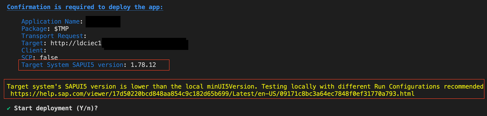

<!-- loio607014e278d941fda4440f92f4a324a6 -->

# Deployment of Application

> ### Note:  
> For any deployment issues, use the SAP Fiori environment check to validate that the saved system or destination in SAP Business Application Studio is valid. For more information, see [Environment Check](../Project-Functions/environment-check-75390cf.md)


<a name="loio607014e278d941fda4440f92f4a324a6__abap"/>

## Deployment to ABAP

You can deploy your application using the Command Palette entry: `Fiori: Deploy Application` and choosing your SAP Fiori project, or you can launch a terminal and type the following command from the project folder:

```
npm run deploy
```

When prompted, check deployment configuration and press `Yes` to proceed.

If authentication to the back end is required, a prompt for username and password appears.

To avoid any issues post deployment because the SAPUI5 version is lower in the target system, if applicable, additional information in the deployment confirmation message about the target system's SAPUI5 version appears with a recommendation to test your application more thoroughly using the [Use Run Control](../Previewing-an-Application/use-run-control-09171c8.md).



Based on the sample configurations above, after a successful deployment, you are presented with the URL for the deployed application in the generated logs. An example of the generated logs is as follows. You can copy or click on the URL in the logs to launch your application.

> ### Sample Code:  
> ```
> 
> ...info builder:custom deploy-to-abap * Done *
> ...info builder:custom deploy-to-abap App available at https://host:port/sap/bc/ui5_ui5/sap/app/index.html
> ...
> ...info builder:custom deploy-to-abap Deployment Successful.
> ...info builder:builder Build succeeded in 18 s
> ```

Users can also choose to deploy an archive file to ABAP by using either of the following commands:

-   > ### Sample Code:  
    > ```
    > npx fiori deploy --archive-path 'somefile.zip'
    > ```

    Where `somefile.zip` is valid ABAP archive.

-   > ### Sample Code:  
    > ```
    > npx fiori deploy --archive-url 'https://someurl.com/archive.zip'
    > ```

    Where `https://someurl.com/archive.zip` points to a valid ABAP archive file that is accessible without authentication.


You can also append the following parameters to apply the required deployment configuration needed for the archive file:

> ### Sample Code:  
> ```
> '-d': 'destination',
> '-u': 'url',
> '-l': 'client',
> '-t': 'transport',
> '-n': 'name',
> '-p': 'package',
> '-e': 'description',
> '-c' : '/path/to/ui5-deploy.yaml'
> ```

> ### Note:  
> If there is no Internet connection available during deployment, a telemetry error is reported in the console. This error can be safely ignored or can be removed by disabling telemetry using the environment variable: `SAP_UX_FIORI_TOOLS_DISABLE_TELEMETRY=true`.


<a name="loio607014e278d941fda4440f92f4a324a6__section_ydb_vbt_jnb"/>

## Deployment to Cloud Foundry

1.  Connect to Cloud Foundry.
2.  Deploy to Cloud Foundry:
    1.  Navigate to a new root folder of the mta project. The folder containing the `mta.yaml` file with

        ```
        cd ..
        ```

    2.  Build the multitarget archive with

        ```
        npm run build
        ```

    3.  Deploy to SCP by using the Command Palette entry: `Fiori: Deploy Application` and choosing your SAP Fiori project, or you can launch a terminal and type the following command from the project folder:

        ```
        npm run deploy
        ```

    4.  This process takes a few minutes.

3.  Preview the deployed application - *Standalone Approuter*:
    1.  In your SAP BTP Cockpit, select your target space.

        By default, the *Applications* tab is selected in the left pane and displays all the deployed HTML5 applications within this space.

    2.  Use the *Search* box to search for a specific router name.
    3.  Click the router name to open the *Overview* page.

        The deployed URL is displayed under *Application Routes*.

    4.  Click the link to open the HTML5 application.

4.  Preview the deployed application - *Managed Approuter*:
    1.  In your SAP BTP Cockpit, select your target space.
    2.  Select the *HTML5 Applications* tab in the left pane.
    3.  Use the *Search* box to filter the list of HTML5 applications by the name of your application.
    4.  Click the application name to open the HTML5 application.

        To retrieve the deployed URL using the Cloud Foundry CLI, open a new terminal and run the following command:

        ```
        cf html5-list -u -di <mta-id>-destination-service -u --runtime launchpad
        ```

        where `<mta-id>` is the `ID` field specified in your `mta.yaml`.

        > ### Note:  
        > `<mta-id>-destination-service` is the name of the resource defined with a type `destination`.

        > ### Note:  
        > To use the above command, the latest version of `html5-list` v1.4.6 is installed as follows:
        > 
        > ```
        > cf install-plugin -r CF-Community "html5-plugin"
        > ```

        If you do not have access to the `mta.yaml` file or the project source code, you can list all HTML5 deployed applications for your Cloud Foundry Space, using the command: `cf html5-list`.

        Find the required project and replace `<mta-id>` with the name column field.


> ### Note:  
> When using SAP Business Application Studio, you can right-click on the mta file and select [Build MTA Project\] to create the deployment artifact. However, this creates a deployment artifact that cannot be deployed using the target.
> 
> ```
> npm run deploy
> ```
> 
> Ensure you build the multi-target archive with the following command.
> 
> ```
> npm run build
> ```


<a name="loio607014e278d941fda4440f92f4a324a6__section_tsv_blj_frb"/>

## Deployment to ABAP System in Test Mode

If the deployment target is an ABAP system, you can choose to deploy your application in Test Mode. Test Mode does not deploy your application, but will show the results of operations \(create, read, update, and delete\) that would be executed in a real run for each file to help you make an informed decision. A successful Test Mode execution does not necessarily mean that your upload will be successful. As a developer, you can use this test mode to make sure that your configurations are correct \(including back-end system, package name, and transport request\) at any point during app development.

1.  Verify that your project's `package.json` file contains a `deploy-test` script:

    1.  `deploy-test:fiori deploy --config ui5-deploy.yaml --testMode true`

    > ### Note:  
    > Make sure in your `package.json` file, the `@sap/ux-ui5-tooling` version is at least **1.3.5** or higher.

2.  To update the `@sap/ux-ui5-tooling` package, use the command: `npm i @sap/ux-ui5-tooling@latest --save-dev`.
3.  In the Terminal, navigate to the project folder. To deploy in test mode, from within the project folder, run `npm run deploy-test` using the script in the `package.json` file.

