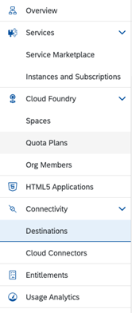
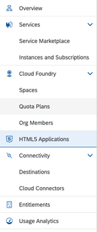

<!-- loio85ad10dea43a41918f72574614bbc203 -->

# Expose Application to Central Application Router

Exposing an application to the central application router supposes the creation of subaccount level destinations requiring the organization manager authorizations.

Open the [SAP Business Technology Platform Cockpit](https://account.int.sap.eu2.hana.ondemand.com/cockpit#/globalaccount/2fcd6ac6-b8e0-40e8-aa71-a357aa99585e/subaccount/f57f211e-2733-4cc6-b645-74f02d034a58)


<a name="loio85ad10dea43a41918f72574614bbc203__section_btn_ctx_n4b"/>

## Prepare Authentication Service

1.  Open *Service Instances*.

    

2.  Select *Authorization & Trust Management*.
3.  Search for your XSUAA service e.g. type `test-<something_unique>`.
4.  Click `>` on the right side of the row containing your service.
5.  If there is no service key, create a new one \(click three dots in the upper right corner\).
6.  Copy the name of a service key.


<a name="loio85ad10dea43a41918f72574614bbc203__section_gpd_w5x_n4b"/>

## Expose Authentication Service

1.  Open *Connectivity* \> *Destinations*.

    

2.  Click `New Destination`
3.  Select `Service Instance`
4.  `Service Instance:` Select the XSUAA service created with your **mta** e.g. `test-<something_unique>-uaa`
5.  `Name:` Give it a meaningful name e.g. `test-<something_unique>-uaa`
6.  Click on `Next` 
7.  Click on `New Property` and add `ServiceKeyName` and paste the name copied before e.g. `test-<something_unique>-uaa-service-key` 
8.  Click on `New Property` and add sap.cloud.service: `test-<something_unique>` 
9.  Click on `Save`


<a name="loio85ad10dea43a41918f72574614bbc203__section_gf3_swx_n4b"/>

## Prepare HTML5 Repository Service

1.  Open *Instances and Subscriptions*.

    

2.  Select `HTML5 Application Repository`
3.  Search for your service e.g. `type test-<something_unique>`
4.  Click on the `>` on the right side in the row with the service with `Plan app-host`
5.  If there is no service key, create one \(click on three dots in the upper right corner\)
6.  Copy the name of a service keyCopy


<a name="loio85ad10dea43a41918f72574614bbc203__section_xxn_zzx_n4b"/>

## Expose HTML5 Repository Service

1.  Open *Connectivity* \> *Destinations*.

    

2.  Click on `New Destination`
3.  Select `Service Instance`
4.  `Service Instance`: Select the HTML5 Repository service created with your mta e.g. `test-<something_unique>-html5-repo-host`
5.  `Name`: Give it a meaningful name e.g. `test-<something_unique>-html5-repo-host`
6.  Click on `Next`
7.  Click on `New Property` and add `ServiceKeyName` and paste the name copied before e.g. `test-<something_unique>-deployer-<something_unique>-html5-repo-host-credentials` 
8.  Change the suggested property `sap.cloud.service` to `test-<something_unique>` \(same as for xsuaa service destination\)
9.  Click on `Save`


<a name="loio85ad10dea43a41918f72574614bbc203__section_z2h_1vy_n4b"/>

## Test Application

1.  Open *HTML5 Application*.

    

2.  Search for your app\(s\) `test-<something_unique>`
3.  Click on your application `test<something_unique>ztravel`


<a name="loio85ad10dea43a41918f72574614bbc203__section_ynm_nvy_n4b"/>

## Enable integration into cFLP

Open the `manifest.json` of your application and add the parameter below to the root node:

```
"sap.cloud": {
    "public": true,
    "service": "test-<something_unique>"
  }
```

Rebuild and deploy your mta project.

> ### Note:  
> If you do not execute the steps above then you will be able to configure the application to work in cFLP but it will fail with an error when being loaded.

