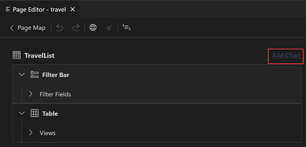
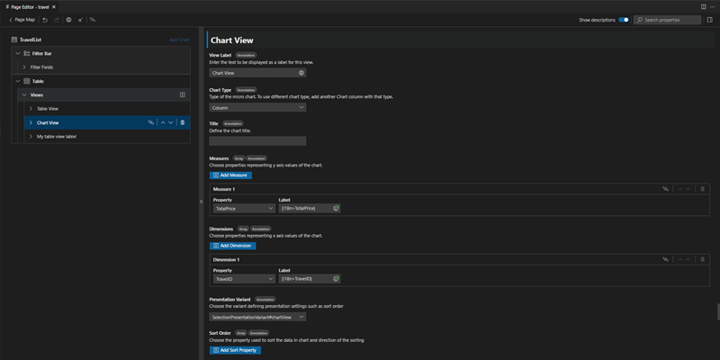

<!-- loio9c086ecaace540be83b0e50101244e78 -->

# Analytical Chart

In *Page Editor*, you can configure the *List Report* page to display aggregated data of your main entity as an analytical chart above or as an alternative to the list report table. This setup is known in `OData V2` as *Analytical List Page*. In `OData V4`, it’s however not a separate template but a flavor of the *List Report* template. You can configure it for your new or existing *List Report* if your main entity contains aggregatable and groupable properties.

<a name="loio9c086ecaace540be83b0e50101244e78__section_ttx_gyf_c5b"/>

## Prerequisites

-   Your list report doesn't contain [Multiple Views](multiple-views-c62b82e.md).
-   Your main entity contains aggregatable and groupable properties.

If the [Add Chart\] button is inactive, hover over the disabled [Add Chart\] button to get a hint on the reason. If aggregated or groupable properties aren't defined, the tooltip informs you what annotations are needed to enable it. If your *List Report* is set up with [Multiple Views](multiple-views-c62b82e.md), the tooltip reminds you of that, and you can delete all the views in your *List Report* except the single table based on main entity to enable the [Add Chart\] button.

> ### Note:  
> *Page Editor* supports adding charts with measures based on custom and transformation aggregations. If you want to use the transformation aggregations, make sure your app runs with SAPUI5 version **1.106 or higher** to ensure transformation aggregation with `@Analytics.AggregatedProperty` is supported. Transformation aggregation with `@Analytics.AggregatedProperties` isn't supported as this annotation is deprecated in favor of `@Analytics.AggregatedProperty`, see [OData Analytics](https://sap.github.io/odata-vocabularies/vocabularies/Analytics.html).

<a name="loio9c086ecaace540be83b0e50101244e78__section_hwx_qdg_c5b"/>

## Adding Analytical Chart

Perform the following steps to add an analytical chart to a *List Report*.

1.  Click [Add Chart\] button in the header of the *Page Editor*.
2.  Enter the minimum required data to generate a chart: chart type, a dimension, and a measure.

    A measure can be specified by selecting one of the following:

    -   Use existing measure
    -   Create new measure

    If you choose to use existing measure, select one of the available measures defined with custom or transformation aggregations in the *Name* field.

    If you choose to create new measure, choose the aggregatable property and one of the supported aggregation methods.

    This allows you to create a new **dynamic** measure and use it in the chart.

    > ### Note:  
    > The technical name and the label are generated automatically. You can then adjust the generated label in the *Property Panel*.

3.  Press [Add\].

The respective annotation and manifest changes are generated and basic chart is displayed in your list report above the table.

<a name="loio9c086ecaace540be83b0e50101244e78__section_arp_zfg_c5b"/>

## Deleting Analytical Chart

The *Analytical Chart* can be deleted by pressing the delete icon  on the layout node. This reverts the floor plan into a conventional *List Report* with a single table.

<a name="loio9c086ecaace540be83b0e50101244e78__analyticalchartproperties"/>

## Maintain Analytical Chart Properties

When you generate a chart, only required properties are defined. To edit the basic chart properties and define additional ones in the properties pane, choose the **chart** node in the outline and update its properties in the **Properties** pane as follows.

### Chart Type

Chart type defines how the aggregated data in your entity are vualized in the application. Based on your data nature and your needs, choose one of the provided chart types to optimally visualize you data in the chart.

### Title

Chart title is displayed above the chart. You can enter the free form text briefly describing the data, their relationship, or or purpose of the chart.

> ### Note:  
> Chart title can be prepared for translation, for more informationsee [Internationalization \(i18n\)](internationalization-i18n-eb427f2.md).

### Measures

Chart measures are the aggregated properties representing values of the chart. *Page Editor* supports custom aggregations and transformation aggregations.

> ### Note:  
> If you want to use custom aggregations for chart measures, your service should also have properties aggregated with `@Aggregation.CustomAggregate`. If you want to use the transformation aggregations, make sure your app runs with SAPUI5 version **1.106 or higher** to ensure transformation aggregation with `@Analytics.AggregatedProperty` is supported. Transformation aggregation with `@Analytics.AggregatedProperties` isn't supported as this annotation deprecated in favor of `@Analytics.AggregatedProperty`, see [OData Analytics](https://sap.github.io/odata-vocabularies/vocabularies/Analytics.html).

When generating a chart, you choose just one measure. Afterwards, you can change it, assign a label for it and add additional measures if needed in the *Property Panel*.

Each chart must have at least one measure set as default. It’sis used for displaying the chart data when the end user starts the application, unless it is defined differently in variant management. All the other measures defined for the entity are available to the end user on demand in chart preferences. The **Measures** property of the chart provides all the measures available for the entity the chart applies to. You can set any of them as default by switching the **Default** property on for the respective measure. You can change the sequence of the default measures.

> ### Note:  
> If a chart has both custom and transformation-based \(dynamic\) measures set as default, their sequence can't be mixed due to the nature of the `UI.Chart` annotation.

**Add Measure**

To add a new measure for the entity, press the [Add New Measure\] button and choose the aggregated property and supported aggregation method for it in the pop-up dialog. When you choose *Apply*, a new **dynamic** measure is generated for the chart entity and set as default in the chart. The technical name and the label are generated automatically. You can then adjust the generated label in the property panel.

**Modify Measure**

To change the **Default** property of a measure, set a different measure as default and switch off the **Default** property for the current one.

**Define Measure Label**

Measure label depends on the `Common.Label` or \(in CAP CDS\) `@title` annotation applied to the property used as a measure. If it'sn't defined, you can enter the text for it in the **`Label`** property displayed in the **Measure** row next to the **Property**. If it's already defined, you can update it. Removing the label text won’t delete any `@title` and `Common.Label` annotations defined for that property in the upper and lower layers.

> ### Note:  
> Changing the measure label has a global effect and will influence all occurrences of that field in the application unless it’s overridden there.

> ### Note:  
> Measure label can be prepared for translation, for more information see [Internationalization \(i18n\)](internationalization-i18n-eb427f2.md).

**Add, Move Measures**

You can add additional measures to your chart if more than one direct property of the main entity is annotated as aggregatable. For that, press the [Add Measure\] button and choose the desired property.

> ### Note:  
> You can't add the same measure to the chart twice. If all the aggregatable properties are already used as chart measures, [Add Measure\] button is disabled.

You can change the sequence in which default measures are displayed in the *Analytical Chart*. For the, drag and drop the measure rows within the **Measures** property or use the [Move Up/Move Down\] icons in the measure row header.

**Delete Measures**

You can delete any transformation-based measure as long as it's defined for the current app and at least one measure remains default for the chart. For this, press the [Delete\] icon in the measure row header

### Dimensions

Chart dimensions are groupable properties categorizing the measures in the chart. When generating a chart, you choose just one dimension to be used by default. Afterwards, you can change it, assign a label to it, and set additional dimensions as default if needed in the *Property Panel*. Dimensions property lists all the dimensions available for the entity the chart is applied to.

Each chart must have at least one default dimension. It's used for categorizing the chart data when the end user starts the application, unless it defined differently in variant management. All the other dimensions defined for the entity are available to the end user on demand in chart preferences. The **Dimensions** property of the chart provides all the measures available for the entity the chart applies to. You can set any of them as default by switching on the **Default** property for the respective measure. You can change the sequence of the default measures.

**Modify Dimension**

To change the property used as a dimension, choose a different groupable property in the **Property** drop-down. To change the dimensions used by default, use the **Default** switch in the header of the respective dimension rows.

**Define Dimension Label**- Dimension label depends on the `Common.Label` or \(in CAP CDS\)`@title` annotation applied to the property used as a dimension. If it'sn't defined, you can enter the text for it in the **Label** property displayed in the **Dimension** row next to the **Property**. If it's already defined, you can update it. Removing the label text won’t delete any `@title` and `Common.Label` annotations defined for that property in the upper and lower layers.

> ### Note:  
> Changing the dimension label has a global effect and influences all occurrences of that field in the application unless it’s overridden there.

> ### Note:  
> Dimension label can be prepared for translation, for more information see [Internationalization \(i18n\)](internationalization-i18n-eb427f2.md).

**Set Dimension Text and Text Arrangement**

You can set the Text and Text Arrangement for the dimension values in the respective *Dimension* table. For more information, on setting Text and Text Arrangement, see [Appendix](appendix-457f2e9.md#loio5d1cc16e80ce48de8a47f2835a42cc47).

> ### Note:  
> Text values for *Dimensions* should be from the same entity as dimension.

**Move Dimension**

You can change the sequence in which measures are grouped by dimensions in the analytical chart. For this, drag and drop the default dimension rows within the *Dimensions* property or use the [Move Up/Move Down\] icons in the dimension row header.

### Presentation Variant

`Presentation Variant` property is used to sort the chart data. It shows the `UI.SelectionPresentationVariant` or`UI.PresentationVariant` annotation defining that order. If `Presentation Variant` isn't yet set for the chart, you can have it generated by choosing `New` option in this property. You can also reuse the `Presentation Variant` applied for the list report table by choosing the [From Table\] option. In this case, sort order applies for both chart and table.

**Sort Order** 

When the `Presentation Variant` is set, you can define one or more properties to sort the chart data by. For this, press the [Add Sort Property\] button then choose one of the direct properties of the chart entity to sort by and the sort direction. If you've more than one sort property, you can define in which order they apply to the chart data by moving them up and down within the [Sort Order\] property. To move the properties, drag and drop the property rows within the [Sort Order\] property or use the [Move Up/Move Down\] icons in the row header.

You can change the properties used for sorting, update the sorting direction as well as delete one or more sorting properties. You can remove the `Presentation Variant` applying to the chart by setting it to **None**. In this case, the `UI.Chart` annotation defining an analytical chart is referenced in manifest directly and sorting won't be applied.

> ### Note:  
> This action deletes respective `UI.SelectionPresentationVariant` or `UI.PresentationVariant` from the manifest.

> ### Note:  
> To remove unreferenced `UI.SelectionPresentationVariant` or `UI.PresentationVariant` annotations from the annotation file, run the cleanup procedure that deletes the unreferenced annotation. You can always generate a new `Presentation Variant` or use the one defined for the table if any by choosing the `New` and [From Table\] options respectively. You can generate a new`Presentation Variant`.

