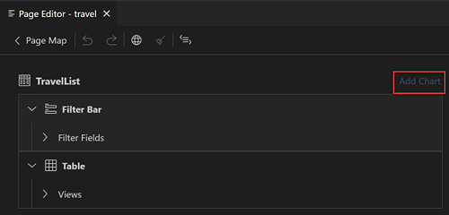
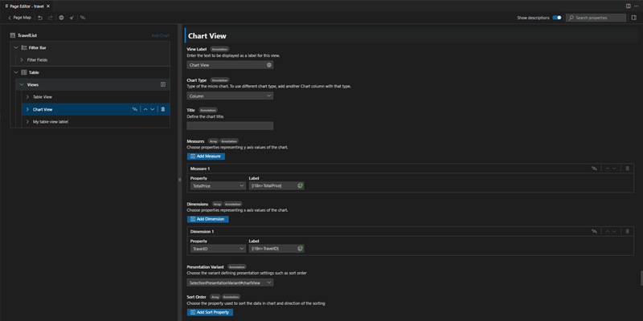

<!-- loio9c086ecaace540be83b0e50101244e78 -->

<link rel="stylesheet" type="text/css" href="../css/sap-icons.css"/>

# Analytical Chart

You can display aggregated data of your main entity as an analytical chart using the *Page Editor*.

You can display aggregated data of your main entity as an analytical chart above or instead of the table in list report pages.

In OData V2, this is called the analytical list page floorplan. In OData V4, this can be implemented in the list report page floorplan.

The *Page Editor* supports adding charts with measures based on custom and transformation aggregations.

<a name="loio9c086ecaace540be83b0e50101244e78__section_ttx_gyf_c5b"/>

## Prerequisites

-   Your list report page does not contain multiple views. For more information, see [Multiple Views](multiple-views-c62b82e.md)

    If *Add Chart* is inactive, hover over the disabled *Add Chart* button to see a tooltip which explains the reason why. If the list report page has multiple views, the tooltip reminds you of this, and you can delete all the views in your list report except the single table based on the main entity to enable this feature.

    

-   If you want to use transformation aggregations, ensure your application runs with SAPUI5 version 1.106 or higher to ensure transformation aggregation with `@Analytics.AggregatedProperty` is supported. Transformation aggregation with `@Analytics.AggregatedProperties` is not supported as this annotation is deprecated in favor of `@Analytics.AggregatedProperty`. For more information, see [OData Analytics](https://sap.github.io/odata-vocabularies/vocabularies/Analytics.html).

<a name="loio9c086ecaace540be83b0e50101244e78__section_hwx_qdg_c5b"/>

## Adding Analytical Chart

Perform the following steps to add an analytical chart to a list report page:

1.  Open the *Page Editor*.
2.  Click *Add Chart*.
3.  Select *Use Existing Chart* or *Create New Chart*.
4.  *Use Existing Chart*: Choose a `UI.Chart` annotation, a `UI.PresentationVariant` annotation which references a `UI.Chart` annotation, or a `UI.SelectionPresentationVariant` annotation which references a `UI.Chart` annotation.
5.  *Create New Chart*: Enter the minimum required data to generate a chart: a chart type, a dimension, and a measure.

    You can add a chart using any of the entity type properties as a dimension if there are no groupable properties defined in the `@Aggregation.ApplySupported` annotation. If there are no groupable properties, all the properties of the main entity are considered groupable.

    A measure can be specified by selecting one of the following options:

    -   *Use Existing Measure*
    -   *Create New Measure*

    If you choose to use an existing measure, select one of the available measures defined with custom or transformation aggregations in the *Name* field.

    If you choose to create a new measure, choose the aggregable property and one of the supported aggregation methods.

    This allows you to create a new dynamic measure and use it in the chart.

    > ### Note:  
    > The technical name and the label are generated automatically. You can then adjust the generated label in the Property Panel.

6.  Click *Add*.

The respective annotation and manifest changes are generated and a basic chart is displayed in your list report page above the table. If you selected to choose an existing annotation, no annotations are generated, but the chosen annotation is referenced in the `manifest.json` file.

<a name="loio9c086ecaace540be83b0e50101244e78__section_arp_zfg_c5b"/>

## Deleting Analytical Chart

The analytical chart can be deleted by clicking the :wastebasket: \(*Delete*\) icon on the layout node. This reverts the floorplan into a conventional list report page with a single table.

<a name="loio9c086ecaace540be83b0e50101244e78__analyticalchartproperties"/>

## Maintain Analytical Chart Properties

When you generate a chart, only the required properties are defined. To edit the basic chart properties and define additional ones in the properties pane, choose the *Chart* node in the outline and update its properties in the Properties Panel as follows.

### Chart Type

The chart type defines how the aggregated data in your entity is visualized in the application. Based on the data and your requirements, choose one of the provided chart types to visualize your data in the chart.

### Title

The chart title is displayed above the chart. You can enter free form text briefly describing the data and its relationship or the purpose of the chart. The chart title can be prepared for translation. For more information, see [Internationalization \(i18n\)](internationalization-i18n-eb427f2.md).

### Measures

Chart measures are the aggregated properties representing values of the chart. The *Page Editor* supports custom aggregations and transformation aggregations.

If you want to use custom aggregations for chart measures, you must have an `@Aggregation.CustomAggregate` annotation for the entity type or entity set where the qualifier matches the aggregated property name.

If you want to use transformation aggregations, ensure your app runs with SAPUI5 version 1.106 or higher to ensure transformation aggregation with `@Analytics.AggregatedProperty` is supported. You must also have aggregatable properties defined in the `@Aggregation.ApplySupported` annotation for the entity type or entity set. Transformation aggregation with `@Analytics.AggregatedProperties` isn't supported as this annotation was deprecated in favor of `@Analytics.AggregatedProperty`. For more information, see [OData Analytics](https://sap.github.io/odata-vocabularies/vocabularies/Analytics.html).

When generating a chart, you choose just one measure. Afterwards, you can change it, assign a label for it and add additional measures if needed in the Property Panel.

Each chart must have at least one measure set as default. It is used for displaying the chart data when the end user starts the application, unless it is defined differently in variant management. All the other measures defined for the entity are available to the end user on demand in chart preferences. The *Measures* property of the chart provides all the measures available for the entity the chart applies to. You can set any of them as default by activating the *Default* property for the respective measure. You can change the sequence of the default measures.

**Add and Move Measures**

To add a new measure for the entity, click*Add New Measure* and choose the aggregated property and supported aggregation method for it in the pop-up dialog. When you click *Apply*, a new dynamic measure is generated for the chart entity and set as default in the chart. The technical name and the label are generated automatically. You can then adjust the generated label in the property panel.

You can add additional measures to your chart if more than one direct property of the main entity is annotated as aggregable. You cannot add the same measure to the chart twice. If all the aggregable properties are already used as chart measures, *Add Measure* is disabled.

You can change the sequence in which default measures are displayed in the analytical chart. Drag and drop the measure rows within the *Measures* property or use the  \(*Move Up*\) or  \(*Move Down*\) icons in the measure row header.

> ### Note:  
> If a chart has both custom and transformation-based \(dynamic\) measures set as default, their sequence cannot be mixed due to the nature of the `UI.Chart` annotation.

**Modify Measures**

To change the *Default* property of a measure, set a different measure as default and deactivate the *Default* property for the current one.

**Define Measure Label**

The measure label depends on the `Common.Label` or \(in CAP CDS\) `@title` annotation applied to the property used as a measure. If it is not defined, you can enter the text for it in the `Label` property displayed in the *Measure* row next to the property. If it's already defined, you can update it. Removing the label text won’t delete any `@title` and `Common.Label` annotations defined for that property in the upper and lower layers. The measure label can be prepared for translation. For more information, see [Internationalization \(i18n\)](internationalization-i18n-eb427f2.md).

> ### Note:  
> Changing the measure label has a global effect and influences all occurrences of that field in the application unless it is overridden there.

**Delete Measures**

You can delete any transformation-based measure as long as it's defined for the current app and at least one measure remains default for the chart. To do so, click the *Delete* icon in the measure row header.

### Dimensions

Chart dimensions are groupable properties categorizing the measures in the chart. When generating a chart, you choose just one dimension to be used by default. Afterwards, you can change it, assign a label to it, and set additional dimensions as default if needed in the Properties Panel. Dimensions property lists all the dimensions available for the entity the chart is applied to.

Each chart must have at least one default dimension. It is used for categorizing the chart data when the end user starts the application, unless it is defined differently in variant management. All the other dimensions defined for the entity are available to the end user on demand in chart preferences. The *Dimensions* property of the chart provides all the measures available for the entity the chart applies to. You can set any of them as default by activating the *Default* property for the respective measure. You can change the sequence of the default measures.

**Modify Dimensions**

To change the property used as a dimension, choose a different groupable property in the *Property* dropdown. To change the dimensions used by default, use the *Default* switch in the header of the respective dimension rows.

**Define Dimension Label**

The dimension label depends on the `Common.Label` or \(in CAP CDS\)`@title` annotation applied to the property used as a dimension. If it is not defined, you can enter the text for it in the *Label* property displayed in the *Dimension* row next to the **Property**. If it's already defined, you can update it. Removing the label text won’t delete any `@title` and `Common.Label` annotations defined for that property in the upper and lower layers. The dimension label can be prepared for translation. For more information, see [Internationalization \(i18n\)](internationalization-i18n-eb427f2.md).

> ### Note:  
> Changing the dimension label has a global effect and influences all occurrences of that field in the application unless it is overridden there.

**Set Dimension Text and Text Arrangement**

You can set the *Text* and *Text Arrangement* for the dimension values in the respective *Dimension* table. For more information, see [Appendix](appendix-457f2e9.md#loio5d1cc16e80ce48de8a47f2835a42cc47).

> ### Note:  
> The text values for the *Dimensions* property must be from the same entity as the dimension.

**Move Dimensions**

You can change the sequence in which measures are grouped by dimensions in the analytical chart. Drag and drop the default dimension rows within the *Dimensions* property or use the  \(*Move Up*\) or  \(*Move Down*\) icons in the dimension row header.

### Presentation Variant

The *Presentation Variant* property is used to sort the chart data. It shows the `UI.SelectionPresentationVariant` or`UI.PresentationVariant` annotation defining that order. If *Presentation Variant* is not yet set for the chart, you can have it generated by selecting *New*. You can also reuse the *Presentation Variant* applied for the list report table by selecting *From Table*. If set to *From Table*, the sort order applies to both the chart and table.

**Sort Order** 

When the *Presentation Variant* is set, you can define one or more properties to sort the chart data by. Click *Add Sort Property* and choose one of the direct properties of the chart entity to sort by, and the sort direction. If you have multiple sort properties, you can define in which order they apply to the chart data by moving them up and down within the *Sort Order* property. To move the properties, drag and drop the property rows within the *Sort Order* property or use the  \(*Move Up*\) or  \(*Move Down*\) icons in the row header.

You can change the properties used for sorting, update the sorting direction as well as delete one or more sorting properties. You can remove the *Presentation Variant* by setting it to **None**. Then, the `UI.Chart` annotation, which defines an analytical chart, is referenced in the `manifest.json` file directly, and sorting is not applied. This action deletes `UI.SelectionPresentationVariant` or `UI.PresentationVariant` anotations from the `manifest.json` file.

> ### Note:  
> To remove unreferenced `UI.SelectionPresentationVariant` or `UI.PresentationVariant` annotations from the annotation file, run the cleanup procedure that deletes the unreferenced annotation.

