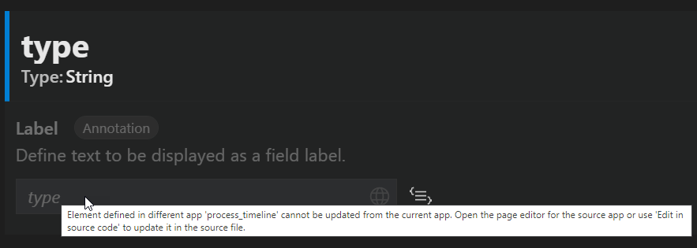

<!-- loio796f6a489cf54e68a78bba4e188493ad -->

# Annotation Support

The generated changes are always written to your application's single top-level local annotation file. Annotation files for modification are determined differently for CAP and non-CAP projects.

### CAP Project

*Page Editor* modifies the top level `.cds` file in the application folder. This file is identified as follows:

-   *Page Editor* searches for a file in the application directory that is not registered in `index.cds` or `service.cds`.
-   If such a file does not exist, a new file `annotations.cds` is created with a `using` directive pointing to the service.

    > ### Note:  
    > If `index.cds` file doesn’t exist, it’s created and updated with the `using` directive pointing to the newly created annotation file \(`annotations.cds`\).

-   If multiple files are found, the top-level file is determined based on the `using` directives.
-   If there are multiple files on the same top level, the first found file on that level is used.

Special handling is applied if the annotation to be modified resides in the different file:

-   If it is defined in the **base** layer \(the file set lower in the hierarchy\) it is overridden in the top-level file.

    > ### Note:  
    > Some of the property values, such as measures and currencies, cannot be overridden if defined in the base layer to keep the consistency across the project.

-   If it is defined in a different `.cds` file of the same app that is on the same hierarchy level, it is overridden in the file maintained by the *Page Editor* and a `using` directive is added to the overridden file to establish the layering hierarchy.
-   If it is defined in the `.cds` file of the different app, it cannot be overridden from the current app to avoid cross references between apps. In this case, open the *Page Editor* for the original app to modify it. Use the tooltip to check the name of the original app: 

### Non-CAP Project

*Page Editor* modifies the local annotation file at the top of the annotation source hierarchy. The annotations in the lower level, such as service metadata or local annotation files at the bottom of the hierarchy are never modified by the *Page Editor*. If the changes made require modification to the annotation already existing in the lower layer, this annotation is copied to the top most local annotation file and edited there, thus overriding the annotation in the lower layer.

-   The top of annotation source hierarchy is determined by the last entry in the `manifest.json` *<datasources =\> annotations file\>*.

    > ### Note:  
    > Annotation file hierarchy can be viewed in the **Annotation File manager** and can be changed. Execute the `Fiori: Open Annotation File Manager` command to open the **Annotation File Manager**.

    > ### Example:  
    > Last entry in *<datasources =\> annotations file\>* of `manifest.json` has the highest precedence.

    -   If the local annotation file does not exist, it is automatically created and registered in the `manifest.json` file as soon as the first annotation change is made.
    -   If a new file is created, it is placed under the `webapp` folder under the `annotations` directory.

