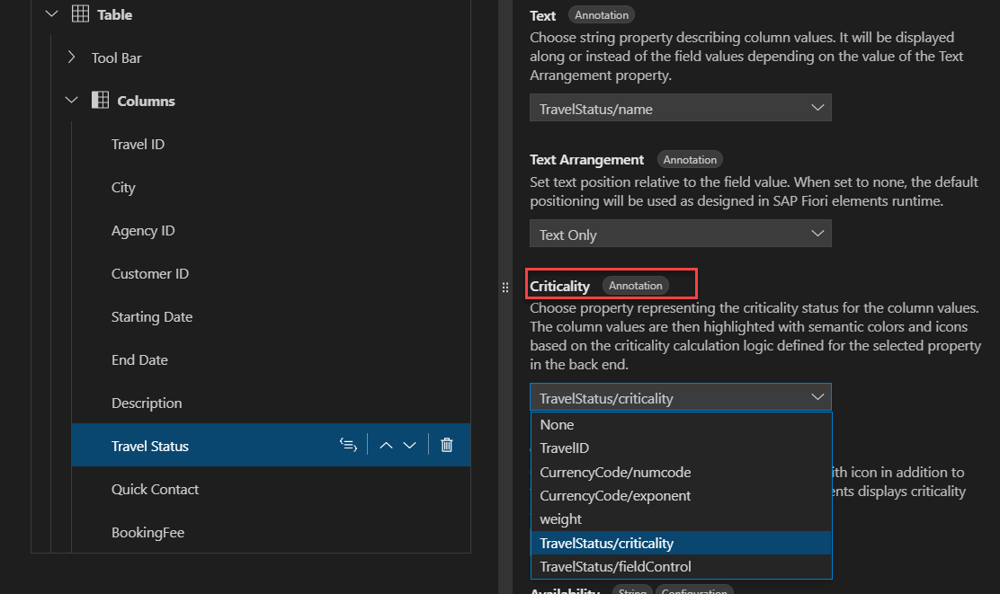
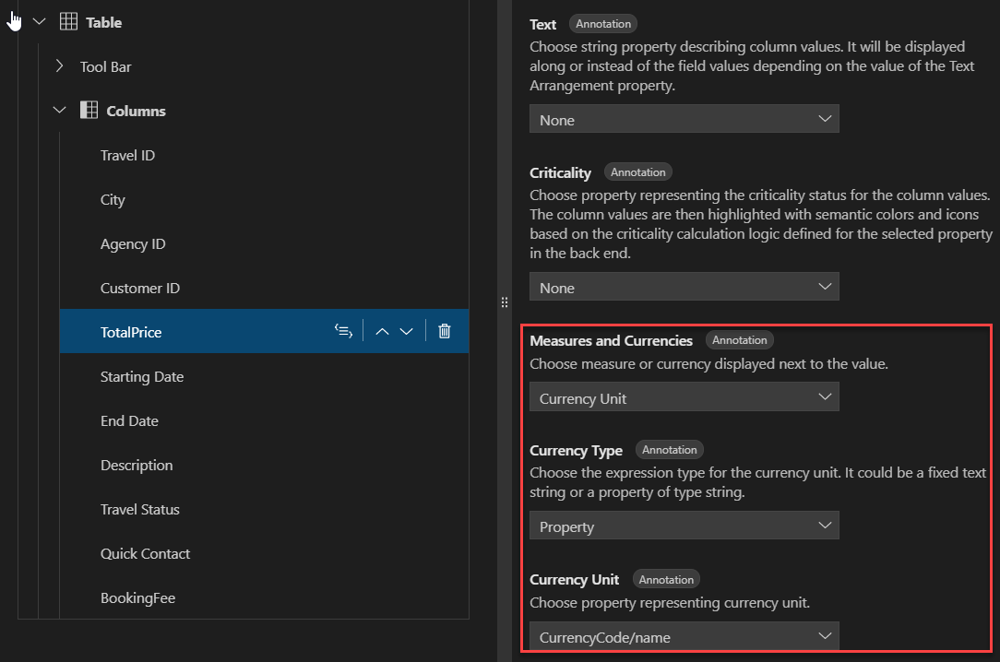
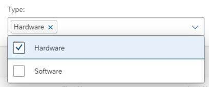
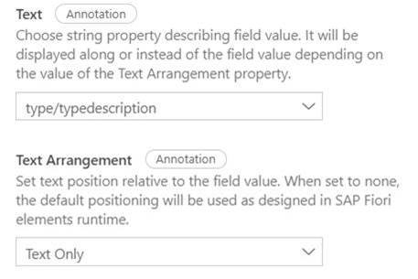
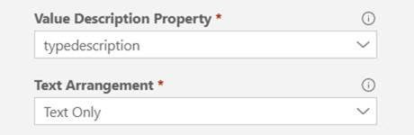
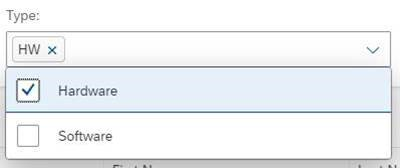
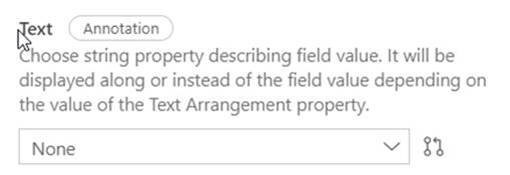
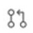
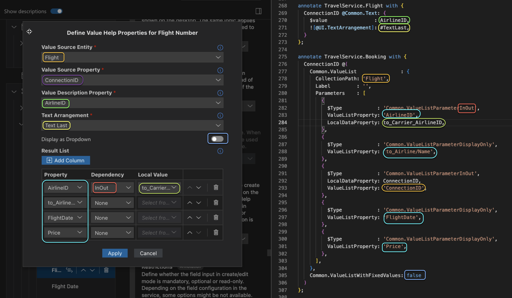

<!-- loio457f2e9699b5437fb09d56311055a4a0 -->

<link rel="stylesheet" type="text/css" href="../css/sap-icons.css"/>

# Appendix

<a name="loio82d94533569741e5888536d49052198c"/>

<!-- loio82d94533569741e5888536d49052198c -->

## Contact

The *Contact* property represents the `fn` property of `Communication.Contact`. You cannot change the property used as the *Contact Name* in the *Property Panel*. If you need to have your contact column based on a different property, delete this column and click the :heavy_plus_sign: \(*Add*\) icon to add a new contact column.


## Job Title

The *Job Title* property represents the property title of `Communication.Contact`.


## Photo

The *Photo* property represents the property photo of `Communication.Contact`.


## Role

The *Role* property represents the property role of `Communication.Contact`.


## Department

The *Department* propert represents the property department of `Communication.Contact`.


## Address

The *Address* property represents the collection property `adr` of `Communication.Contact`, which has the record type `Communication.AddressType`. You can maintain multiple addresses, each represented by a table row.

The row contains the following fields:

-   *Street* - representing property street of `Communication.AddressType`
-   *City* - representing property locality of `Communication.AddressType`
-   *State/Province* - representing property region of `Communication.AddressType`
-   *Postal Code* - representing property code of `Communication.AddressType`
-   *Country* - representing property country of `Communication.AddressType`


## Phone

The *Phone* property represents the collection property `tel` of `Communication.Contact`, which has record type `Communication.PhoneNumberType`. Users can maintain multiple phone entries, each represented by a table row.

The row contains the following fields:

-   *Phone* - representing property `uri` of `Communication.PhoneNumberType`
-   *Type* - with options `Work` \(default\), `Mobile`, `Fax`, depending on if `type` of `Communication.PhoneNumberType` contains enum value `work`, `cell` or `fax` respectively.


## Email

The *Email* Property represents the collection property `email` of `Communication.Contact`, which has record type `Communication.EmailAddressType`. Users can maintain multiple email entries, each represented by a table row.

The row contains the following field:

-   *Email* - representing property email of `Communication.EmailAddressType`

<a name="loio19d82b5d8bc940738afcb49b51a48bed"/>

<!-- loio19d82b5d8bc940738afcb49b51a48bed -->

## Criticality


<a name="loio19d82b5d8bc940738afcb49b51a48bed__section_fg3_fkj_kfc"/>

## Criticality in Basic Fields and Columns

You can display the values of the section fields or basic table columns with semantic coloring and optionally with criticality icons. For example, you can choose to display the *Travel Status* value in red if the trip is canceled and in green if it is confirmed.

As a prerequisite, your service should contain the property representing the status criticality information. If this prerequisite is fulfilled, do the following:

-   In the outline, choose the table column or field you want to show with the semantic information.
-   In the Properties pane, choose the property representing the status criticality information in the *Criticality* field.



As a result, the *Criticality* property is added to the `UI.DataField` record and the respective column or field values are shown in semantic colors. In addition, the criticality icon may appear – this depends on the default behavior of the SAP Fiori elements template. You may override this default by explicitly defining the *Criticality Representation*.


<a name="loio19d82b5d8bc940738afcb49b51a48bed__section_xdw_kkj_kfc"/>

## Criticality for Micro Charts and Progress Indicators

In comparison micro charts, harvey micro charts, stacked bar micro charts, and progress indicators, you can define the semantic coloring by choosing the appropriate property in the *Criticality* field. To remove the semantic coloring, choose *None*.

<a name="loiof2b7486cb4644441979d818802b79940"/>

<!-- loiof2b7486cb4644441979d818802b79940 -->

## Criticality Representation

*Criticality Representation* is a property for section fields and columns.

When the *Criticality* property is defined, the *Criticality Representation* property appears. If you want to use the default representation defined by SAP Fiori elements, you can leave this field set to *None*. Otherwise, you can explicitly define whether to indicate the criticality by an icon in addition to the semantic coloring. For this, choose one of the following options:

-   **With Icon** – displays the icon in addition to the semantic coloring, independent of the default representation defined by SAP Fiori elements.
-   **Without Icon**

As a result, the *Criticality Representation* property is added to the `UI.DataField` record and the respective column or field values are shown with or without the icon, independent of the default representation defined by SAP Fiori elements presenting the table column or section field.

<a name="loioa94b995dd1dd4ee5b68dde0882a3ab29"/>

<!-- loioa94b995dd1dd4ee5b68dde0882a3ab29 -->

## Criticality Source

*Criticality Source* is a property for area, bullet, column, and radial micro charts.

Choose how the chart color should be calculated. Choose *Property* \(not applicable to area micro charts\) if criticality calculation is performed in the back end and exposed as a service entity element. Choose *Calculation* to define the criticality calculation parameters, such as improvement direction and deviation ranges.

If *Criticality Source* is set to *Property*, the following properties are available:

-   Criticality Value
    -   Choose a property representing the criticality status for chart values. The chart value is then displayed with semantic colors based on the criticality calculation logic defined for the selected property in the back end.
    -   Criticality value is only displayed if *Criticality Source* is set to *Property*.


If *Criticality Source* is set to *Calculation*, the following property is available:

-   [Improvement Direction](appendix-457f2e9.md#loiobc3ba187c04d4c759af63fedb380aa6d)

<a name="loio53c6d1a41ee041e7a01918f14b4925e6"/>

<!-- loio53c6d1a41ee041e7a01918f14b4925e6 -->

## Description

For some header section types, such as progress or micro charts, you can set the description of the content. To set the description, perform the following:

1.  Open the *Page Editor* and choose a header section.
2.  In the Properties Pane, enter the text you want to use in the *Description* property.

> ### Note:  
> The description can be prepared for translation. For more information, see [Internationalization \(i18n\)](internationalization-i18n-eb427f2.md).

<a name="loio6514184c6c21405cab30fd41e9102897"/>

<!-- loio6514184c6c21405cab30fd41e9102897 -->

## Dimension

*Dimension* is a required property for area, line, and column micro charts.

Choose a dimension to represent the x-axis of the chart by default.

<a name="loio344568c1e4014621905d78857cf66401"/>

<!-- loio344568c1e4014621905d78857cf66401 -->

## Display as Image

If the table column or section field is built on a string property and contains a link to the image, you can set it so that it displays as an image in your application at runtime. To do so, activate the *Display as Image* property. This applies `@UI.IsImageURL: true` to the property used for that column or field.

> ### Note:  
> -   All fields and columns in your project built on this property use the same rendering. Deleting a column or field does not remove the annotation, as this can impact other instances of the field at runtime.
> 
> -   If the property is annotated with `@UI.IsImageURL: true` in the service or in the local annotation file of the lower layer, the setting cannot be changed in the Page Editor.
> 
> -   Table columns and section fields annotated with `@Core.MediaType` along with `@Core.IsURL` are also displayed as images at runtime. However, as these annotations are applicable on the service level, they cannot be maintained using the Page Editor, and so *Display as Image* is displayed in read-only mode for such fields and columns.

<a name="loio6544398b07024f4faff4bad25949b64d"/>

<!-- loio6544398b07024f4faff4bad25949b64d -->

## Display Type

Define how the field is represented in create or edit mode. Available options depend on the value type. For most value types, you can define value help if the service metadata contains entities with a list of eligible options. String values can also be represented as a text area.

<a name="loio13f6d7fd6c6c4f60908cefa7d4260e49"/>

<!-- loio13f6d7fd6c6c4f60908cefa7d4260e49 -->

## External ID

*External ID* is a property for fields, filter fields, columns, and value help.

The *External ID* property is mainly used for the entity type properties of the `Edm.Guid` type to display a human-readable identifier on the UI instead of the`Edm.Guid` value.

> ### Tip:  
> If a value help is defined, the *External ID* value must be a direct property of the entity used as the *Value Source Entity* in the value help.

<a name="loio0cb6999ed1004cccbeb06fee763eb8bb"/>

<!-- loio0cb6999ed1004cccbeb06fee763eb8bb -->

## Forecast Value

*Forecast Value* is an optional property for bullet micro charts.

You can also display an additional value to indicate a forecast. You can choose a numeric service property to be used as a forecast value in the properties pane.

<a name="loiof7ad71792a0044d6b6172f078827bdc0"/>

<!-- loiof7ad71792a0044d6b6172f078827bdc0 -->

## Hidden

The *Hidden* property defines if a column should be hidden in the application UI. Once you have activated the *Hidden* feature with the toggle button, you can choose the boolean property as a hiding condition in the *Hide by Property* field.

<a name="loio4e8bb3df433546f8a80f16e53b29e4c1"/>

<!-- loio4e8bb3df433546f8a80f16e53b29e4c1 -->

## Hide by Property

In this property, you can define the condition for hiding the UI element. For this, choose one of the suggested boolean properties from the dropdown list. If the chosen property evaluates to true for the specific context, the element is hidden, otherwise it is displayed.

> ### Note:  
> The exact impact of hiding an element in the application UI depends on the UI element. For more information, see [Hiding Features Using the UI.Hidden Annotation](https://sapui5.hana.ondemand.com/#/topic/ca00ee45fe344a73998f482cb2e669bb).

<a name="loio7fe32a215209419da6d6c19da0f69ccb"/>

<!-- loio7fe32a215209419da6d6c19da0f69ccb -->

## Importance

Define how the field is rendered on small-screen devices. Fields of high importance are shown on a mobile phone. Fields of high or medium importance are shown on a tablet.

<a name="loiobc3ba187c04d4c759af63fedb380aa6d"/>

<!-- loiobc3ba187c04d4c759af63fedb380aa6d -->

## Improvement Direction

Choose the direction in which the value is considered improved.

Improvement direction is a required property for area, bullet, radial, and column micro charts if *Calculation* is selected in the *Criticality Source*.

If *Minimize* is selected, the following properties are required:

-   Deviation High Value
    -   Highest value that is considered neutral.

-   Tolerance High Value
    -   Highest value that is considered positive.


If *Maximize* is selected, the following properties are required:

-   Deviation Low Value
    -   Lowest value that is considered neutral.

-   Tolerance Low Value
    -   Lowest value that is considered positive.


If *Target* is selected \(not applicable to radial micro charts\), the following properties are required:

-   Deviation Low Value
-   Tolerance Low Value
-   Deviation High Value
-   Tolerance High Value

<a name="loiod44832d99bdf4f73ba14cdbb16dc9301"/>

<!-- loiod44832d99bdf4f73ba14cdbb16dc9301 -->

## Label

To change the label, perform the following steps:

1.  Select the required section and navigate to the properties pane area.

2.  Enter a new name in the *Label* text box. This field defines the text to be displayed at a section label.

    The section is renamed both in the Page Editor and in the application preview.


The `Form/Table/Identification/Chart` section labels are translatable and readable elements which are rendered in the SAP Fiori apps. When the user creates a supported section, the label inputted by the user is assigned to the `Label` property of the `ReferenceFacet` record in the `Facet` annotation. During deletion of the section, the `ReferenceFacet` record is deleted which deletes the `Label` in it.

> ### Note:  
> All the labels translatable and can maintained through i18n project files. For more information, see [Internationalization \(i18n\)](internationalization-i18n-eb427f2.md).


<a name="loiod44832d99bdf4f73ba14cdbb16dc9301__section_fm3_c35_j5b"/>

## Fields

-   The `Fields` labels can be maintained with annotations, such as `Common.Label` and `@title`.
-   The `Fields` sublabel can be maintained with the information type of the entity property such as `name: String(50)`.
-   The navigation to source code leads to the respective `DataField` record.
-   If these annotations are not present for the entity property, the `Label` property of the `DataField` is generated with the same value as the `Value` property.
-   The application does not generate the label annotations directly on the properties.
-   If you attempt to change the value of the `Label` provided by annotation, the annotation value is not updated. The `Label` property of `DataField` is generated or updated.
-   During deletion of the field, the annotations mentioned above are not deleted, only labels which are directly maintained in the record are deleted because the record is removed. For more information, see [Internationalization \(i18n\)](internationalization-i18n-eb427f2.md).


<a name="loiod44832d99bdf4f73ba14cdbb16dc9301__section_e3g_3l5_j5b"/>

## Columns

The `Column` labels can be maintained with annotations, such as `Common.Label` and `@title`. The `Basic Column` sublabel can be maintained with the information type of the entity property such as `name: String(50)`. The navigation to the source code leads to the respective `DataField` record. The other column types such as `Rating Column`, `Progress Column` sublabel can be maintained with column type information such as `Type: Rating` or `Type: Progress`. If the annotations are not maintained, the label is empty and you can add a label using the property panel and the `Label` property for `DataField` is generated. During deletion of column, the label maintained in the record is deleted because the record is completely removed.


<a name="loiod44832d99bdf4f73ba14cdbb16dc9301__section_ysw_3l5_j5b"/>

## Actions

`Actions` has also editable labels.

-   During creation of an action, the last segment of actions is used to create the label. For example, with `Trippin.Container/GetNearestAirport`, the `Label` has `GetNearestAirport` as the value assigned to it.
-   This `Label` is rendered as the Button Label in SAP Fioriapplications. During deletion, the entire `DataFieldForAction` record is deleted which deletes the `Label` along with it.
-   Label based annotations are not removed during the cleanup procedure. For more information, see [Project Cleanup](project-cleanup-2640899.md).

<a name="loio27fdaca358bb419f95290eebc86ed7da"/>

<!-- loio27fdaca358bb419f95290eebc86ed7da -->

## Maximum Value Type

*Maximum Value Type* is a property for bullet micro charts and table columns.

Choose the expression type for the maximum possible value in the chart. It can be a decimal number or a property of type decimal. Maximum value type influences the maximum value property.

<a name="loiofb3939d43c884bf5b458657ef3f6f3be"/>

<!-- loiofb3939d43c884bf5b458657ef3f6f3be -->

## Maximum Value

*Maximum Value* is a required property for bullet and harvey micro charts.

For the bullet micro chart, the scale is based on the minimum value \(by default: 0\) and maximum value you chose when generating this micro chart.

You can modify the scale of the bullet micro chart by updating these minimum and maximum values. You can either define these values based on the service properties of numeric type or as fixed number. For that, you first choose the Maximum \(Minimum\) value type and then the desired number or property.

For the harvey micro chart, the maximum value is represented by a numeric property. You can change the numeric property to a different numeric property of the same entity or a 1:1 related entity.

<a name="loiof7225b8412704a6cb8a7b45fda3f56fe"/>

<!-- loiof7225b8412704a6cb8a7b45fda3f56fe -->

## Measures

*Measures* is applicable to line, area, column, and comparison micro charts in header sections and columns.

You can add additional measures in line micro charts by choosing properties representing values for additional lines.

<a name="loio8ad2438ea4ed4a52ab530ff104530f98"/>

<!-- loio8ad2438ea4ed4a52ab530ff104530f98 -->

## Measures and Currencies

You can display the numeric values of the section fields or basic table columns together with measures or currencies represented by these values. For example, you can display prices along with the currencies and product dimensions, such as width or weight, with the measure unit. For this, as a prerequisite, do the following:

-   In outline, choose the table column or field you want to show with the semantic information.
-   In the Properties pane, choose one of the following options in the *Measures and Currencies* field:
    -   **Currency Unit**
    -   **Measure Unit**

-   In the pop-up, define how the unit should be represented by choosing one of the following options and clicking *Apply*:
    -   **Path** – if you want to define the unit as the property of associated entity, choose the property representing measure or currency units.
    -   **String**– if you want to define the unit as plain text, such as %. the property of associated entity, enter the text for the unit to be displayed along with the value


As a result, the `Measures.ISOCurrency` annotation is applied to the field or column value referencing the property or string you chose and the respective column or field values are shown with the respective currency or measure unit.

You can change the selected measure or currency in the properties pane at any time by choosing the values in the newly appeared *Type* and *Unit* fields. You can prevent displaying the unit with your column/field value by setting the *Measures and Currencies* value to *None*.



<a name="loiob3ecb1ff7aca434882b58f83176e8cb4"/>

<!-- loiob3ecb1ff7aca434882b58f83176e8cb4 -->

## Minimum Value Type

*Minimum Value Type* is a property of bullet micro charts and table columns.

Choose the expression type for the starting value of the chart. It can be a decimal number or a property of type decimal. *Minimum Value Type* influences the *Minimum Value* property.

<a name="loiobcca4bede254425d88e3fe13180194ed"/>

<!-- loiobcca4bede254425d88e3fe13180194ed -->

## Minimum Value

Choose a decimal number representing the starting value for the chart.

<a name="loio58fec66ebb1f48fbbd3092d3a1b27fda"/>

<!-- loio58fec66ebb1f48fbbd3092d3a1b27fda -->

## Restrictions

Define whether the input field in create or edit mode is mandatory, optional, or read-only. Depending on the field configuration, some options may not be available. For example, values generated by the system are always read-only.

<a name="loio7fba03aba4214ceab2130f16186f4ff2"/>

<!-- loio7fba03aba4214ceab2130f16186f4ff2 -->

## Target

Choose a number representing the maximum rating.

<a name="loio678bf9265c664134a075b59fd193c64e"/>

<!-- loio678bf9265c664134a075b59fd193c64e -->

## Target Type

*Target Type* is a property of progress header sections and progress columns.

Choose the expression type for the progress goal. It can be a constant number or a property of a numeric type if provided in the service.

<a name="loioa9654b0fd63443d9b2727d1a497f84b6"/>

<!-- loioa9654b0fd63443d9b2727d1a497f84b6 -->

## Target Value

*Target Value* is a required property for radial micro charts and an optional property for area and bullet micro charts.

Apart from the main value, you can also display an additional value as a target. You can choose a numeric service property to be used as a target in the properties pane.

<a name="loio5d1cc16e80ce48de8a47f2835a42cc47"/>

<!-- loio5d1cc16e80ce48de8a47f2835a42cc47 -->

## Text

Fields and basic table columns representing IDs or codes often need to be displayed along with the descriptive text which conveys the meaning in a human-readable way. For example, status codes: `O`, `A`, and `C` are meaningless for the user and should be accompanied or even replaced by the descriptive text, such as Open, Accepted, or Cancelled.

To add such descriptive texts, select the property representing the descriptive text in the *Text* property. Then, the `Common.Text` annotation will be applied to the property representing field/column value.

<a name="loioecd5568919bf43c5a04dd6b5e8e173f6"/>

<!-- loioecd5568919bf43c5a04dd6b5e8e173f6 -->

## Text Arrangement

When *Text* is defined, the `Text Arrangement` property appears in the properties pane right after it. If you want to use the default arrangement of SAP Fiori elements, you can leave this field set to *None*. Otherwise, you can define how this text is displayed to the field or column value.

> ### Note:  
> The option *None* is not available if `UI.TextArrangement` or `Common.TextArrangement` is already defined on a lower layer, such as in the service.

Also, you can set the text arrangement explicitly, as follows:

-   To display both, the field/column value and text, select the *Text First* or *Text Last* values.
-   To substitute the field/column value with the text, select *Text Only*.
-   To conceal the property defined as a text in the value help, select *ID Only*.

As a result, the `UI.TextArrangement` annotation is applied to the `Common.Text` annotation defined for the text property.

<a name="loio64af370703b94edb9b4068fda3e2a613"/>

<!-- loio64af370703b94edb9b4068fda3e2a613 -->

## Tooltip

You can set tooltips for some table columns and header section types, in particular:

-   Progress Columns in list report and object page tables.
-   Rating Columns in list report and object page tables.
-   Progress Header Sections in object pages.
-   Rating Header Sections in object pages.
-   Data Point Header sections in object pages.

This tooltip can be set as a fixed text or as a dynamic text coming from the service property.

To set the tooltip:

1.  Open the *Page Editor*, choose a Header Section or Column type which supports tooltips.
2.  In the Properties Pane, select the desired source of the tooltip.
    -   **String**: lets you enter the fixed translatable text.
    -   **Property**: provides a list of string service properties to choose from.

3.  Enter the tooltip text or choose the desired property based on the option you selected.

> ### Note:  
> Tooltips that are defined as a text string can be prepared for translation. For more information, see [Internationalization \(i18n\)](internationalization-i18n-eb427f2.md).

<a name="loiof0bc466aae5b42e697c89506026050af"/>

<!-- loiof0bc466aae5b42e697c89506026050af -->

## Tooltip Source

Choose the source of the tooltip. Choose *Property* if the tooltip is defined in the back end and exposed as a service entity element. Choose *String* to define the same text for all values.

<a name="loio43ced2fc24ac473e82ccaeb20b5f1f3f"/>

<!-- loio43ced2fc24ac473e82ccaeb20b5f1f3f -->

## Text and Text Arrangement for Fields Configured with Value Help

If the field display type is configured the same way as `Value Help`, you can configure the field value the same way as the `Value Help` value.

To do so, select the same property as *Text* for the field and *Value Description Property* for `Value Help`. Also, choose the same options for the text arrangement.

-   **Example 1**:

    The selected value in the *Type* filter field is consistent with the `Value Help` list values.

    

    This is assured by the same values selected in the *Text/Value Description Property* and *Text Arrangement* for the filter field and its value help. The `typedescription` property is used as the *Text/Value Description Property* and *Text Only* as the *Text Arrangement*.

    **Filter Field Properties**:

    

    **`Value Help` Properties**:

    

-   **Example 2**:

    The selected value in the filter field is not consistent with the value help list values.

    

    The *Text/Value Description Property* and *Text Arrangement* are configured differently on the field and value help. The `typedescription` property is used as the *Value Description Property* and `Text Only` as the *Text Arrangement* for the value help, while *Text* and *Text Arrangement* are not defined on the filter field itself because it is set to *None*.

    **Filter Field Properties**:

    

    **Value Help Properties**:

    


The  button is provided by the *Page Editor* to simplify the text/text arrangement synchronization. It appears next to the *Text* field once the *Value Description Property* is defined in the `Value Help`. When you click it, the value defined in the `Value Help` is set as the *Text* for the field.

Similarly, it appears next to the *Value Description Property* field in the `Value Help`, once *Text* is defined for the field. When you click it, the value defined for the field *Text* is set for the *Value Description Property* .

> ### Note:  
> The  button doesn’t appear if both properties are set in the same way.

If the values of *Value Description Property* and *Text* field are synchronized, *Text Arrangement* values are checked. If they don’t match, the  button appears next to the *Text Arrangement* which allows you to synchronize one value with another.

As a result, the values in the `Common.Text` annotations applied to the field value and source value of the value help point to the same property and `UI.TextArrangement` have the same enum value.

-   *Text* and *Text Arrangement* on the field value:

    ```
    annotate service.Capex with {
        type @(
            Common.Text : type.typedescription,
            Common.Text.@UI.TextArrangement : #TextOnly,
        )
    };
    ```

-   *Text* and *Text Arrangement* on the source value of the value help:

    ```
    annotate service.CapexType with {
        type @(
            Common.Text : typedescription,
            Common.Text.@UI.TextArrangement : #TextOnly,
    )};
    
    ```


<a name="loio90e03983431d4bfd927b51593a937955"/>

<!-- loio90e03983431d4bfd927b51593a937955 -->

## Semantic Object Name

Fields and basic table columns sometimes need to serve as links for navigation to other applications in the launchpad. Once the `manifest.json` file of the target application is configured for the inbound navigation and respective configuration is set in the launchpad, enter the semantic object name as defined in the inbound navigation of the target application.

<a name="loio7726cb0d97194461973e3ec176c8a888"/>

<!-- loio7726cb0d97194461973e3ec176c8a888 -->

## Semantic Object Property Mapping

When [Semantic Object Name](appendix-457f2e9.md#loio90e03983431d4bfd927b51593a937955) is defined, the Semantic Object Property Mapping property is enabled in the properties pane. If the semantic object property in the target application is different from the current one, provide the name of semantic object property in the target application for the correct mapping.

<a name="loio3f4dde1260b24ecdae6b5c516b4790d3"/>

<!-- loio3f4dde1260b24ecdae6b5c516b4790d3 -->

## Value Help

You can configure the default value help for the section fields, table columns, and filter fields unless they are represented by properties of type Boolean or defined as read-only \(directly or using the parent entity\). To do so, you need to set the *Display Type* property to *Value Help*.

To enable the value help, your service must contain the entity set representing the list of suitable values. For example, if you want to define the value help for the `CapexType` field, your service should have an entity set, such as `CapexType` containing at least one property representing available CAPEX categories.

```
entity CapexType : managed {
    key type            : String;
        typedescription : String;
}

```

When the *Value Help* option is selected, the dialog window *Define Value Help Properties* appears where you provide the data source parameters for the following possible values:

-   **Label**

    Text displayed in the value help dialog if more than one value help is defined for the property.

-   **Value Source Entity**: Entity set representing the list of field values.

    When working in a CAP project and the field value is defined as an association, the associated entity is suggested automatically. For example, if you configure the *Value Help* for the `Type` field defined as an association to the `CapexType`, `CapexType` is added automatically as a value.

    ```
    entity CapexBase : managed {
            type : Association to CapexType;
    }
    
    ```

-   **Value Source Property**: Property to be used as an input field.

    If you work in the CAP project and the field value is defined as an association, the first key property of the associated entity is automatically suggested.

-   **External ID**: Property representing a human-readable identifier to be displayed on the UI instead of the *Value Source Property* value.
-   **Value Description Property**: Property to be used for displaying the additional text along with or instead of the input value.

    This property is usually defined if the *Value Source Property* represents a code or ID. For example, if the *Value Source Property* is set to the `Type` field representing `CapexType` code, we recommend that the *Value Description Property* represents the human-readable description of the `CapexType`.

    > ### Note:  
    > *Value Description Property* and *Text Arrangement* are similar to the *Text* and *Text Arrangement* properties of filter fields, form section fields, and basic table columns. They result in the same annotations and are applied to the property selected as *Value Source Property*. If you expect the *Text* and *Text Arrangement* defined for the field to be the same as in the value help, click *Take Over* to apply the respective values.

-   **Text Arrangement**: Defines how the *Value Description Property* is displayed with regard to the *Value Source Property*.

    You can display them together by selecting the *Text First* or *Text Last* values, or substitute the code or ID represented in the *Value Source Property* with the descriptive value by selecting *Text Only*.

    > ### Note:  
    > If you select *ID only*, the *Value Description* property is not displayed in the value help.

-   *Display as Dropdown* checkbox: Defines if the field is displayed as a combo box or a standard value help dialog.

    > ### Note:  
    > Check the SAP Fiori guidelines to decide which option to use.

-   *Result List*

    You can provide information about the available value options by configuring the *Result List* table. For example, it can contain instructions on when the specific type applies and the processing rules, if any.

    To add columns to the *Result List* table, click *Add Column* and select a property for it.

    If needed, you can set the dependent filtering. To do so, you choose the dependency direction in the *Dependency* column and the respective local property in the *Local Value* column:

    -   *None:* The selected property is represented in the `Common.ValueList` annotation as `ValueListParameterDisplayOnly`. At runtime, the selected value does not affect other fields or columns based on the same property. The *Local Value* column is not applicable in this case.

    -   *In:* The selected property is represented in the `Common.ValueList` annotation as `ValueListParameterIn`. At runtime, the selected value filters the available options in other fields or columns based on the same property. When this dependency is selected, you must choose the corresponding property from the main entity in the *Local Value* column.

    -   *Out:* The selected property is represented in the `Common.ValueList` annotation as `ValueListParameterOut`. The selected value is automatically set in other fields or columns at runtime based on the same property. When this dependency is selected, you must choose the corresponding property from the main entity in the *Local Value* column.

    -   *InOut:* The selected property is represented in `Common.ValueList` annotation as `ValueListParameterInOut`. At runtime, the selected value is automatically set and filters the available options in other fields or columns based on the same property. When this dependency is selected, you must choose the corresponding property from the main entity in the *Local Value* column.


-   *Sort Order*

    You can define how the *Result List* is sorted by default. For example, you can choose which property \(column\) is sorted by and in which direction. You can choose multiple columns to sort by and define the sorting order.

    > ### Note:  
    > Sorting by properties that are not part of the *Result List* and by properties of associated entities is not possible.

    To set the default sorting, proceed as follows:

    1.  Click *Add Sort Property*.

    2.  Choose the property to sort by first. If needed, change the default sorting direction.

    3.  Repeat to sort by additional properties \(columns\).

        You can change the sequence of properties to sort by with drag-and-drop or by clicking the <span class="SAP-icons-V5"></span> \(*Sort*\) icon in the *Sort Order* table row. You can delete the sort property by clicking the :wastebasket: \(*Delete*\) icon in the *Sort Order* table row.


Select the required value and click *Apply*.

When the configuration is complete, the following annotations are generated and updated on the application layer:

-   `UI.MultiLineText`
-   `Common.ValueList`
-   `Common.ValueListWithFixedValues`
-   `Common.Text`
-   `UI.PresentationVariant` with auto-generated qualifier.

    `UI.PresentationVariant` is referenced using its qualifier in the `PresentationVariantQualifier` property of the `Common.ValueList` annotation.


These annotations map to the *Value Help* properties as shown in the following screenshot:



> ### Note:  
> To edit previously selected properties, click *Edit Properties for Value Help*.

> ### Note:  
> Several value help variants may be manually defined for your application in addition to the default one. You cannot read or update such additional value helps with the *Page Editor*, but you can determine that they are already defined by an information message in the value help dialog. Value help variants listed in `@Common.ValueListRelevantQualifiers` are not supported.

