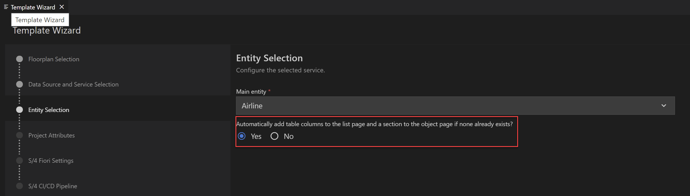

<!-- loio576f9fe2cd7649d4b13f882985cbc2e8 -->

# Automatic Generation

When generating your application, you have the option of automatically adding page elements, such as *List Report* table or *Object Page* section. You can select the option `Yes` during **entity selection** step when generating your application. A default annotation is generated depending on the template and based on the following logic:

`UI.FieldGroup`, `UI.Facets`, and `UI.LineItem` annotation terms are generated for the Main Entity type and saved in the local annotation file. This only happens if these annotation terms aren’t yet defined to avoid overriding.

-   `UI.LineItem` annotation is generated for the list report and contains `UI.DataField` records referencing the first properties of the main entity type. Hidden properties and properties of type UUID are excluded.
-   `UI.FieldGroup` and `UI.Facets` annotation referencing it in `UI.ReferenceFacet` records are generated on the main entity type for the *Form* and *Object Page*.
-   `UI.FieldGroup` contains `UI.DataField` records for all the direct properties of the main entity type. Hidden properties are excluded.

