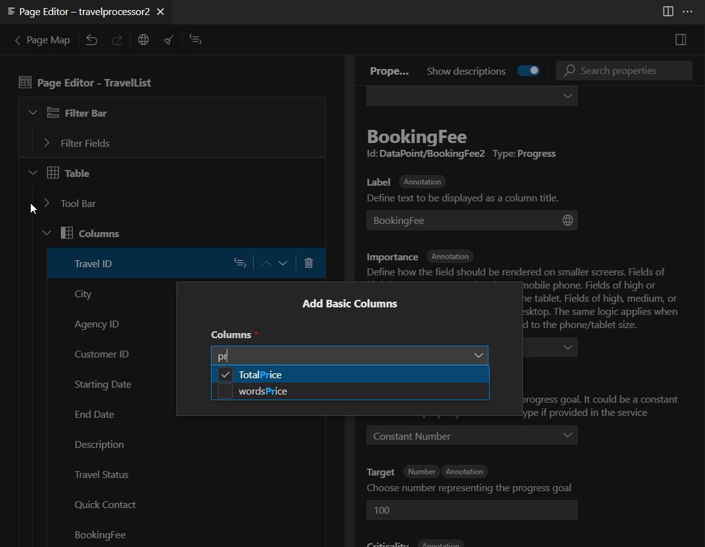

<!-- loio5f8c75b2b4f3468aa85e9658825389de -->

<link rel="stylesheet" type="text/css" href="../css/sap-icons.css"/>

# Basic Columns

A basic column is used for the standard representation of the value type. For example, it shows string values as text and numeric values as numbers. You can add multiple basic columns at a time by selecting more than one value in the *Columns* field. To find the desired value, you can filter the list of available options by typing in a few characters of the value name.

<a name="loio5f8c75b2b4f3468aa85e9658825389de__section_rnc_z5y_35b"/>

## Adding a Basic Column

To add a basic column to a table in a section, perform the following steps in the *Page Editor*:

1.  Click the :heavy_plus_sign: \(*Add*\) icon next to the *Columns* node.
2.  Click *Add Basic Columns*.
3.  Select columns in the *Columns* dropdown.
4.  Click *Add*.

    > ### Note:  
    > You cannot add the column based on the same value twice into the table.

Basic columns contain the following properties:

> ### Tip:  
> You can see a subset of these properties for a basic column depending on the value type and draft enablement.

-   [Label](appendix-457f2e9.md#loiod44832d99bdf4f73ba14cdbb16dc9301)
-   [Importance](appendix-457f2e9.md#loio7fe32a215209419da6d6c19da0f69ccb)
-   [Hidden](appendix-457f2e9.md#loiof7ad71792a0044d6b6172f078827bdc0)
-   [Text](appendix-457f2e9.md#loio5d1cc16e80ce48de8a47f2835a42cc47) \(for all value types except Boolean\)
-   [Text Arrangement](appendix-457f2e9.md#loioecd5568919bf43c5a04dd6b5e8e173f6) \(for all value types except Boolean\)
-   [Display Type](appendix-457f2e9.md#loio6544398b07024f4faff4bad25949b64d) \(for string values\)
-   [Restrictions](appendix-457f2e9.md#loio58fec66ebb1f48fbbd3092d3a1b27fda)
-   [Criticality](appendix-457f2e9.md#loio19d82b5d8bc940738afcb49b51a48bed) \(for string and numeric values\)
-   [Criticality Representation](appendix-457f2e9.md#loiof2b7486cb4644441979d818802b79940) \(for string and numeric values\)
-   [Display as Image](appendix-457f2e9.md#loio344568c1e4014621905d78857cf66401)
-   [Measures and Currencies](appendix-457f2e9.md#loio8ad2438ea4ed4a52ab530ff104530f98) \(for numeric values\)
-   [Semantic Object Name](appendix-457f2e9.md#loio90e03983431d4bfd927b51593a937955)
-   [Semantic Object Property Mapping](appendix-457f2e9.md#loio7726cb0d97194461973e3ec176c8a888)

<a name="loio5f8c75b2b4f3468aa85e9658825389de__section_pxb_cry_35b"/>

## Moving a Basic Column

To move a column within a table, use one of the following options:

-   **Drag and Drop**

    Hover over the table column outline, press and hold the mouse button while moving the mouse pointer to the different position within the table. Release the mouse button at the desired position. Eligible positions are highlighted in green.

    With drag and drop, you can move multiple columns at once by pressing [CTRL\] + [\+\]  .

-   **Arrow Icons**

    Click the \(*Move Up*\) or  \(*Move Down*\) icon next to the column name. This option only moves one column at a time.

<a name="loio5f8c75b2b4f3468aa85e9658825389de__section_adr_ksy_35b"/>

## Deleting a Basic Column

To delete a column, perform the following steps:

1.  Navigate to a column.
2.  Click the :wastebasket: \(*Delete*\) icon to open the *Delete Confirmation* popup window.
3.  Click *Delete* to confirm the action.

