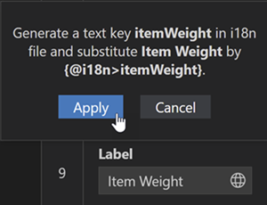
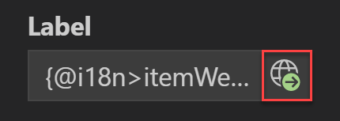

<!-- loio5781b2841a7742ec80b19e3ee20f26a4 -->

# Change the Code

You can make the code change by using Copy/Insert Snippet functionality. A code snippet provides a sample code that needs to be implemented in the respective file described in the guide step. In most cases, you need to provide input for the dynamic content that is substituted in the snippet. Once all the values are supplied, you can see the following options:

-   *Copy*. Copy the code snippet to the clipboard. You can then insert it into any file and change it as you wish.
-   *Insert Snippet*. Automatically inserts the code snippet into the relevant file. The applied change is highlighted, and the confirmation message “Code snippet has been successfully applied” appears.

> ### Note:  
> The *Insert Snippet* button is disabled if the guide can't be applied. It can happen if the guide refers to a different OData version or page type than the selected project, or if there's no project selected.

<a name="loio5781b2841a7742ec80b19e3ee20f26a4__section_c5p_2zy_h4b"/>

## Parameters in Guides

In some guides, code snippets don't have any parameters. Other guides contain drop-down lists and text boxes allowing you to specify the parameters to customize the code snippet.

Most drop-down lists parameters are context-dependent and only populated when guided development has the context. Also, there are static drop-down parameters, when the values in them remain the same regardless of the context. In some cases, parameters that only have one selection option available for the given project may automatically select that option.

Some parameters depend on each other. For example, the *Navigation Property* parameter in the **Add semantic highlights to line items in tables based on their criticality** guide can only be selected after a value is selected for the *Entity* parameter. Parameters that are dependent on a previous parameter selection will be marked with an info icon tooltip. Hover over the icon to see where another parameter selection is required.

Parameters can be mandatory and optional. Mandatory parameters are marked with an asterisk symbol at the end of their name. If you click *Insert Snippet* without providing values for mandatory parameters, you'll see an error message for each mandatory field that isn’t filled in. Some parameters also feature inline validation in the form of an error message to help you correct formatting issues. The error will be cleared and the *Insert Snippet* button will be reactivated once the issue is addressed. Similar inline error messages will also appear for duplicated parameters that would cause errors if inserted. Remove or change the parameter value to clear the error.

In addition, in some guides, such as **Add progress indicator column to a table** or **Add a field group as a section to a page**, parameters selected in the first step are prefilled in step 2 when appropriate. For example, the values selected for the *Entity* type parameter in step 1 will be filled as the default value for the *Entity* type in step 2 with the tooltip “1” displayed. If you want to change the prefilled values, you can do so manually.

In some guides where you can refer to annotations using qualifiers, you will be able to update these annotations by entering the existing qualifier in the guide. This will populate the rest of the parameters with values that reflect the current annotations. You can then update these values as needed and click *Insert Snippet* to confirm your changes. This functionality is currently available in the *Add a field group to an object page* and *Configure Multiple Views* guides.

[i18n\] keys for the globalization of your project can be automatically generated from the values you enter into input fields in guides. To create an [i18n\] key in guided development, enter a value into the input field and press the [Internationalization\] button.

A popup opens, asking if you would like to generate a text key for your value. Click *Apply*.

This will add the [i18n\] key to your `i18n.properties` file. You can click the updated [Internationalization\] button to jump to the file for further revisions if necessary.

