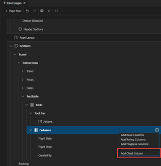

<!-- loiob78b3023e27b4078bab94189937fb550 -->

<link rel="stylesheet" type="text/css" href="../css/sap-icons.css"/>

# Chart Column

A chart column can be added to a table that is part of a *List Report* or in an *Object Page* section.

Depending on the desired chart type, you need to choose values for the mandatory properties.

<a name="loiob78b3023e27b4078bab94189937fb550__section_rnc_z5y_35b"/>

## Adding a Chart Column

To add a chart column to a table to a section, perform the following steps:

1.  Click *Add Chart Column* when clicking the :heavy_plus_sign: \(*Add*\) icon in the Columns node in the *Page Editor* .

    > ### Note:  
    > The *Add Chart Column* option is disabled if the table entity does not have any numeric properties.

2.  Chose a *Chart Type* using the tree control.

    > ### Note:  
    > Depending on the selected chart type, fill in additional properties as described below.

3.  Click *Add*. Depending on the desired chart type, you need to choose values for the mandatory properties.
    -   When the chart column is added, a new `UI.Chart` and `UI.DataPoint` annotation is created.

### Area Chart

-   **Value Source**: property to represent the chart data.
-   **Measure**: property representing a value in the chart.
-   **Dimension**: dimension to represent the x-axis of the chart by default..

The area chart has the following additional properties:

-   [Label](appendix-457f2e9.md#loiod44832d99bdf4f73ba14cdbb16dc9301)
-   [Importance](appendix-457f2e9.md#loio7fe32a215209419da6d6c19da0f69ccb)
-   [Hidden](appendix-457f2e9.md#loiof7ad71792a0044d6b6172f078827bdc0)
-   [Dimension](appendix-457f2e9.md#loio6514184c6c21405cab30fd41e9102897)
-   [Target Value](appendix-457f2e9.md#loioa9654b0fd63443d9b2727d1a497f84b6)
-   [Criticality Source](appendix-457f2e9.md#loioa94b995dd1dd4ee5b68dde0882a3ab29)

### Bullet Chart

-   **Value**: numeric property to represent the chart data.
-   **Maximum Value \(Path\)**: fixed number to represent the maximum possible value in the chart.

    > ### Note:  
    > You can set the Maximum Value to the numeric property in the Properties pane once you add the chart column.

The bullet chart column contains the following additional properties:

-   [Label](appendix-457f2e9.md#loiod44832d99bdf4f73ba14cdbb16dc9301)
-   [Importance](appendix-457f2e9.md#loio7fe32a215209419da6d6c19da0f69ccb)
-   [Hidden](appendix-457f2e9.md#loiof7ad71792a0044d6b6172f078827bdc0)
-   [Target Value](appendix-457f2e9.md#loioa9654b0fd63443d9b2727d1a497f84b6)
-   [Maximum Value Type](appendix-457f2e9.md#loio27fdaca358bb419f95290eebc86ed7da)
-   [Maximum Value](appendix-457f2e9.md#loiofb3939d43c884bf5b458657ef3f6f3be)
-   [Minimum Value Type](appendix-457f2e9.md#loiob3ecb1ff7aca434882b58f83176e8cb4)
-   [Minimum Value](appendix-457f2e9.md#loiobcca4bede254425d88e3fe13180194ed)
-   [Forecast Value](appendix-457f2e9.md#loio0cb6999ed1004cccbeb06fee763eb8bb)
-   [Criticality Source](appendix-457f2e9.md#loioa94b995dd1dd4ee5b68dde0882a3ab29)

### Column Chart

-   **Value Source**: property to represent the chart data.
-   **Measure**: property representing a value in the chart.
-   **Dimension**: dimension to represent the x-axis of the chart by default.

The column chart contains the following additional properties:

-   [Label](appendix-457f2e9.md#loiod44832d99bdf4f73ba14cdbb16dc9301)
-   [Importance](appendix-457f2e9.md#loio7fe32a215209419da6d6c19da0f69ccb)
-   [Hidden](appendix-457f2e9.md#loiof7ad71792a0044d6b6172f078827bdc0)
-   [Dimension](appendix-457f2e9.md#loio6514184c6c21405cab30fd41e9102897)
-   [Criticality Source](appendix-457f2e9.md#loioa94b995dd1dd4ee5b68dde0882a3ab29)

### Line Chart

-   **Value Source**: property to represent the chart data.
-   **Measure**: property representing a value in the chart.
-   **Dimension**: dimension to represent the x-axis of the chart by default..

The line chart contains the following additional properties:

-   [Label](appendix-457f2e9.md#loiod44832d99bdf4f73ba14cdbb16dc9301)
-   [Importance](appendix-457f2e9.md#loio7fe32a215209419da6d6c19da0f69ccb)
-   [Hidden](appendix-457f2e9.md#loiof7ad71792a0044d6b6172f078827bdc0)
-   [Measures](appendix-457f2e9.md#loiof7225b8412704a6cb8a7b45fda3f56fe)
-   [Dimension](appendix-457f2e9.md#loio6514184c6c21405cab30fd41e9102897)

### Radial Chart

-   **Value**: numeric property to represent the chart data.
-   **Target Value \(Path\)**: numeric property to represent the maximum possible value in the chart.

The radial chart contains the following additional properties:

-   [Label](appendix-457f2e9.md#loiod44832d99bdf4f73ba14cdbb16dc9301)
-   [Importance](appendix-457f2e9.md#loio7fe32a215209419da6d6c19da0f69ccb)
-   [Hidden](appendix-457f2e9.md#loiof7ad71792a0044d6b6172f078827bdc0)
-   [Target Value](appendix-457f2e9.md#loioa9654b0fd63443d9b2727d1a497f84b6)
-   [Criticality Source](appendix-457f2e9.md#loioa94b995dd1dd4ee5b68dde0882a3ab29)

### Comparison Chart

-   **Value Source**: property to represent the chart data.
-   **Measure**: property representing a value in the chart.
-   **Dimension**: dimension to represent the x-axis of the chart by default.

The comparison chart contains the following additional properties:

-   [Label](appendix-457f2e9.md#loiod44832d99bdf4f73ba14cdbb16dc9301)
-   [Importance](appendix-457f2e9.md#loio7fe32a215209419da6d6c19da0f69ccb)
-   [Hidden](appendix-457f2e9.md#loiof7ad71792a0044d6b6172f078827bdc0)
-   [Dimension](appendix-457f2e9.md#loio6514184c6c21405cab30fd41e9102897)
-   [Criticality for Micro Charts and Progress Indicators](appendix-457f2e9.md#loio19d82b5d8bc940738afcb49b51a48bed__section_xdw_kkj_kfc)

When a chart column is added, a new `UI.Chart` and `UI.DataPoint` annotation is created.

> ### Note:  
> The generated chart is based on the minimum required properties entered when adding the chart column. You can configure it further in the *Property Panel* by defining additional properties for the selected chart type, such as criticality and thresholds.

<a name="loiob78b3023e27b4078bab94189937fb550__section_amv_mry_35b"/>

## Moving Chart Column

To move a column within a table, use one of the following options:

-   **Drag and Drop**

    Hover over the table column outline, press and hold the mouse button while moving the mouse pointer to the different position within the table. Release the mouse button at the desired position. Eligible positions are highlighted in green.

    With drag and drop, you can move multiple columns at once by pressing [CTRL\] + [\+\]  .

-   **Arrow Icons**

    Click the \(*Move Up*\) or  \(*Move Down*\) icon next to the column name. This option only moves one column at a time.

<a name="loiob78b3023e27b4078bab94189937fb550__section_gg1_psy_35b"/>

## Deleting Chart Column

To delete a column, perform the following steps:

1.  Navigate to a column.
2.  Click the :wastebasket: \(*Delete*\) icon to open the *Delete Confirmation* popup window.
3.  Click *Delete* to confirm the action.

<a name="loiob78b3023e27b4078bab94189937fb550__section_n15_vy5_jfc"/>

## Sorting Micro Charts in Chart Columns

Sorting micro charts in chart columns is set in the *Sort Order* property of the chart column. This property is only visible if you have the *Presentation Variant* property defined for the micro chart column. This requires SAPUI5 version 1.130 or higher defined as the `minUI5Version` in the `manifest.json` file. You can only sort chart data in micro charts that are area, line, column, or comparison type.

### Presentation Variant

The *Presentation Variant* property shows the `UI.PresentationVariant` annotation that defines the micro chart column's sorting options. To view the sorting properties, you must set the *Presentation Variant: Annotation* to *New*.

When the *Presentation Variant: Annotation* is set, you can define one or more direct properties of the entity by which to sort the chart column. Under *Presentation Variant: Sort Order*, click *Add Sort Property*. A new table row for the sort property is added with *Property* and *Direction* fields. Choose a property and direction to sort by to update the sorting logic for your micro chart column.

If you have multiple sort properties, you can define in which order they apply by moving them up and down within the sort property.

You can remove the reference to the `UI.PresentationVariant` annotation generated by the *Page Editor* by setting the *Presentation Variant: Annotation* to *None*.

To remove unreferenced `UI.PresentationVariant` annotations generated by the *Page Editor* from the annotation file, run the cleanup procedure. This also removes the other unreferenced `UI.PresentationVariant` annotations defined with qualifiers to keep your annotation file as clean as possible.

