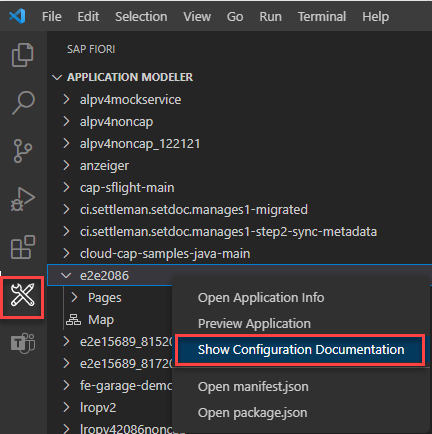

<!-- loio047507c86afa4e96bb3d284adb9f4726 -->

<link rel="stylesheet" type="text/css" href="../css/sap-icons.css"/>

# Configure Page Elements

Developers can configure the SAP Fiori elements applications by using manifest settings and SAPUI5 flexibility changes \(`OData V2`\) in the *Page Editor*. The configuration properties available for UI-based maintenance are provided by the <code><a href="https://www.npmjs.com/package/@sap/ux-specification">@sap/ux-specification</a></code> node module, which is installed in the application's root folder.

There are different module versions that correspond to the different SAPUI5 versions. You can find the right version by checking the UI5-\* tags at [@sap/ux-specification](https://www.npmjs.com/package/@sap/ux-specification?activeTab=versions). In case you need to change the **minUI5version** please see, [Application Minimum SAPUI5 Version](../Project-Functions/application-minimum-sapui5-version-009f43e.md).

An overview of the available manifest and **UI5** flexibility properties can be accessed in the [Application Information](../Project-Functions/application-information-c3e0989.md) page. In addition, you can access the Configuration Documentation by right-clicking on your project in the tree view of the application modeler.

<a name="loio047507c86afa4e96bb3d284adb9f4726__section_s4m_mxm_xlb"/>

## Page Editor Features

The *Page Editor* provides an outline view of the configurable elements on the selected page. To change settings, click on a node in the outline and the *Property Panel* will open. The *Property Panel* displays the editable properties, provides a search filter option, info tooltips for properties, and the option to edit the property directly in the associated file.

In the *Page Editor*, it’s now possible to create and maintain annotation-based UI elements for *List Report*, *Object Page*, and *Form Entry Page* `OData V4` applications. With this feature available in the application modeler, application development becomes even easier and up-to-speed. For more information, see [Maintaining Annotation-Based Elements](maintaining-annotation-based-elements-a524d8a.md).

### Supported Templates of SAP Fiori elements

-   *List Report Page* with `OData V2` and `OData V4`
-   *Worklist Page* with `OData V2` and `OData V4`
-   *Analytical List Page* with `OData V2` and `OData V4`
-   *Overview Page* with `OData V2` and `OData V4`
-   *Form Entry Object Page* with `OData V4`
-   *Custom Page* with `OData V4`

<a name="loio047507c86afa4e96bb3d284adb9f4726__section_k2b_vrl_1qb"/>

## How to Use Page Editor

To start using *Page Editor*, follow one of the available scenarios:

-   Select the root folder of your app or any folder in your workspace within Explorer, right-click, and select *Show Page Map*. See [Define Application Structure](define-application-structure-bae38e6.md) for more information about *Page Map*.
-   Select the page that you want to configure and click the [pencil icon\].
-   Navigate to the project sidebar view and click the respective page node in the tree view of the application modeler.
-   In the text editor of the virtual `JSON` file of the page, click the  \(*Show Page Editor*\) icon in the Editor Title menu.

<a name="loio047507c86afa4e96bb3d284adb9f4726__section_isw_gff_1qb"/>

## Application Modeler Tree View

By default, the project is displayed with a simplified tree view. The tree view reflects the hierarchy of the virtual files, such as *Project Name* \> *App Name* \> *Pages* \> *Page Name*.

To configure page layout and navigation, click the *Map* node that resides in the tree view. Then, the [Define Application Structure](define-application-structure-bae38e6.md) opens at the right side of the tree view.

If you want to switch to the technical view displaying the full path with all the files generated in the background, you need to enable the JSON schema files. To do so, perform the following steps:

1.  Navigate to *Settings* \> **.
2.  Select the *Show JSON Schemas* box.

As a result, the tree view of the application modeler is now updated with the generated `JSON` schemas files.

