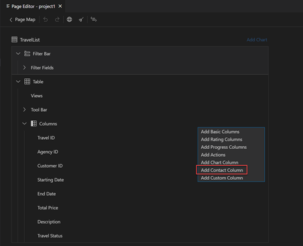

<!-- loiodc5931d0541040ab9e6126b9108b4154 -->

<link rel="stylesheet" type="text/css" href="../css/sap-icons.css"/>

# Contact Column

A contact column can be added to a table that is part of a list report or in an object page section.

<a name="loiodc5931d0541040ab9e6126b9108b4154__section_rl2_nmz_g5b"/>

## Adding a Contact Column

To add a contact column to a table to a section, perform the following steps:

1.  In the *Page Editor*, under the *Columns* node, click the :heavy_plus_sign: \(*Add*\) icon. Then, click *Add Contact Column* .
2.  Select *Contacts* using the tree control.
3.  Click *Add*. A new `Communication.Contact` annotation is created with the Contact Name label by default. You can change the default label in the *Property Panel*.

A contact column has the following additional properties:

-   [Label](appendix-457f2e9.md#loiod44832d99bdf4f73ba14cdbb16dc9301)
-   [Importance](appendix-457f2e9.md#loio7fe32a215209419da6d6c19da0f69ccb)
-   [Hidden](appendix-457f2e9.md#loiof7ad71792a0044d6b6172f078827bdc0)
-   [Contact](appendix-457f2e9.md#loio82d94533569741e5888536d49052198c)

<a name="loiodc5931d0541040ab9e6126b9108b4154__section_jpx_rfv_h5b"/>

## Moving a Contact Column

To move a column within a table, use one of the following options:

-   **Drag and Drop**

    Hover over the table column outline, press and hold the mouse button while moving the mouse pointer to the different position within the table. Release the mouse button at the desired position. Eligible positions are highlighted in green.

    With drag and drop, you can move multiple columns at once by pressing [CTRL\] + [\+\]  .

-   **Arrow Icons**

    Click the \(*Move Up*\) or  \(*Move Down*\) icon next to the column name. This option only moves one column at a time.

<a name="loiodc5931d0541040ab9e6126b9108b4154__section_oz3_kgv_h5b"/>

## Deleting a Contact Column

To delete a column, perform the following steps:

1.  Navigate to a column.
2.  Click the :wastebasket: \(*Delete*\) icon to open the *Delete Confirmation* popup window.
3.  Click *Delete* to confirm the action.

