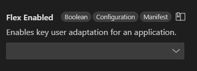
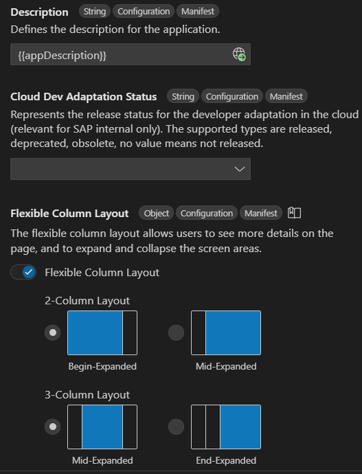

<!-- loiobae38e6216754a76896b926a3d6ac3a9 -->

<link rel="stylesheet" type="text/css" href="../css/sap-icons.css"/>

# Define Application Structure

Being part of the SAP Fiori Tools – Application Modeler extension, SAP Fiori tools *Page Map* allows to change the pages structure of the application and application-wide settings like the *Flexible Column Layout* that is available when using SAP Fiori elements.

> ### Tip:  
> Page Map also supports SAPUI5 freestyle applications. However, this is an experimental feature with a limited scope. For example, you cannot add and delete pages.

<a name="loiobae38e6216754a76896b926a3d6ac3a9__section_uph_2rk_xlb"/>

## Launching Page Map

You can launch the *Page Map* in several ways:

1.  *Application Info*

    For more information, see [Application Information](../Project-Functions/application-information-c3e0989.md).

2.  **Command Palette**.
    -   Open the *Command Palette*\([CMD/CTRL\] + [Shift\] + [P\] \) and start typing *Page Map*.
    -   Click *Fiori: Show Page Map*.
    -   In your workspace, select the SAP Fiori elements project.

3.  **Folder Context Menu**.

    If you already have a SAP Fiori elements project in your current workspace, right-click the project folder and click *Show Page Map*.

<a name="loiobae38e6216754a76896b926a3d6ac3a9__section_kqt_fwk_xlb"/>

## Using the Page Map

**Application Settings**

When the *Page Map* is open, you can see *Application Settings* in the default view. These settings contain the common and layout settings that are valid for the whole application.

-   To change the application title after the application was created, use the *Title* field.
-   To change the application description, use the *Description* field.
-   The *Flex Enabled* field indicates whether the application supports UI adaptation. This field has the following options available:

    -   `true`: Enables UI Adaptation.
    -   `false`: Disables UI Adaptation.

    The default value is undefined.

    

    For more information, see [SAPUI5 Flexibility: Enable Your App for UI Adaptation](https://sapui5.hana.ondemand.com/#/topic/f1430c0337534d469da3a56307ff76af)

-   After you change any setting, the update applies immediately.
-   To hide the panel, click *Toggle properties panel visibility* in the upper-right corner.

**Adding a New Page**

With the SAP Fiori tools *Page Map*, you can add additional pages to your application.

-   Click the  \(*Add New Page*\) icon in the header.
-   From the *Select Page Type* list, select *ObjectPage* and click *Add*.
-   In the *Navigation* field, select an entity that the page would navigate to.

    The list of available entities depends on the previous entity you navigate from. See [Configure Page Elements](configure-page-elements-047507c.md) for more information.

For `OData V4`, you can add a custom page.

-   Click the  \(*Add New Page*\) icon in the header of a page file.
-   From the *Select Page Type* list, select *CustomPage* and click *Add*.
-   In the *Navigation* field, select an entity that the custom page navigates to.
-   Under *Select your view*, select one of the following option buttons:
    -   *Create a New View*. Can create a new view.
    -   *Use Existing View*. Provides a list of the prepared sample custom views.

-   In the *View Name* field, enter the name of the view or select a value from the existing list.
-   Click *Add*. As a result, a success message appears, such as *Custom Page ProcessFlow added successfully*.

> ### Note:  
> For `OData V4` based applications, the templates used by the *Page Map* to provide this flexibility are published as part of our Open UX tools [`@sap-ux/fe-fpm-writer`](https://github.com/SAP/open-ux-tools/blob/main/packages/fe-fpm-writer/README.md). This new transparency allows everyone to inspect the sources behind the scenes.

**Configuring the Page**

Click the :pencil2: \(*Configure Page*\) icon in the header of a page file to open the outline view of the [Configure Page Elements](configure-page-elements-047507c.md). With [Configure Page Elements](configure-page-elements-047507c.md), you can edit page properties. You can also open [Configure Page Elements](configure-page-elements-047507c.md) from the tree view of the application modeler. When changes are applied, this is reflected in the `webapp/manifest.json` file or the SAPUI5 flexibility changes are updated accordingly.

**Deleting the Page** 

Click the :wastebasket: \(*Delete Page*\) icon to delete the page.

See [Fiori Design Guidelines: Layouts](https://experience.sap.com/fiori-design-web/list-report-floorplan-sap-fiori-element/) for more information about the Layout Settings.

