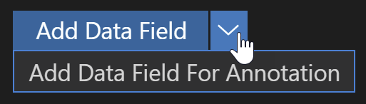
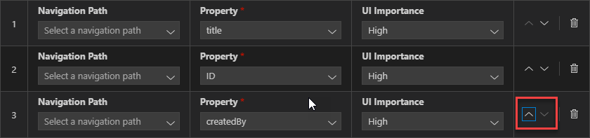
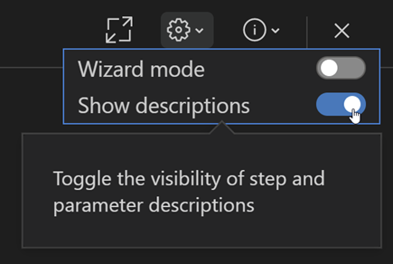

<!-- loioef157a5bc67f487794dee58f2bd51d0e -->

<link rel="stylesheet" type="text/css" href="../css/sap-icons.css"/>

# Develop with a Guide

Once the required guide is selected, click *Start Guide* under the description section to start the development process. By default, the guide is opened in a *side-by-side* mode. With this flexible mode, you can see both the guide window and the list of guides window side-by-side in split view.

-   You can adjust window by dragging the vertical line between the windows.
-   If you want to exit split view, navigate the pointer to the upper-right corner of the guide window and click the full-screen button.

    > ### Note:  
    > If you reduce the size of the application window, the list of guides will be hidden automatically.

A guide walks you through details of a specific feature/task that needs to be implemented in the application. It provides a short description of the feature, screenshots, and a reference to additional documentation containing more information on the topic. Links to additional documentation can be found under the  \(*Information*\) icon in the top-right corner of the Guide details screen.

If a guide involves creating annotations, it also includes a list of Annotation Terms used to implement the functionality. Navigate your pointer over “Annotation Term” to display a tooltip with more information about it.

To implement a feature, you need to follow all the steps provided in the selected guide.

A step includes:

-   Details of the file that would need to change.
-   A brief description of the change required.
-   Code snippet with sample code to implement the step.
-   Parameters to customize code snippet.

If required, you can select multiple values from a drop-down list. After you entered all the values, you can either apply the code snippet or copy it based on the instructions in the step. If an error is found with one or more of your parameter selections, guided development will scroll up to the parameter that needs correcting. Select another parameter to reactivate the Insert Snippet button.

Some guides may feature a table of parameters related to screen elements in your application. For example: the parameters that make up the columns in a table or the filter \(selection\) fields available in your project. The different rows represent the order of the elements in the application. New elements can be added using the [Add\] button. For example: [Add column\] or [Add selection field\]. This button will be found above the table, with an additional button present below the table if it has more than 5 rows. This is intended to reduce your need to scroll in the event you have a larger table. In some cases it may also be possible to select from different annotations, for example: [Add Data Field\] or [Add Data Field for Annotation\], via the dropdown next to the button. The parameters displayed in the new row will update based on your selection.

You can rearrange existing screen elements, as well as the ones added by the guide, by reordering the rows in the table. This can be done by clicking anywhere in the row and dragging it to the desired position. You can also rearrange elements using keyboard navigation. Once your focus is within the collection of parameters, press [Tab\] until your focus is on the parameter rearrangement arrows. The left and right arrow keys are used to switch between the up or down arrows. Press [Enter\] to move the row in the desired direction. Regardless of the method chosen to rearrange the collection of parameters, a loading indicator will indicate that the code snippet is being updated.

You can view the guide in different modes:

-   **Wizard mode \(default\)**
    -   Displays each step in a separate screen.
    -   Click the [Next\] button in the bottom left corner to navigate to the next step and the [Back\] button to return the previous step \(or guide description if there isn't a previous step\).
    -   You can also click the numbered step tiles at the top to get to any step directly.

-   **Full view mode**
    -   Displays all steps in one scrollable screen.
    -   You can also click the numbered step tiles at the top to get to any step directly.

-   **Show Descriptions \(default\)**
    -   Each guide step has a description of what the step achieves.
    -   Each parameter has a description of how it affects your project.

-   **Hide Descriptions**
    -   Step description and parameters description aren’t displayed.

To switch between Wizard mode and Full view mode, click the [Settings\] icon and switch the *Wizard mode* toggle.

To switch between Show Descriptions and Hide Descriptions mode, click the [Settings\] icon and switch the *Show Descriptions* toggle.

You can combine the modes as you like, such as using Wizard mode with Hide descriptions mode. That way, you can see each step separately, but without any descriptions of steps or parameters.

