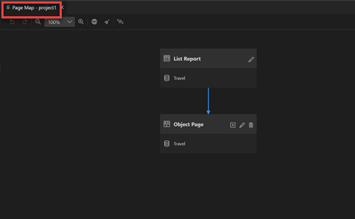
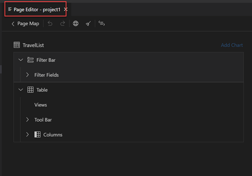
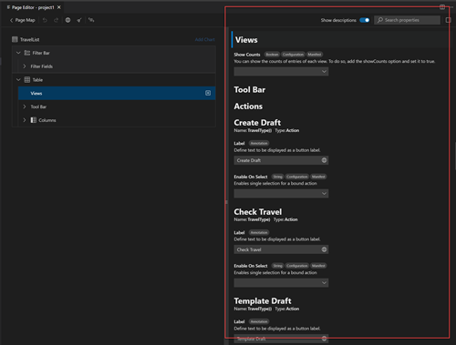
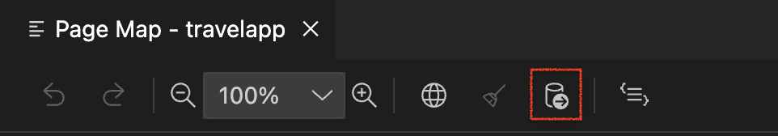

<!-- loioa9c004397af5461fbf765419fc1d606a -->

<link rel="stylesheet" type="text/css" href="../css/sap-icons.css"/>

# Developing an Application

Once the application has been [generated](../Generating-an-Application/SAP-Fiori-Elements/sap-fiori-elements-1488469.md), you can use SAP Fiori Tools – Application Modeler extension to [preview](../Previewing-an-Application/previewing-an-application-b962685.md) and customize the SAP Fiori elements application.

This extension provides the following capabilities.

-   [Define Application Structure](define-application-structure-bae38e6.md) - The *Page Map* provides a visual representation of the application pages, navigations, and the service entities that it uses. You can add new navigations and pages, delete pages, and navigate to corresponding editing tools. In addition, you can see global page settings that can be applied to the whole project.

    

    Click the :pencil2: \(*Configure Page*\) icon to open the *Page Editor*.

-   [Configure Page Elements](configure-page-elements-047507c.md) - The *Page Editor* provides an outline view of the configurable nodes on the selected page.

    

    Once you select any node to change the settings, the *Property Panel* opens.

    

    The saved changes are converted into corresponding artifact changes or UI flexibility changes in the project's folder of the application. Afterwards, the refresh of the [preview](../Previewing-an-Application/previewing-an-application-b962685.md) is triggered.

-   [Generating Mock Data with AI](../Previewing-an-Application/generating-mock-data-with-ai-815c310.md) - Application Modeler provides the ability to generate mock data by using the property names of entities to generate meaningful and contextually relevant data with AI.

    

