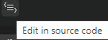
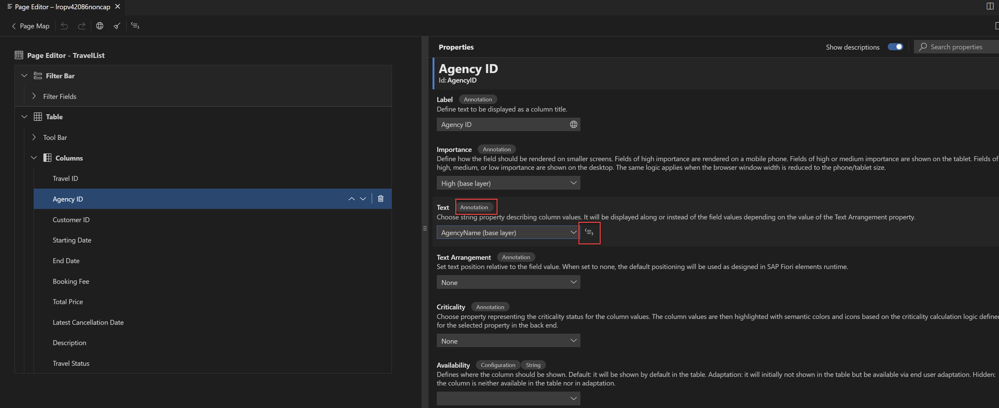

<!-- loio7d8e94278e084e949ff23adbe7ee9ce6 -->

# Edit in Source Code

With the edit in source code feature, the user can navigate to the code fragments in the annotation file where the related annotation is defined.

<a name="loio7d8e94278e084e949ff23adbe7ee9ce6__section_xns_mq4_bsb"/>

## How to Use the Feature

To find the *Edit in source code* icon in the *Property Panel* for editable and non-editable properties, locate the annotation tag, and click on the  \(*Edit in source code*\) icon next to the text field. If multiple definitions are present, a pop-up window with the options appears, and you can click a particular file to see the definition.

> ### Note:  
> Multiple definitions pop-up window are only available in Visual Studio Code. Only the first annotation is displayed in SAP Business Application Studio.

> ### Note:  
> There can be more than one way to configure a UI feature on a Fiori elements-based application. Some ways will be too complex for the *Page Editor* to interpret. In those cases, the respective field control \(dropdown, input field\), including the *Edit in source code* icon is not rendered in the *Properties Panel*. Instead, the *Edit in source code* link is displayed with the same functionality as the icon. You can then use this link to edit the property directly in the code.

