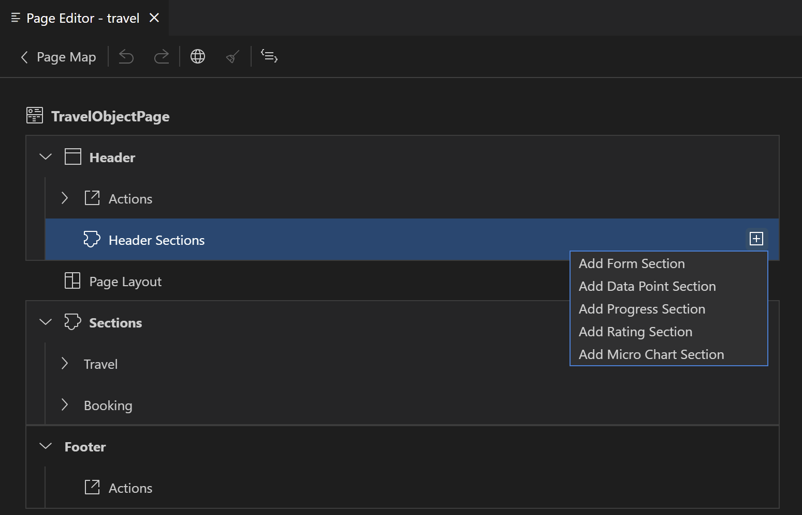

<!-- loioa05d7fc1bbbf42a0ade9fb50f6b58b56 -->

# Header

<a name="loioe26d602fe170401abb23d963bda7dd92"/>

<!-- loioe26d602fe170401abb23d963bda7dd92 -->

## Header Properties

The following annotation-based properties can be defined on the Header node of an *Object Page*

-   Type Name
-   [Type Name Plural](header-a05d7fc.md#loioe26d602fe170401abb23d963bda7dd92__TypeName)
-   [Title](header-a05d7fc.md#loioe26d602fe170401abb23d963bda7dd92__Title)
-   Description
-   [Image](header-a05d7fc.md#loioe26d602fe170401abb23d963bda7dd92__Image)
-   [Initials](header-a05d7fc.md#loioe26d602fe170401abb23d963bda7dd92__Initials)
-   [Icon URL](header-a05d7fc.md#loioe26d602fe170401abb23d963bda7dd92__URL)

All properties are based on annotation `@UI.HeaderInfo`.

If `@UI.HeaderInfo` doesn't exist, it will be created as soon as one of the properties above gets a value.

If `@UI.HeaderInfo` annotation it’s defined in the lower layer, such as service, the values of these properties are marked with the "\(base layer\)" suffix indicating the value origin. Once changed at least one property value, the complete annotation is copied to the local annotation file and \(base layer\) suffix is no longer displayed to indicate it.

### Type Name/Type Name Plural

String properties describing the main object of the page. `Type Name` is displayed in on the very top of the *Object Page*: `Type Name Plural` represents a plural form of the object name and is displayed as a table header on the previous page. As these properties are mandatory, they’re set to the empty string if not \(yet\) defined otherwise. The properties support internationalization. See [Internationalization \(i18n\)](internationalization-i18n-eb427f2.md) for more information.

### Title

Property representing the main object of the page. It’s displayed in the page header area. You can choose one of the direct properties of the page entity provided in the drop-down box. If you set it to **None**, *Object Page* header will not contain the title. Default text will be displayed instead. Always define the **Title** if the property **Visible** of the page header is set to **true**.

> ### Note:  
> None option isn’t available if the Title is defined in a lower layer such as service.

### Image

-   Adds property `ImageUrl` with the selected property as a value to the `UI.HeaderInfo`.
-   Value is a path pointing to string properties of the entity or of a to one associated entity.
-   To remove `ImageUrl` property, you can select option **None**.

For more information on images, see: [Using Images, Initials, and Icons](https://sapui5.hana.ondemand.com/sdk/#/topic/5760b638ea274d7aab59e4e434899528.html).

### Initials

-   Adds property `Initials` with the selected property as a value to the `UI.HeaderInfo`.
-   Value is a path pointing to string properties of the entity or of a to one associated entity.
-   To remove `Initials` property, you can select option `None`

### Icon URL

-   Adds property `TypeImageUrl` with the sap icon text as a value to the `UI.HeaderInfo`.

    > ### Example:  
    > sap-icon://accept

-   Value is a string pointing to sap icon, for example, from icon explorer.

<a name="loioed6ebe654f8d4aacb472c691eb11e5e3"/>

<!-- loioed6ebe654f8d4aacb472c691eb11e5e3 -->

## Header Actions

Header actions are displayed in the object page header as buttons. Header actions are based on the following records of `UI.Identification` annotation applied to the main entity of the page:

-   `UI.DataFieldForAction` with `Determining` property set to `false` or not defined. These actions are performed within the application.
-   `UI.DataFieldForIntentBasedNavigation` these actions are used for external navigation from the current application to a different \(target\) application configured in the SAP Fiori launchpad.

You can add, delete and maintain the header actions same as described in the [Table Actions](table-actions-da1931b.md) section.

> ### Note:  
> Properties applicable only to action columns \(*Importance, Requires Context*\) are not relevant and therefore not provided for header actions.

You can move header actions to the Form sections based on the same entity. You can move the actions based on `UI.DataFieldForAction` to the Footer.

<a name="loio8a127fc36f5640abaab0056e632fe630"/>

<!-- loio8a127fc36f5640abaab0056e632fe630 -->

## Header Section

Header sections show that the key information on the *Object Page* entity are displayed in the header area. The visualization of this information depends on the `section type. information`.

<a name="loio8a127fc36f5640abaab0056e632fe630__header_section"/>

## Adding Header Section

To add a Header section, perform the following steps:

1.  Click the *Object Page* to open the *Page Editor*.
2.  Navigate to the Header section now and click [\+\] icon.

    As a result, a list of section types supported in the page header appears.

3.  Choose the desired section type, respond to the prompts, and press *Add*.
4.  Depending on the section type selected, additional information is needed:
    -   Form Section - Label
    -   Data Point Section - Value Source Property
    -   Progress Section - Value Source Property
    -   Rating Section - Value Source Property
    -   Chart Header Section - Chart Type. You're prompted for more information depending on the selected chart type, same as for Chart Column.

Once the header section is generated, you can add and maintain its properties in the *Property Panel*.

### Form Section

The Form header section displays a group of fields under the common label. Once you add the Form section, no fields are added automatically. Add the fields you need using the [\+\] icon in the *Fields* node.

For more information, see [Form Section](form-section-4102b3d.md)

### Progress Section

The *Progress* header section visualizes the numeric value you chose as an indicator of a progress towards a certain target. You can modify the generated label and a default target as well as define a description for your progress indicator, apply the semantic coloring based on the value criticality and provide a tooltip.

*Target* initially the progress indicator is generated based on the value you entered and the default target \(goal\) of 100. You can then modify the target by setting it to a different numeric constant or choose a numeric service property that represents a target. For that, you first choose the target value type and then the desired number or property.

See [Appendix](appendix-457f2e9.md#loio457f2e9699b5437fb09d56311055a4a0) for more information on [Criticality](appendix-457f2e9.md#loio19d82b5d8bc940738afcb49b51a48bed), [Measures and Currencies](appendix-457f2e9.md#loio8ad2438ea4ed4a52ab530ff104530f98) and [Tooltip](appendix-457f2e9.md#loio64af370703b94edb9b4068fda3e2a613).

### Data Point Section

The *Data Point* header section is used to display the single point of the key data. It's typically a number but can also be textual, for example, a status value. Initially, it is generated with a minimum property based on the value you entered. You can then enhance it in the properties pane with additional features, such as semantic coloring based on criticality. You can also add a tooltip describing the value. If your data point represents a numeric value, you can additionally define the measure or currency for it if this isn't done in the base level.

See [Appendix](appendix-457f2e9.md#loio457f2e9699b5437fb09d56311055a4a0) for more information on [Criticality](appendix-457f2e9.md#loio19d82b5d8bc940738afcb49b51a48bed), [Measures and Currencies](appendix-457f2e9.md#loio8ad2438ea4ed4a52ab530ff104530f98) and [Tooltip](appendix-457f2e9.md#loio64af370703b94edb9b4068fda3e2a613).

### Rating Section

The *Rating* header section displays numeric value you chose with the corresponding number of stars out of the certain maximum \(target\). Initially it's generated based on the value you entered and default target value of 5. Subsequently, you can modify the generated label and set the target to any other integer number in the properties pane as well as enter a description and a tooltip.

See [Appendix](appendix-457f2e9.md#loio457f2e9699b5437fb09d56311055a4a0) for more information on [Criticality](appendix-457f2e9.md#loio19d82b5d8bc940738afcb49b51a48bed), [Measures and Currencies](appendix-457f2e9.md#loio8ad2438ea4ed4a52ab530ff104530f98) and [Tooltip](appendix-457f2e9.md#loio64af370703b94edb9b4068fda3e2a613).

### Micro Chart Section

The *Micro Chart* header section allows you visualizing the numeric properties of your service as micro charts of different types. Initially micro charts are generated based on the minimum required information you entered and some assumed defaults. You can modify some of the generated chart properties as well as define optional ones in the properties pane.

Required and optional properties you can configure depend on the selected chart type.

> ### Note:  
> You can't change the type or main value \(measure\) of the micro chart. If you need to modify one of these properties, just add a new micro chart section and delete an existing one instead.

**Radial Chart**

Radial chart displays the numeric value compared with the target. Both values you choose when generating a radial micro chart. Then you can choose a different numeric service property to be used as a target in the properties pane, as well as set a description for your chart and apply the semantic coloring based on the value criticality.

See [Appendix](appendix-457f2e9.md#loio457f2e9699b5437fb09d56311055a4a0) for more information on [Description](appendix-457f2e9.md#loio53c6d1a41ee041e7a01918f14b4925e6) and [Criticality](appendix-457f2e9.md#loio19d82b5d8bc940738afcb49b51a48bed).

**Bullet Chart**

Bullet chart visualizes the numeric value on a given scale. Besides, the main value, you can display addition ones, such as target or forecast on the same scale as well as set a description for your chart and apply the semantic coloring based on the value criticality.

**Target Value**

Apart from the main value, bullet chart can also display an additional value as a target. You can choose a numeric service property to be used as a target in the properties pane.

**Forecast Value**

Bullet chart can also display an additional value to indicate a forecast. You can choose a numeric service property to be used as a forecast value in the properties pane.

### Minimum and Maximum Values

Bullet Chart scale is based on the minimum value \(by default 0\) and maximum value you chose when generating this micro chart.

You can modify the scale of the chart by updating these minimum and maximum values. You can either define these values based on the service properties of numeric type or as fixed number. For that, you first choose the Maximum \(Minimum\) value type and then the desired number or property.

### Criticality

To semantically color the bullet chart according to the value criticality, you can either choose a property with the criticality information or define the criticality information in place. So, first you need to choose the Criticality Source. When set to Property, you're prompted to choose a service property containing the criticality information. When set to Calculation, you have to choose the desired improvement direction:

-   Minimize: low values are considered as best
-   Maximize: hight values are considered as best
-   Target: values close to the target are considered as best Depending on the selected direction, enter the values to be used as threshold for critical and warning coloring.

See [Appendix](appendix-457f2e9.md#loio457f2e9699b5437fb09d56311055a4a0) for information on setting the radial chart description.

<a name="loio8a127fc36f5640abaab0056e632fe630__section_w12_yrj_bsb"/>

## Moving Header Section

The user can change the order of the sections in the application header. By using the drag-and-drop functionality, drag the required section to a different position within the *Header Sections* node:

-   When dropped, the records in the `UI.Facets` collection are reordered.
-   When SAP Fiori application is rendered, sections are displayed based on the records sequence in the `UI.HeaderFacets` annotation.

**Move multiple sections**

To move the multiple sections to another position, perform the following steps:

1.  Use the [Ctrl\] + [Click\]  combination to select more than one section.
2.  Drag the selected section to the desired position with your pointer.

<a name="loio8a127fc36f5640abaab0056e632fe630__section_rbl_mkv_t5b"/>

## Deleting Header Section

To delete the section in the application, perform the following steps:

1.  Navigate to the section node in the outline.
2.  Click the delete icon  to open the *Delete Confirmation* popup window.
3.  Click *Delete* to confirm the action.

> ### Note:  
> This action deletes respective `UI.ReferenceFacet` record from `UI.Facets`.

> ### Note:  
> To remove unreferenced `UI.FieldGroup` annotation, run the cleanup procedure that deletes the unreferenced annotation.

<a name="loio8a127fc36f5640abaab0056e632fe630__section_mqk_l5s_s5b"/>

## Maintaining Header Section Properties

### Label

All the *Header* sections regardless the type contain the *Label* property. It can be based on a different annotation properties depending on the section type. For example, the *Label* for the *Form* section is based on the *Label* property of the `UI.ReferenceFacet` record within the `UI.Facets` annotation since the *Label* of the *Data Point* section is based on the *Title* property of the `UI.Chart` annotation. Nevertheless, you can maintain the *Label* for all the *Header* section types in the same way. All the other *Header* section properties depend on the *Header* section type.

To change the section label, perform the following steps:

1.  Select the required section and navigate to the properties pane area.
2.  Enter a new name in the *Label* text box. This field defines the text to be displayed at a section label.

    As a result, the section is renamed both in the *Page Editor* and in the application preview.

See [Label Maintenance](appendix-457f2e9.md#loiod44832d99bdf4f73ba14cdbb16dc9301) for more information.

> ### Note:  
> See [Internationalization \(i18n\)](internationalization-i18n-eb427f2.md) for translation if not yet there.

