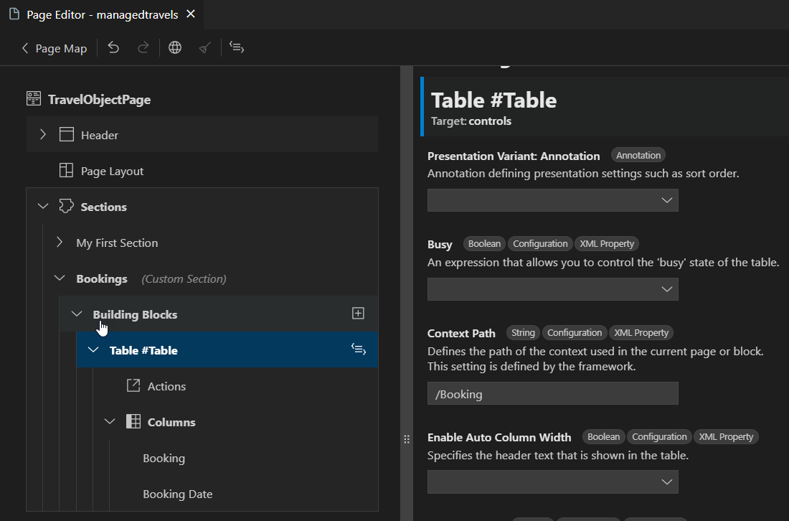

<!-- loio6d3ad83b9694475684d41f017bbccf20 -->

# Maintaining Building Blocks

The *Page Editor* supports adding and maintaining properties of SAP Fiori elements building blocks for OData V4-based applications. For more information about building blocks, see [Building Block Overview](https://sapui5.hana.ondemand.com/test-resources/sap/fe/core/fpmExplorer/index.html#/buildingBlocks/buildingBlockOverview).

> ### Note:  
> Currently, the *Page Editor* supports adding custom pages and custom sections to an object page.

You can see the existing building blocks in the *Page Editor*.

You can create the following building blocks using the *Page Editor*:

-   *Chart*
-   *Filter Bar*
-   *Table*

The *Page Editor* property panel shows XML properties and annotation properties, both of which can be modified.

