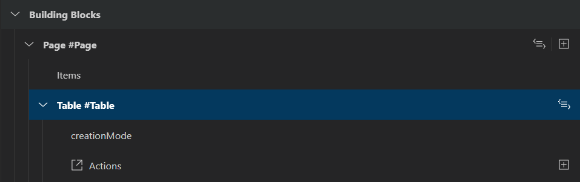
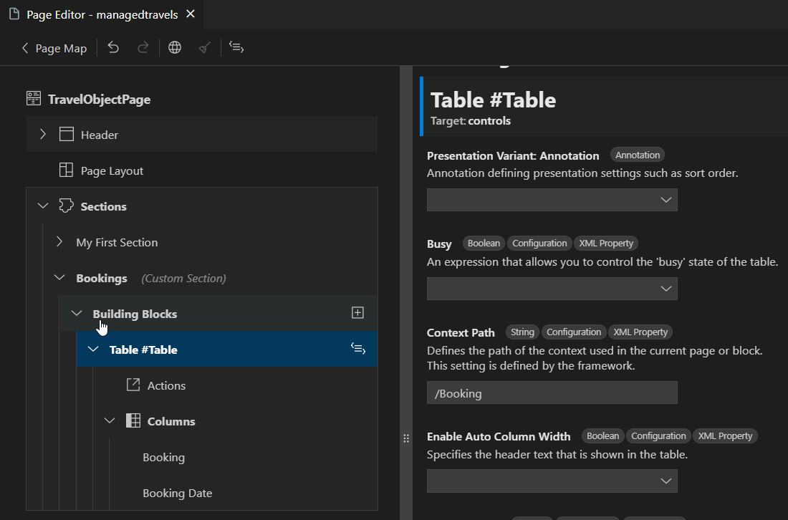

<!-- loio6d3ad83b9694475684d41f017bbccf20 -->

# Maintaining Building Blocks \(Experimental\)

Starting as of version 1.10.1, *Page Editor* supports adding and maintaining properties of SAP Fiori elements building blocks for `OData V4`-based applications. For more information about building blocks, see [Building Block Overview](https://sapui5.hana.ondemand.com/test-resources/sap/fe/core/fpmExplorer/index.html#/buildingBlocks/buildingBlockOverview).

This feature is currently an experimental one and is subject to changes and enhancements based on customer feedback.

> ### Note:  
> Currently, it only supports Custom Pages and Custom Sections of *Object Page*.

You can see the existing building blocks in the *Page Editor*.

Creation of the following building blocks is possible via integration with guided development:

-   *Chart*
-   *Filterbar*
-   *Table*

For more information, see [Develop with a Guide](develop-with-a-guide-ef157a5.md).

The *Page Editor* property panel shows XML properties and annotation properties, both of which can be modified.

