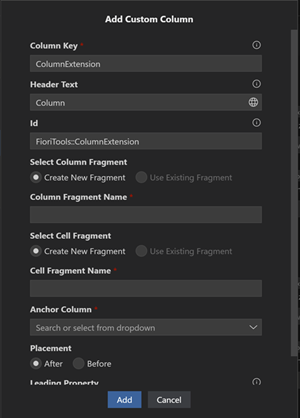
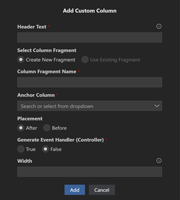
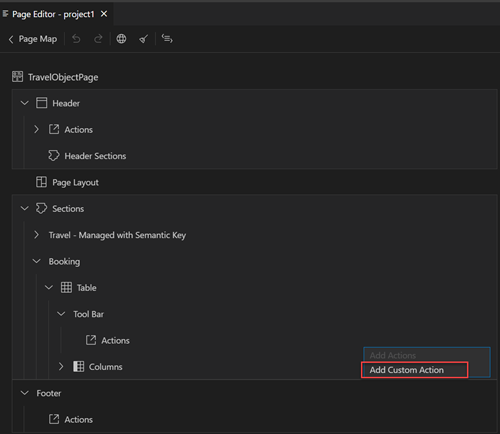
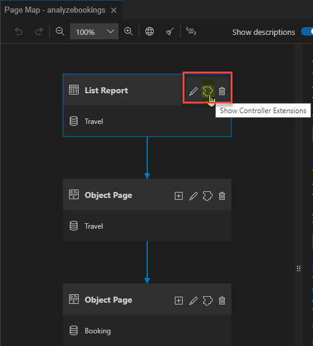
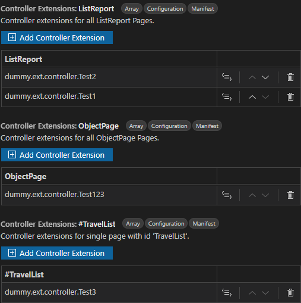
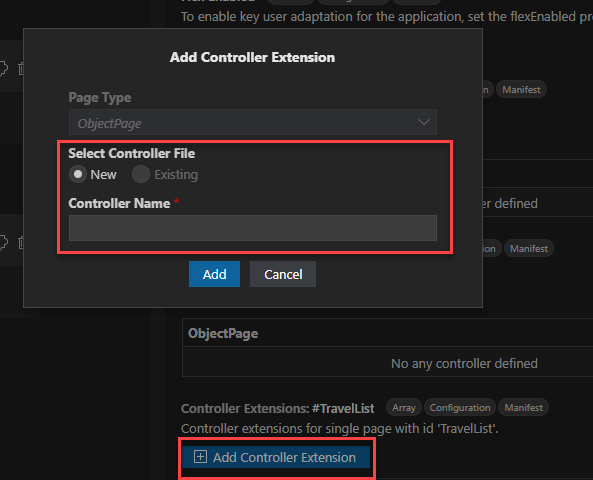

<!-- loio02172d2bb461469f83c18c834613232c -->

<link rel="stylesheet" type="text/css" href="../css/sap-icons.css"/>

# Maintaining Extension-Based Elements

> ### Note:  
> For OData V4 based applications, the templates used by the *Page Editor* to provide this flexibility is published as part of our Open UX tools [`@sap-ux/fe-fpm-writer`](https://github.com/SAP/open-ux-tools/blob/main/packages/fe-fpm-writer/README.md). This new transparency allows everyone to inspect the source behind the scenes.

<a name="loioa95f614fdbff4c60baa6467c913b6d44"/>

<!-- loioa95f614fdbff4c60baa6467c913b6d44 -->

## Adding Custom Column

You have the ability to create a custom column for your table in a *List Report* or *Analytical Chart* page.

<a name="loioa95f614fdbff4c60baa6467c913b6d44__section_ur2_br3_wnb"/>

## Custom Column \(OData V2 Only\)

1.  In the *Page Editor* outline view next to the *Columns* header, click the :heavy_plus_sign: \(*Add*\) icon to add a new column.
2.  Provide the following information:
    -   **Column Key** - A key for the column.
    -   **Header Text** - A title for the column.
    -   **ID** - A unique ID for the column which is automatically created, but can be modified.
    -   **Select Column Fragment**
        -   Create New Fragment
        -   Use Existing Fragment

    -   **Column Fragment Name**
    -   **Select Cell Fragment** \(for responsive table type\)
        -   Create New Fragment
        -   Use Existing Fragment

    -   **Cell Fragment Name**
    -   **Anchor Column** - Select one of existing columns in the table. You can select where you want to insert the custom column, before or after the selected target column.
    -   **Placement** - Before/After
    -   **Leading Property** - If the content of your custom column refers to a property such as \{Price\}, you need to include a corresponding `leadingProperty` entry in the column definition.

The custom column fragment and cell code are looked up and written to the project's `ext` folder. A custom column can be dragged into a new position using the handle in outline view. Click the :wastebasket: \(*Delete*\) icon to delete a custom column.

<a name="loioa95f614fdbff4c60baa6467c913b6d44__section_tnr_243_rsb"/>

## Custom Column \(OData V4 Only\)

1.  In the *Page Editor* outline view next to the *Columns* header, click the :heavy_plus_sign: \(*Add*\) icon to add a new column.
2.  Provide the following information:

    -   **Header Text**- A title for the column.
    -   **Select Column Fragment**
        -   Create New Fragment
        -   Use Existing Fragment

    -   **Column Fragment Name**
    -   **Anchor Column** - Select an existing column in the table.
    -   **Placement** - Before/After. You can select where you want to insert the custom column, before or after the selected anchor column.
    -   **Generate Event Handler** - True/False
    -   **Width** - The width of the new column

    

The custom column fragment and optional default controller code is written to the project's `ext` folder. A custom column can be dragged into a new position using the handle in outline view. Click the :wastebasket: \(*Delete*\) icon to delete a custom column.

<a name="loiode514dafa2364693baeabbb40d564006"/>

<!-- loiode514dafa2364693baeabbb40d564006 -->

## Adding Custom Section

You can create a custom section as part of your *Object Page* using the *Page Editor*.

1.  In the *Page Editor* outline view of your *Object Page*, click the :heavy_plus_sign: \(*Add*\) icon on the *Sections* node. For OData V4, click *Add Custom Section* from the menu. For OData V2, the selection is prefilled.
2.  Provide the following information:
    -   **Title** - The label of the custom section.
    -   **View Type** - The types are **View** or **Fragment** \(`OData V2` only\).
    -   **Select Your Fragment/View**- Choose new or existing.
    -   **Fragment/View Name** - The file name of the artifact.
    -   **Anchor Section** - Select one of the existing sections in the *Object Page*.
    -   **Placement** - before, after, or replace \(OData V2 only\)
    -   **Generate Event Handler** - Decide whether a demo controller is to be created \(OData V4 only\).

After clicking *Add*, the custom section fragment, view, and or controller code is written to the project's `ext` folder. A custom section can be dragged into a new position using the handle in outline view. Click the :wastebasket: \(*Delete*\) icon to delete a custom section.

<a name="loio76374b198e514b39a96176094bb8aa1b"/>

<!-- loio76374b198e514b39a96176094bb8aa1b -->

## Adding Custom Action

You can create a custom action in your *List Report* and *Object Page* using the *Page Editor* for OData V4 applications.

1.  In the *Page Editor*, click the :heavy_plus_sign: \(*Add*\) icon on the *Actions* node and click *Add Custom Action* from the menu.
2.  Provide the following information:
    -   **Action ID** - ID for the action.
    -   **Button Text** - Text displayed on the button.
    -   **Anchor** - Key of another action to be used as placement anchor.
    -   **Placement** - Define placement after or before the anchor action.
    -   **Action Handler File** - Decide if you want to add to exiting file or create new action handler file.
    -   **Handler File** - If you selected add to existing file, select the action handler file.
    -   **Action Handler Method** - Select if you want to create new function or add to an existing function.
    -   **Handler Method** - Select handler method.
    -   **Required Selection** - Toggle if this is required or not.

After clicking *Add*, the custom action is written to the project's `ext` folder. A custom action can be dragged into a new position using the handle in outline view. Click the :wastebasket: \(*Delete*\) icon to delete a custom action.

> ### Note:  
> This feature is only available for OData V4 and with `@sap/ux-specification` version 1.96 or higher. For more information, see [https://www.npmjs.com/package/@sap/ux-specification](https://www.npmjs.com/package/@sap/ux-specification).

<a name="loiodbb5c734f310444a93a612e3db4b9b97"/>

<!-- loiodbb5c734f310444a93a612e3db4b9b97 -->

## Adding Custom View

You can create a custom view in your *List Report* and *Object Page* using the *Page Editor* for OData V4 applications.

1.  In the *Page Editor*, click the :heavy_plus_sign: \(*Add*\) icon on the *View* node and click *Add Custom View* from the menu.

    > ### Note:  
    > The custom view feature is only available on List Reports that do not contain a chart.

2.  Provide the following information:
    -   **Key** - A key for the view.
    -   **Label** - A title for the view.
    -   **Select Your Fragment** - Enter a new fragment or choose an existing one.
    -   **Fragment Name** - The file name of the artifact.
    -   **Generate Event Handler** - Decide whether a demo controller needs to be created.

After clicking *Add*, the custom view is written to the project's `ext` folder. A custom view can be dragged into a new position using the handle in outline view. Click the :wastebasket: \(*Delete*\) icon to delete a custom view.

> ### Note:  
> This feature is only available for OData V4 and with `@sap/ux-specification` version 1.96.29, 1.102.14 or higher. For more information, see [https://www.npmjs.com/package/@sap/ux-specification](https://www.npmjs.com/package/@sap/ux-specification).

<a name="loiofe286b8483f84963877e44d4c817b0ed"/>

<!-- loiofe286b8483f84963877e44d4c817b0ed -->

## Adding Controller Extension

You can create a controller extension as part of your *List Report* and *Object Page* using the *Page Map* for OData V4 applications.

1.  Launch the *Page Map*. For more information, see the *Launching Page Map* section in [Define Application Structure](define-application-structure-bae38e6.md).

2.  In the *Page Map* view, click the  \(*Show Controller Extensions*\) icon for your selected page.

    

3.  You see the list of existing controller extensions for the selected page in the Properties Panel.

    

4.  You can add a new controller extension by clicking *Add Controller Extension*.

    

    In the pop-up window, provide the required information.

5.  You can then change the order in which the extensions are executed using the drag-and-drop functionality, or using the  \(*Move Up*\) or  \(*Move Down*\) icons.

6.  You can also click the  \(*Edit in source code*\) icon to navigate to the respective controller code file.

> ### Tip:  
> For more information about controller extensions and related examples, see [Controller Extensions](https://sapui5.hana.ondemand.com/test-resources/sap/fe/core/fpmExplorer/index.html#/controllerExtensions/controllerExtensionsOverview/guidanceControllerExtensions).

