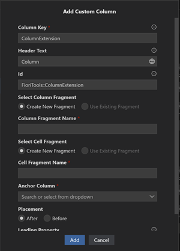
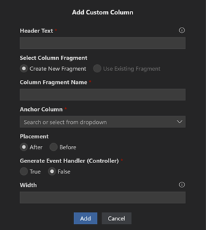
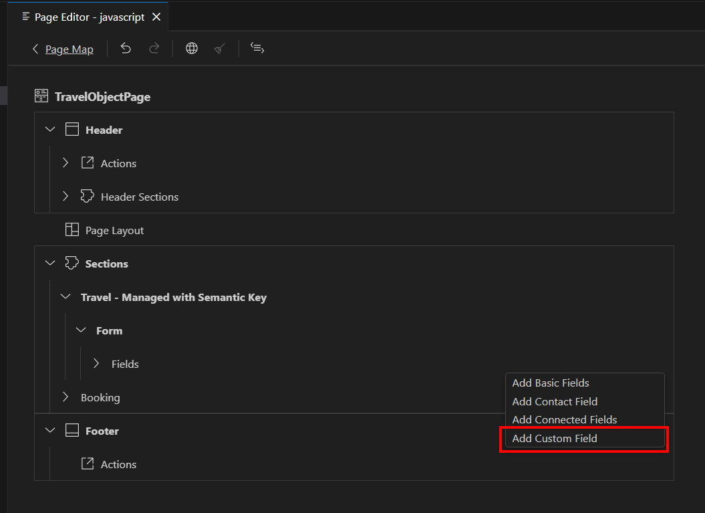
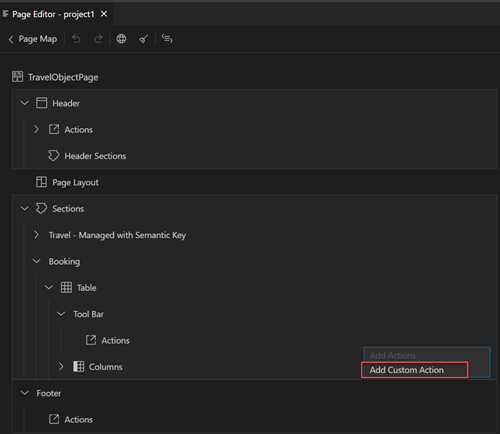
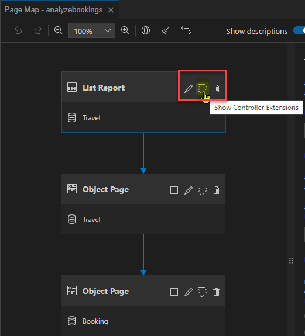
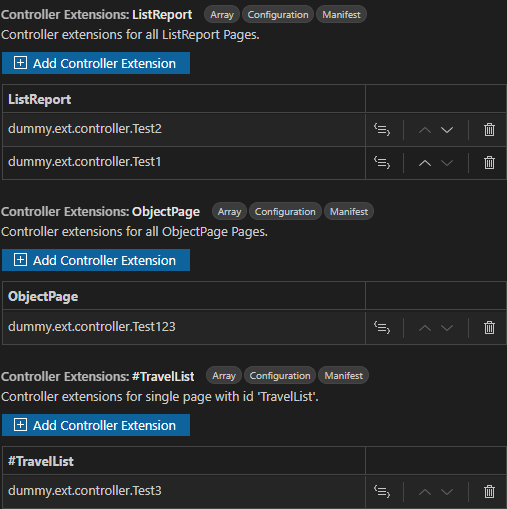
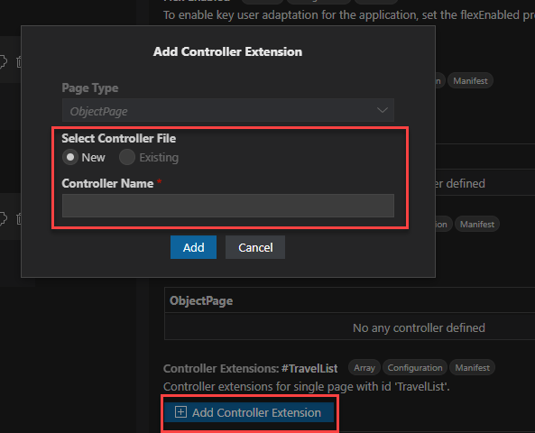

<!-- loio02172d2bb461469f83c18c834613232c -->

<link rel="stylesheet" type="text/css" href="../css/sap-icons.css"/>

# Maintaining Extension-Based Elements

You can maintain extension-based elements using the *Page Editor*.

> ### Note:  
> You can view the source code behind this functionality, which is published as part of Open UX tools. For more information, see [@sap-ux/fe-fpm-writer](https://github.com/SAP/open-ux-tools/blob/main/packages/fe-fpm-writer/README.md).

<a name="loioa95f614fdbff4c60baa6467c913b6d44"/>

<!-- loioa95f614fdbff4c60baa6467c913b6d44 -->

## Adding Custom Column

You can create a custom column for your table in a list report page or an analytical chart.

<a name="loioa95f614fdbff4c60baa6467c913b6d44__section_ur2_br3_wnb"/>

## Custom Column \(OData V2\)

1.  In the *Page Editor* next to the *Columns* header, click the :heavy_plus_sign: \(*Add*\) icon to add a new column.
2.  Provide the following information:
    -   *Column Key*: Provide a key for the column.
    -   *Header Text*: Provide a title for the column.
    -   *ID*: Provide a unique ID for the column which is automatically created, but can be modified.
    -   *Select Column Fragment:* Select *Create New Fragment* or *Use Existing Fragment*.
    -   *Column Fragment Name*: Provide a name for the column fragment.
    -   *Select Cell Fragment*: Select *Create New Fragment* or *Use Existing Fragment*. This property is only applicable to the responsive table type.
    -   *Cell Fragment Name*: Provide a name for the cell fragment.
    -   *Anchor Column*: Select one of existing columns in the table.
    -   *Placement*: Select *After* or *Before* to choose whether you want to insert the custom column, before or after the anchor column.
    -   *Leading Property*: If the content of your custom column refers to a property such as `{Price}`, you need to include a corresponding `leadingProperty` entry in the column definition.

The custom column fragment and cell code are written to the project's `ext` folder. A custom column can be dragged into a new position using the handle in the outline view. Click the :wastebasket: \(*Delete*\) icon to delete a custom column.

<a name="loioa95f614fdbff4c60baa6467c913b6d44__section_tnr_243_rsb"/>

## Custom Column \(OData V4\)

1.  In the *Page Editor* outline view next to the *Columns* header, click the :heavy_plus_sign: \(*Add*\) icon to add a new column.
2.  Provide the following information:

    -   *Header Text*: Provide a title for the column.
    -   *Select Column Fragment*: Select *Create New Fragment* or *Use Existing Fragment*.
    -   *Column Fragment Name*: Provide a name for the column fragment.
    -   *Anchor Column*: Select an existing column in the table.
    -   *Placement*: Select *After* or *Before* to choose whether you want to insert the custom column, before or after the anchor column.
    -   *Generate Event Handler* Select *True* or *False*.
    -   *Width*: Provide the width of the column as a CSS size.

    

The custom column fragment and optional default controller code is written to the project's `ext` folder. A custom column can be dragged into a new position using the handle in outline view. Click the :wastebasket: \(*Delete*\) icon to delete a custom column.

<a name="loiode514dafa2364693baeabbb40d564006"/>

<!-- loiode514dafa2364693baeabbb40d564006 -->

## Adding Custom Section

You can create a custom section as part of your object page using the *Page Editor*.

1.  Open the *Page Editor* for your object page.
2.  Click the :heavy_plus_sign: \(*Add*\) icon on the *Sections* node.
3.  For OData V4 applications, perform the following:
    1.  Click *Add Custom Section*.
    2.  Perform the following for the properties in the dialog:
        1.  *Title*: Provide a label for the custom section.
        2.  *Select Your Fragment*: Select *Create New Fragment* or *Use Existing Fragment*.
        3.  *Fragment*: Provide a file name for the artifact.
        4.  *Anchor Section*: Select one of the existing sections in the object page.
        5.  *Placement*: Select *After* or *Before*.
        6.  *Generate Event Handler*: Decide whether a demo controller is to be created.

4.  For OData V2 applications, perform the following for the properties in the dialog:
    1.  *Title*: Provide a label for the custom section.
    2.  *View Type*: Select *View* or *Fragment*.
    3.  If you chose *View*, perform the following:
        1.  *Select Your View*: Select *Create New View* or *Use Existing View*.
        2.  *View Name*: Provide a file name for the artifact.

    4.  If you chose *Fragment*, perform the following:
        1.  *Select Your Fragment*: Select *Create New Fragment* or *Use Existing Fragment*.
        2.  *Fragment Name*: Provide a file name for the artifact.

    5.  *Anchor Section*: Select one of the existing sections in the object page.

        > ### Note:  
        > You cannot anchor to a custom section in OData V2. You can only anchor to an annotation facet or section.

    6.  *Placement*: Select *After*, *Before*, or *Replace*.

5.  Click *Add*.

The fragment, view, and controller code for the custom section is written to the project's `ext` folder. You can drag a custom section into a different position using the handle in the outline view. Click the :wastebasket: \(*Delete*\) icon to delete a custom section.

<a name="loioe00eab06bc244e0286ad438453918b49"/>

<!-- loioe00eab06bc244e0286ad438453918b49 -->

## Adding Custom Field

You can create a custom field as part of your *Object Page* using the *Page Editor*.

1.  In the *Page Editor* outline view of your *Object Page*, click the :heavy_plus_sign: \(*Add*\) icon on the *Fields* node and click *Add Custom Field* from the menu.

    

2.  Provide the following information:
    -   **Label**: The label of the custom field.
    -   **Select Your Fragment/View**: Choose new or existing.
    -   **Fragment/View Name**: The file name of the artifact.
    -   **Anchor**: Select one of the existing fields in the fields group.
    -   **Placement**: You can select where you want to insert the custom field, before or after the selected anchor field.
    -   **Generate Event Handler**: Decide whether a demo controller is to be created.

After clicking *Add*, the custom field fragment and optional default controller code is written to the project's `ext` folder. A custom field can be dragged into a new position using the handle in the outline view. Click the :wastebasket: \(*Delete*\) icon to delete a custom field.

<a name="loio76374b198e514b39a96176094bb8aa1b"/>

<!-- loio76374b198e514b39a96176094bb8aa1b -->

## Adding Custom Action

You can create a custom action in your *List Report* and *Object Page* using the *Page Editor* for OData V4 applications.

1.  In the *Page Editor*, click the :heavy_plus_sign: \(*Add*\) icon on the *Actions* node and click *Add Custom Action* from the menu.
2.  Provide the following information:
    -   **Action ID** - ID for the action.
    -   **Button Text** - Text displayed on the button.
    -   **Anchor** - Key of another action to be used as placement anchor.
    -   **Placement** - Define placement after or before the anchor action.
    -   **Action Handler File** - Decide if you want to add to exiting file or create new action handler file.
    -   **Handler File** - If you selected add to existing file, select the action handler file.
    -   **Action Handler Method** - Select if you want to create new function or add to an existing function.
    -   **Handler Method** - Select handler method.
    -   **Required Selection** - Toggle if this is required or not.

After clicking *Add*, the custom action is written to the project's `ext` folder. A custom action can be dragged into a new position using the handle in outline view. Click the :wastebasket: \(*Delete*\) icon to delete a custom action.

> ### Note:  
> This feature is only available for OData V4 and with `@sap/ux-specification` version 1.96 or higher. For more information, see [https://www.npmjs.com/package/@sap/ux-specification](https://www.npmjs.com/package/@sap/ux-specification).

<a name="loiodbb5c734f310444a93a612e3db4b9b97"/>

<!-- loiodbb5c734f310444a93a612e3db4b9b97 -->

## Adding Custom View

You can create a custom view in your *List Report* and *Object Page* using the *Page Editor* for OData V4 applications.

1.  In the *Page Editor*, click the :heavy_plus_sign: \(*Add*\) icon on the *View* node and click *Add Custom View* from the menu.

    > ### Note:  
    > The custom view feature is only available on List Reports that do not contain a chart.

2.  Provide the following information:
    -   **Key** - A key for the view.
    -   **Label** - A title for the view.
    -   **Select Your Fragment** - Enter a new fragment or choose an existing one.
    -   **Fragment Name** - The file name of the artifact.
    -   **Generate Event Handler** - Decide whether a demo controller needs to be created.

After clicking *Add*, the custom view is written to the project's `ext` folder. A custom view can be dragged into a new position using the handle in outline view. Click the :wastebasket: \(*Delete*\) icon to delete a custom view.

> ### Note:  
> This feature is only available for OData V4 and with `@sap/ux-specification` version 1.96.29, 1.102.14 or higher. For more information, see [https://www.npmjs.com/package/@sap/ux-specification](https://www.npmjs.com/package/@sap/ux-specification).

<a name="loiofe286b8483f84963877e44d4c817b0ed"/>

<!-- loiofe286b8483f84963877e44d4c817b0ed -->

## Adding Controller Extension

You can create a controller extension as part of your *List Report* and *Object Page* using the *Page Map* for OData V4 applications.

1.  Launch the *Page Map*. For more information, see the *Launching Page Map* section in [Define Application Structure](define-application-structure-bae38e6.md).

2.  In the *Page Map* view, click the  \(*Show Controller Extensions*\) icon for your selected page.

    

3.  You see the list of existing controller extensions for the selected page in the Properties Panel.

    

4.  You can add a new controller extension by clicking *Add Controller Extension*.

    

    In the pop-up window, provide the required information.

5.  You can then change the order in which the extensions are executed using the drag-and-drop functionality, or using the  \(*Move Up*\) or  \(*Move Down*\) icons.

6.  You can also click the  \(*Edit in source code*\) icon to navigate to the respective controller code file.

> ### Tip:  
> For more information about controller extensions and related examples, see [Controller Extensions](https://sapui5.hana.ondemand.com/test-resources/sap/fe/core/fpmExplorer/index.html#/controllerExtensions/controllerExtensionsOverview/guidanceControllerExtensions).

