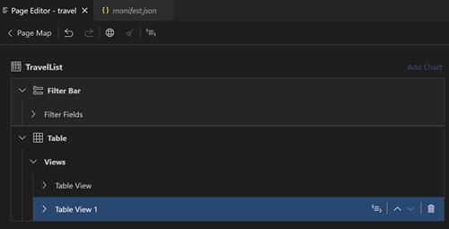

<!-- loioc62b82e124a74c1684f0d51f0db41c81 -->

# Multiple Views

You can configure your *List Report* to display one or more additional tables and charts next to the main *List Report* table in separate views. The user of your application can switch between views using an icon tab bar. The tables in the views can be based on any entity in your service. The charts can be based on any entity as long as it contains aggregatable and groupable properties.

> ### Note:  
> Groupable and aggregatable properties are defined on the service level with`@Aggregation.ApplySupported`. If it'sn't provided, you can't generate chart views with *Page Editor*. If you want to use custom aggregations for chart measures, your service should also have properties aggregated with `@Aggregation.CustomAggregate`.

If you want to use the transformation aggregations, make sure your app runs with SAPUI5 version **1.106** or **higher** to ensure transformation aggregation with `@Analytics.AggregatedProperty` is supported. Transformation aggregation with `@Analytics.AggregatedProperties` isn't supported as this annotation is deprecated in favor of `@Analytics.AggregatedProperty`, see [OData Analytics](https://sap.github.io/odata-vocabularies/vocabularies/Analytics.html).

> ### Note:  
> You can’t configure multiple views if your *List Report* is configured to display an *Analytical Chart* above or as alternative to the main *List Report* table, see [Analytical Chart](analytical-chart-9c086ec.md). You can delete*Analytical Chart* to enable adding views.

<a name="loioc62b82e124a74c1684f0d51f0db41c81__section_l5k_mcb_15b"/>

## Adding a Table or Chart View

1.  In the *Page Editor* for the *List Report* page, click [\+\] on the Views node.
2.  In the popup menu, select [Add Table View\] or [Add Chart View\]. A popup dialog allows to choose an `Entity` from the OData Service. If you chose to [Add Chart View\], you’re also prompted for the minimum required data to generate a chart: chart type, a dimension, and a measure.

    A measure can be specified by selecting one of the following:

    -   Use existing measure
    -   Create new measure

    If you choose to use existing measure, select one of the available measures defined with custom or transformation aggregations in the *Name* field.

    If you choose to create new measure, choose the *aggregatable* property and one of the supported aggregation methods.

    This allows you to create a new *dynamic* measure and use it in the chart.

    > ### Note:  
    > The technical name and the label is generated automatically . You can then adjust the generated label in the *Property Panel*.

    > ### Note:  
    > Create new measure only works with transformation aggregations so it should be used for the apps runs with SAPUI5 version **1.106** or **higher**. If all the possible measures based on all the aggregatable properties and supported aggregation methods are already defined in the project, you can't create a new measure. Use the existing measure instead.

3.  Press [Add\] in the dialog. In the Page Editor,** a new subnode is appended to the Views node with generated view label.

    > ### Note:  
    > The table is added with no columns. You can add columns using [\+\] button for the **Columns** subnode.

The following changes take place in the annotation file:

-   `UI.LineItem` or `UI.Chart` annotation with qualifier is generated targeting the `EntityType` referenced by the selected `EntitySet`.
-   If you chose to create a new measure, `@Analytics.AggregatedProperty` is applied to the selected aggregatable property with your chosen aggregation method.
-   `Views/Paths` section in `manifest.json` is generated or appended with an entry pointing to the generated `UI.SelectionPresentationVariant`. If different from the main `EntitySet` of the, *List Report* the chosen `EntitySet` is added to the paths entry.

> ### Note:  
> If the `Views/Paths` section in `manifest.json` didn’t exist before, second entry is created with table or chart view, with the first entry representing the original table.

<a name="loioc62b82e124a74c1684f0d51f0db41c81__section_nm3_hwh_15b"/>

## Moving Table or Chart View

All table or chart views are represented as subnodes of **views** node. Drag and drop them or use the corresponding [Move Up\] + [Move Down\]  buttons to change view sequence in *Lt Report*.

<a name="loioc62b82e124a74c1684f0d51f0db41c81__section_pxg_3wh_15b"/>

## Deleting Table or Chart View

To remove a table or chart view, press the [Delete\] icon on the corresponding **views** node.

> ### Note:  
> It's not possible to remove the last table view that is based on the main entity set of the *List Report*.

If all views except the last table view are deleted, *List Report* is implicitly converted into plain *List Report*:

-   `Views/Paths` section in `manifest.json` is removed.
-   If needed: `defaultTemplateAnnotationPath` in `manifest.json` is created to point to an `UI.SelectionPresentationVariant`.
-   **Views do**n't display any subnodes: details of the *List Report* \(columns, actions, etc.\) can be maintained in the `Table` node.

<a name="loioc62b82e124a74c1684f0d51f0db41c81__section_ecv_4mx_d5b"/>

## Table or Chart View Properties

**View Label**

View label is a text used to indicate a view on an icon tab bar above the table or chart. It’s auto-generated when you add a view. You can change the generated label by entering the text that is meaningful in your application context.

> ### Note:  
> View label can be prepared for translation, for more information see Internationalization \(i18n\)[Internationalization \(i18n\)](internationalization-i18n-eb427f2.md).

**Presentation Variant**

`Presentation Variant` property lets you define the representation of the table or chart data such as sorting.

`Presentation Variant` property lets you sort the table data and is maintained the same way as in the standard *List Report* table. See [Table](table-aaff7b1.md) for more information.

`Presentation Variant` for the chart view is maintained the same way as in the [Analytical Chart](analytical-chart-9c086ec.md).

> ### Note:  
> As different views in the *List Report* aren't necessary based on the same entity, you can’t reuse the same `Presentation Variant` for different views. For this reason, the options `From Chart` or `From Table` aren't provided. To have the same representation of different views, just define the same options for each related view.

