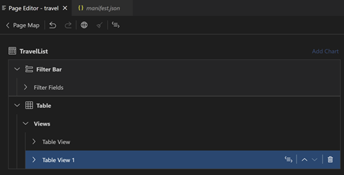

<!-- loioc62b82e124a74c1684f0d51f0db41c81 -->

<link rel="stylesheet" type="text/css" href="../css/sap-icons.css"/>

# Multiple Views

You can configure your list report page to display one or more additional tables and charts next to the main table in separate views.

Users can switch between views using an icon tab bar. Tables in the views can be based on any entity in your service. Charts can be based on any entity with custom or transformation aggregations.

If you want to use custom aggregations for chart measures, you must have aggregatable properties defined in the `@Aggregation.ApplySupported` annotation for the entity type or entity set or an `@Aggregation.CustomAggregate` annotation for the entity type or entity set where the qualifier matches the aggregated property name.

If you want to use the transformation aggregations, make sure your app runs with SAPUI5 version 1.106 or higher to ensure transformation aggregation with `@Analytics.AggregatedProperty` is supported. Transformation aggregation with `@Analytics.AggregatedProperties` isn't supported as this annotation was deprecated in favor of `@Analytics.AggregatedProperty`, see [OData Analytics](https://sap.github.io/odata-vocabularies/vocabularies/Analytics.html).

> ### Note:  
> You cannot configure multiple views if the list report page is configured to display an analytical chart. For more information, see [Analytical Chart](analytical-chart-9c086ec.md). You can delete an analytical chart to enable adding views.

<a name="loioc62b82e124a74c1684f0d51f0db41c81__section_l5k_mcb_15b"/>

## Adding a Table or Chart View

1.  Open the Page Editor.
2.  Click the :heavy_plus_sign: \(*Add*\) icon on the *Views* node.
3.  Click *Add Table View* or *Add Chart View*. Select an entity from the OData service.
4.  *Add Chart View*: Select *Use Existing Chart* or *Create New Chart*.
    1.  *Use Existing Chart*: Choose a `UI.PresentationVariant` annotation which references a `UI.Chart` annotation, or a `UI.SelectionPresentationVariant` annotation which references a `UI.Chart` annotation.
    2.  *Create New Chart*: Enter the minimum required data to generate a chart: a chart type, a dimension, and a measure.

        A measure can be specified by selecting one of the following options:

        -   *Use Existing Measure*
        -   *Create New Measure*

        If you choose to use an existing measure, select one of the available measures defined with custom or transformation aggregations in the *Name* field.

        If you choose to create a new measure, choose the aggregable property and one of the supported aggregation methods.

        This allows you to create a new dynamic measure and use it in the chart. The technical name and the label are generated automatically. You can then adjust the generated label in the Property Panel.

        > ### Note:  
        > *Create New Measure* only works with transformation aggregations so ensure your app runs with SAPUI5 version 1.106 or higher to ensure transformation aggregation with ***@Analytics.AggregatedProperty*** is supported. If all the possible measures based on all the aggregable properties and supported aggregation methods are already defined in the project, you cannot create a new measure. Use an existing measure instead.

5.  Click *Add* in the dialog. A new subnode is appended to the *Views* node with generated view label. The table is added with no columns. You can add columns using the :heavy_plus_sign: \(*Add*\) icon for the *Columns* subnode.

The following changes take place in the annotation file:

-   If you chose to add a table view or a chart view based on a new chart, a `UI.LineItem` or `UI.Chart` annotation with qualifier is generated which targets the `EntityType` referenced by the selected `EntitySet`.
-   If you chose to create a new measure, `@Analytics.AggregatedProperty` is applied to the selected aggregable property with your chosen aggregation method.
-   If you chose an existing chart, no annotations are created or updated.
-   A `Views` or `Paths` section in the `manifest.json` file is generated or appended with an entry pointing to the generated `UI.SelectionPresentationVariant`. If different from the main `EntitySet` of the list report page, the chosen `EntitySet` is added to the `paths` entry.

> ### Note:  
> If the `Views` or `Paths` section in the `manifest.json` file did not exist before, a second entry is created with the table or chart view, with the first entry representing the original table.

<a name="loioc62b82e124a74c1684f0d51f0db41c81__section_nm3_hwh_15b"/>

## Moving Table or Chart View

All table or chart views are represented as subnodes of the *Views* node. Drag and drop them or use the corresponding  \(*Move Up*\) or  \(*Move Down*\) icons to change the view sequence in the list report page.

<a name="loioc62b82e124a74c1684f0d51f0db41c81__section_pxg_3wh_15b"/>

## Deleting Table or Chart View

To remove a table or chart view, click the :wastebasket: \(*Delete*\) icon on the corresponding *Views* node.

> ### Note:  
> It's not possible to remove the last table view that is based on the main entity set of the list report page.

If all views except the last table view are deleted, the list report page is implicitly converted into a plain list report apge:

-   The `Views` or `Paths` section in the `manifest.json` file is removed.
-   If needed: `defaultTemplateAnnotationPath` in the `manifest.json` file is created to point to an `UI.SelectionPresentationVariant`.
-   Views do not display any subnodes: details of the list reports, such as columns and actions, can be maintained in the *Table* node.

<a name="loioc62b82e124a74c1684f0d51f0db41c81__section_ecv_4mx_d5b"/>

## Table or Chart View Properties

### View Label

The view label is a text used to indicate a view on an icon tab bar above the table or chart. It is auto-generated when you add a view. You can change the generated label by entering the text that is meaningful in your application context. The view label can be prepared for translation. For more information, see [Internationalization \(i18n\)](internationalization-i18n-eb427f2.md).

### Presentation Variant

The *Presentation Variant* property lets you define the representation of the table or chart data.

The *Presentation Variant* property lets you sort the table data and is maintained the same way as in the standard table in a list report page. For more information, see [Table](table-aaff7b1.md).

The *Presentation Variant* for the chart view is maintained the same way as in the [Analytical Chart](analytical-chart-9c086ec.md).

> ### Note:  
> As different views in the list report page are not necessary based on the same entity, you cannot reuse the same *Presentation Variant* for different views. For this reason, the *From Chart* and *From Table* options are not provided. To have the same representation of different views, just define the same options for each related view.

