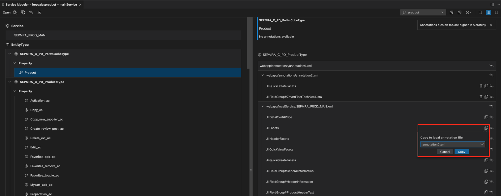

<!-- loio2f1bb9ce466b4e6fac37431f1343b95d -->

<link rel="stylesheet" type="text/css" href="../css/sap-icons.css"/>

# Overriding Annotations

The following is a list of steps of how to override back-end annotation to your local annotation file.

### Overriding backend Annotations

1.  Once you have found annotation of interest and are viewing backend annotation details.
2.  Click the  \(*Copy*\) icon opposite the **backend annotation**. This gives you a starting point for extending or customizing your application. Use [Maintaining Annotations with Language Server](maintaining-annotations-with-language-server-6fc93f8.md) to maintain your local annotation file.

    If there’s only one local annotation file associated to the service in the project, the annotation is copied automatically to that local annotation file. If there are multiple local annotation files associated to that service available in the project, you can choose which local annotation file you would like to copy the annotation to via a selection dropdown.

    > ### Note:  
    > You can add multiple local annotations files to your project.

    > ### Note:  
    > You can copy **local annotations** to and from **local annotation** files. You can't copy **local annotation** to **backend annotation** files.

    

### Creating Additional Annotation Files

1.  Right click on `manifest.json` file, select *Open Annotation File Manager*.
2.  Click *Create Local Annotation File*.
3.  Enter file name, namespace, and select the intended file folder location.
4.  Click *Create*.

> ### Note:  
> Additional annotation files can only be created for OData service, not CAP CDS.

