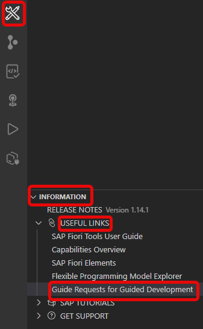

<!-- loiob6722617735b4c60aae0d2ef04646c75 -->

<link rel="stylesheet" type="text/css" href="../css/sap-icons.css"/>

# Request a New Guide

The guides available in the guided development extension present the most commonly used features. There are also many more features available to SAP Fiori elements developers, which is why guided development also allows you to submit a request for a guide.

You can request a new guide through one of the following options:

-   Scroll to the bottom of the guides list and click *Request Guide* in the *Don't have what you are looking for?* section.
-   Enter *request guide* into the *Search guides* field.
-   Navigate your pointer to the  \(*Help*\) icon and select *Request New Guide* from the drop-down list.
-   Using the Command Palette entry: *Fiori: Request New Guide*.

-   From the *INFORMATION* panel, under the *USEFUL LINKS* section, choose *Guide Requests for Guided Development*.

    

How to use the **Request Guide** form:

1.  Fill in your name, email, title for a new guide, and description of what you need.
2.  Click *Submit*.
3.  When an email client opens, check your message and click *Send*.

For more information about features available in SAP Fiori elements applications, see [Developing Apps with SAP Fiori elements](https://sapui5.hana.ondemand.com/#/topic/03265b0408e2432c9571d6b3feb6b1fd).

