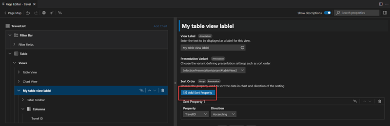

<!-- loioaaff7b105f8d4ab8ba7e0b3ac1509f0a -->

# Table

Table is an essential part of the *List Report* age. It’s based on the `UI.LineItem` annotation that can be generated along with the application, unless you choose differently in the SAP Fiori application generator. For more information, see [Overview](overview-66c5b6f.md).*Page Editor* lets you further configure the list report table by adding columns and actions.

Currently supported elements for *List Report* table are:

-   [Table Actions](table-actions-da1931b.md)
-   [Table Columns](table-columns-a80d603.md)

<a name="loioaaff7b105f8d4ab8ba7e0b3ac1509f0a__section_ow5_yyx_d5b"/>

## Table Sorting

Sorting table data is set in the `Presentation Variant` property of the table. A table node in *Page Editor* layout tree therefore has the annotation based properties `Presentation Variant` and `Sort Order`..

> ### Note:  
> Maintaining `Presentation Variant` and `Sort Order` in analytical charts is described in [Analytical Chart](analytical-chart-9c086ec.md).

### Presentation Variant

`Presentation Variant` property shows the `UI.SelectionPresentationVariant` or `UI.PresentationVariant` annotation defining the table presentation options, such as sorting or grouping. If `Presentation Variant` is not yet set for the table, you can have it generated by choosing `New` option in this property.

> ### Note:  
> If your *List Report* is configured with the *Analytical Chart*, you can also choose to reuse the `Presentation Variant` applied for that chart. In this case, sort order will apply for both chart and table.

When the `Presentation Variant`is set, you can define one or more direct properties of the entity to sort the table data by. For this, press the [Add Sort Property\] button. A new table row for the sort property is added with the **Property** and **Direction** fields. Update the default values for these fields in the table row if needed.

If you have more than one sort property, you can define in which order they apply to the table data by moving them up and down within the Sort Order property.

You can detach the `Presentation Variant` generated by the *Page Editor* by setting it to **None** unless your *List Report* is configured with [Multiple Views](multiple-views-c62b82e.md).

> ### Note:  
> This action deletes respective `UI.SelectionPresentationVariant` from the manifest.

> ### Note:  
> To remove unreferenced `UI.SelectionPresentationVariant` annotations generated by the *Page Editor* from the annotation file, run the cleanup procedure that deletes the unreferenced annotation. This will also remove the other unreferenced `UI.SelectionPresentationVariant` and `UI.PresentationVariant` annotations defined with qualifier to keep your annotation file as clean as possible.

