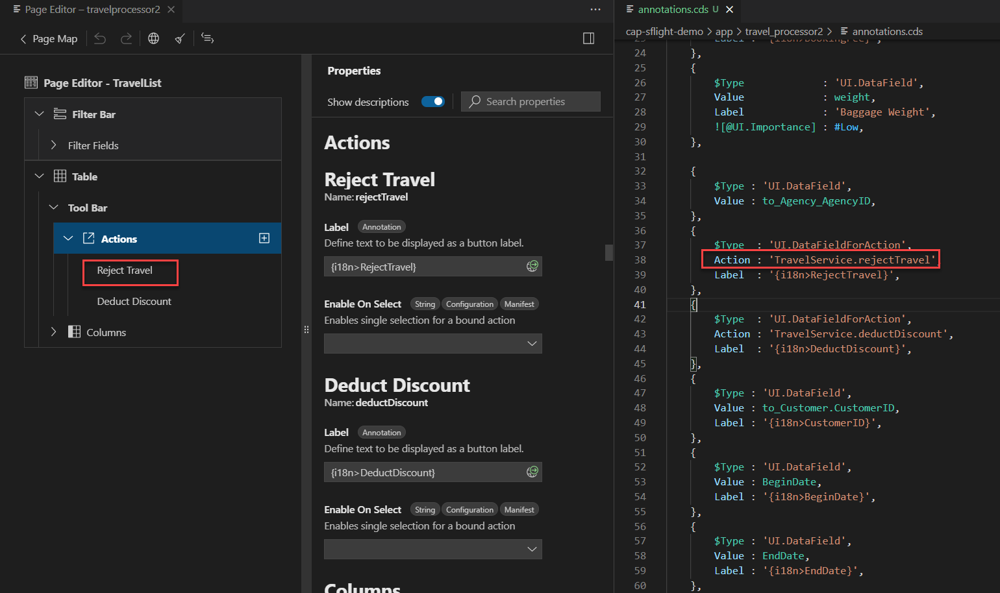

<!-- loioda1931b61b9442fd8f5f7d80cdd99aba -->

<link rel="stylesheet" type="text/css" href="../css/sap-icons.css"/>

# Table Actions

Table actions can be placed in a toolbar or inline in table rows in an object page section, or a list report. With the *Page Editor*, you can configure the actions to be performed within the application and external navigation actions to navigate to a different \(target\) application configured in SAP Fiori launchpad. The actions to be performed within the application are based on the records of type `UI.DataFieldForAction` and the actions for actions navigation to the different application are based on `UI.DataFieldForIntentBasedNavigation`.

> ### Note:  
> To enable the cross-application navigation, the appropriate configuration must be set in SAP Fiori launchpad and in the `manifest.json` file of the target application.

Toolbar and inline action definitions differ in the `Inline` property of `UI.DataFieldForAction`. This means that actions displayed as table columns are defined with the `Inline` property set to `true` in the corresponding record.

<a name="loioda1931b61b9442fd8f5f7d80cdd99aba__section_nhp_11m_zrb"/>

## Adding Actions

You can only add table actions if there is an available action or function defined in the service. Bound actions and bound functions are only considered if they are applied to the same entity type as `UI.LineItem` defining the table for which the action must be created.

You can only add external navigation actions if you know the semantic object name and action as defined in the target application.

Adding the table actions can be applied to the following nodes in the *Page Editor*:

-   *List Report*: *Columns* or *Tool Bar* node in a *Table* node.
-   *Object Page*: *Columns* or *Tool Bar* node in a *Table* section.

To add an action, do the following:

1.  Click the :heavy_plus_sign: \(*Add*\) icon in the respective node and choose the type of action to add.
2.  Provide the requested data:
    -   For table actions, choose *Action* or *Function*.
    -   For external navigation actions, enter the semantic object name and action name as defined in the target application.

3.  Click *Add*. The `Inline` property of `UI.DataFieldForAction` or`UI.DataFieldForIntentBasedNavigation` is added and set to `true`.

When an action is added as a table column, the `Inline` property of `UI.DataFieldForAction` is added and set to `true`.

<a name="loioda1931b61b9442fd8f5f7d80cdd99aba__section_ptv_psy_pfc"/>

## Adding Action Menus

You can add an action menu in the *Tool Bar* node of the *Table* node in a list report or object page. You can only add an action menu if there are actions which have not already been added to the node.

To add an action menu, proceed as follows:

1.  Click the  \(*Add Actions*\) icon next to *Actions*.
2.  Click *Add Action Menu*.
3.  Provide a *Label* for your action menu.
4.  Select the *Actions* you want to include in your action menu. Note: An action cannot be in two different action menus, and both inside and outside an action menu.
5.  Click *Add*.

<a name="loioda1931b61b9442fd8f5f7d80cdd99aba__section_yrp_b1m_zrb"/>

## Maintaining Table Action and Action Menu Properties

**Label**

The label for a table action to be performed within the application is derived from the existing `Common.Label` or `@title` annotations \(CAP CDS\) targeting the action.

If these annotations are missing, the `Label` property is generated within `UI.DataFieldForAction`. You can change the label and the changed value is persisted in `UI.DataFieldForAction`.

> ### Note:  
> When an action is deleted, the `Common.Label` or `@title` annotations are not deleted. Only the `Label` property of the `UI.DataFieldForAction` is deleted along with the table action.

The label for an external navigation action is derived from the **Semantic Object Name** and the **Semantic Object Action** you entered when adding the action. For example, if you entered `Customer` as the **Semantic Object Name** and **display** as the **Semantic Object Action**, the label is generated as **Display Customer**.

The label for an action menu is provided when the action menu is created.

**Importance**

The *Importance* property is provided when the action is added as a table column. For more information, see [Table Columns/Importance](table-columns-a80d603.md).

**Hidden**

You can hide an annotation-based table action or action menu in the application UI. For more information, see [Hidden](appendix-457f2e9.md#loiof7ad71792a0044d6b6172f078827bdc0) and [Hide by Property](appendix-457f2e9.md#loio4e8bb3df433546f8a80f16e53b29e4c1).

**Criticality**

You can highlight the annotation-based table actions located inline in table rows with semantic colors. To do so, set the *Criticality* property to *Positive* or *Negative*, depending on the semantic meaning of your action.

Note that the table toolbar cannot contain semantically highlighted buttons. Therefore, you cannot set the criticality for them or move actions with semantic highlighting from table columns to the table toolbar.

To remove the semantic highlighting from inline table actions, set the *Criticality* property to *None*.

**Semantic Object Name**

This property is required for the external navigation actions and must match the name of the relevant semantic object in the target application.

**Semantic Object Action**

This property is required for the external navigation actions and must match the name of the relevant action for the semantic object as defined in the launchpad configuration.

**Mapping**

If the semantic object name defined for the external navigation action differs in the current and target application, this property can be used to define the mapping.

Click *Add Semantic Mapping* and enter the name of the semantic object property as defined in the target application. Then, choose the local property corresponding to it. You can define only one mapping per external navigation action.

**Requires Context**

If a external navigation action is defined in the table toolbar, you can use this property to define whether a table row needs to be selected as a navigation context. By default, it is set to off, which is interpreted as "context not required" and the end user can choose this action without the table row selection. This property is not available for actions set as table columns because the context is always available.

<a name="loioda1931b61b9442fd8f5f7d80cdd99aba__section_ag2_dcw_ksb"/>

## Moving Actions and Action Menus

Moving a table action from the **toolbar** to **columns** or the other around switches the **Inline** property accordingly. A table action can only be moved within the same table.

Action menus and actions within action menus can also be moved. However, you cannot move the last action outside of an action menu if it means there would be no actions left.

<a name="loioda1931b61b9442fd8f5f7d80cdd99aba__section_sy4_btn_qxb"/>

## Deleting Actions and Action Menus

You can delete actions and action menus by clicking the :wastebasket: \(*Delete*\) icon.

