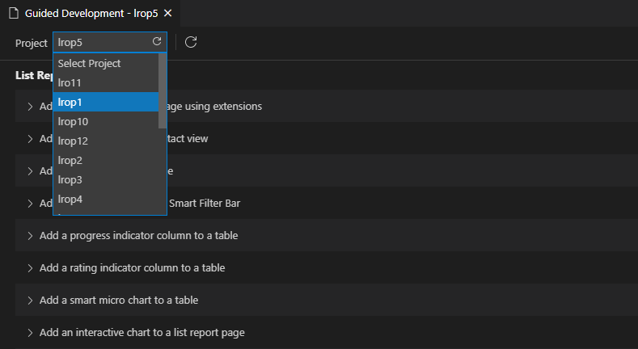

<!-- loio0c9e518ecf704b2f80a2bed0eaca60ae -->

# Use Feature Guides

With guided development, you can access **how-to** guides and tutorials that explain how to implement certain functionality in an SAP Fiori elements application. You can read through the steps required to implement a feature and then use the guided development approach to make the required changes in your project.

<a name="loio0c9e518ecf704b2f80a2bed0eaca60ae__section_g4l_234_slb"/>

## Launching Guided Development

You can launch guided development in the following ways:

### Using Command Palette

-   Open *Command Palette* \([CMD\]/[CTRL\] + [Shift\] + [P\]\).
-   Start typing *guided development*.
-   Select *Fiori: Open Guided Development* or *Fiori: Open Guided Development to the Side*.
-   Select SAP Fiori elements project from your workspace.

The *Fiori: Open Guided Development* option opens guided development in a new tab. The *Fiori: Open Guided Development to the Side* option opens guided development to the side of the current file in another column.

### Using folder context menu

If you already have a SAP Fiori elements project in your current workspace, you can right-click its folder and select *SAP Fiori tools - Open Guided Development*. Then, guided development opens to the side of the current file in another column.

> ### Note:  
> If you don’t have any SAP Fiori elements project in your workspace, you can still open guided development by using *Command Palette*. It’s possible to check the available guides descriptions and code samples, while interactive features are disabled in this case.

### Working with projects

Guided development can only work with one project at a time. The name of this project is displayed on the tab header next to guided development, and this project provides all project-specific data used in the guides.

The project-specific data contains the following components:

-   The list of entities in the *Entity* list.

-   The list of data sources in the *Model* list.

-   The list of pages in the *Page* list.

-   The annotation terms that are defined in the service across all the guides.

    > ### Note:  
    > In guided development, you can add annotations from services other than the mainService.

**To select or change a project.**

1.  Click *Select Project* on the left side of the toolbar.
2.  Select a project from the *Project* list.

    

In some cases, we recommend that you refresh **guided development**.

<table>
<tr>
<th valign="top">

When

</th>
<th valign="top">

How

</th>
</tr>
<tr>
<td valign="top">

When a new project is added to the workspace.

</td>
<td valign="top">

Click the “Refresh” icon inside the Project list.

</td>
</tr>
<tr>
<td valign="top">

When something in the current project is changed outside guided development, such as a new page added, or an underlying service is updated.

</td>
<td valign="top">

Click the “Refresh” icon on the toolbar next to the Project list.

</td>
</tr>
</table>

<a name="loio0c9e518ecf704b2f80a2bed0eaca60ae__section_lc1_hwm_1rb"/>

## Accessibility

You can navigate to guided development with either a mouse or a keyboard. Keyboard navigation provides a streamlined experience, allowing users to find and use guides without needing to use their mouse. Use the arrow keys to navigate within sections, the `Tab` key to navigate to new sections and controls, `Shift + Tab` to navigate back to sections and controls, and `Enter` to make selections.

Guided development supports the use of high contrast themes.

