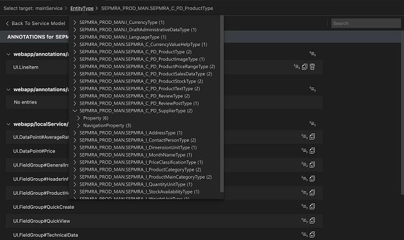
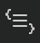
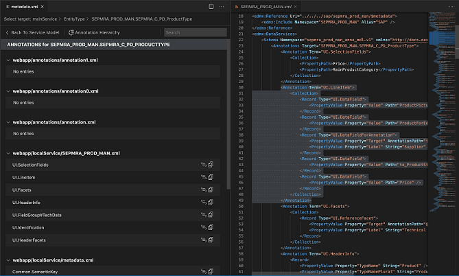

<!-- loio58784b52f2284532afe2ab161e0312c9 -->

# Visualizing Annotations with Service Modeler

You can view backend annotations in the SAP Fiori tools - Service Modeler, and maintain them with [XML Code Editor](maintaining-annotations-with-language-server-6fc93f8.md#loio6fc93f80827940809437365abdf85b75__XML_Code_Editor).

Only OData service and CAP service annotations are supported. Annotations are associated to: projections, entities, and properties and are identified by the annotation icon  in the entity or projection detail panel, or on the entity or projection node in the *Expanded View* and *List View*.

You can view the annotations associated to an entity, projection, or properties displayed in the Service Modeler *Annotation List View*.

For OData service, the Annotation *List View* displays the annotations associated to the target entity in both the backend and local annotations files. The annotation terms defined in the local annotation file win over the same annotation with the same qualifier and applied to the same target in the backend sources. Backend annotations can’t be edited via the SAP Fiori tools - Service Modeler tool but backend annotations can be overridden in the local annotation file and edited manually via a **text editor** or using the [XML Code Editor](maintaining-annotations-with-language-server-6fc93f8.md#loio6fc93f80827940809437365abdf85b75__XML_Code_Editor). The local annotations file is located: `/webapp/annotations/<filename>.xml`, see [XML Code Editor](maintaining-annotations-with-language-server-6fc93f8.md#loio6fc93f80827940809437365abdf85b75__XML_Code_Editor) for more information about how to work with local annotations.

<a name="loio58784b52f2284532afe2ab161e0312c9__section_uph_2rk_xlb"/>

## Launching Service Modeler for Annotations

Service Modeler can be launched in several ways.

**Using Command Palette**

-   Open *Command Palette*
-   Start typing *Service Modeler*
-   Select *SAP Fiori tools: Service Modeler: Open Service Modeler* 
-   Select SAP Fiori elements project from your workspace.

**Using folder context menu**

If you already have a SAP Fiori elements project in your current workspace, you can right-click on any folder in your project and *Open Service Modeler*.

**From the Text Editor**

If your `metadata.xml` file is open in the text editor, click on the annotations icon .

<a name="loio58784b52f2284532afe2ab161e0312c9__section_fcs_dn1_wlb"/>

## Using Service Modeler for Annotations

To view annotations associated to a projection.

1.  In any of the views, select the target projection.
2.  Click on the *annotation* icon  associated to the target projection or the property of the target projection in the project detail panel.
3.  Click on *show source* icon beside the annotation. The source file is opened to the side with the annotation hightlighted.

<a name="loio58784b52f2284532afe2ab161e0312c9__section_m2j_nhs_cnb"/>

## Searching for Annotations

1.  Select the target entity.
2.  Click *annotation* icon..
3.  Enter search criteria in the search input box in the upper-right corner.

<a name="loio58784b52f2284532afe2ab161e0312c9__section_erd_yhs_cnb"/>

## Changing Target

1.  Ensure you are in *List View*.
2.  Click the *select target* breadcrumb.
3.  Select a service, entity, or property.

<a name="loio58784b52f2284532afe2ab161e0312c9__section_fjp_hdj_ylb"/>

## Editing Annotations

You cannot edit backend annotations with the SAP Fiori tools - Service Modeler. However, you can edit local annotations by navigating to XML annotation language server with the Service Modeler.

1.  Select the target entity.
2.  Click the *annotation* icon .
3.  Click the *go to editor* icon  opposite the selected local annotation in the service local annotation file.

    

4.  Edit the local annotation manually in the [XML Code Editor](maintaining-annotations-with-language-server-6fc93f8.md#loio6fc93f80827940809437365abdf85b75__XML_Code_Editor) and save the local annotation file.

<a name="loio58784b52f2284532afe2ab161e0312c9__section_apf_xfs_cnb"/>

## Deleting Annotations

1.  Select the Target Entity.
2.  Click the *annotations* icon .
3.  Click the *delete* icon opposite to the selected local annotation in the service local annotation file.

