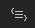
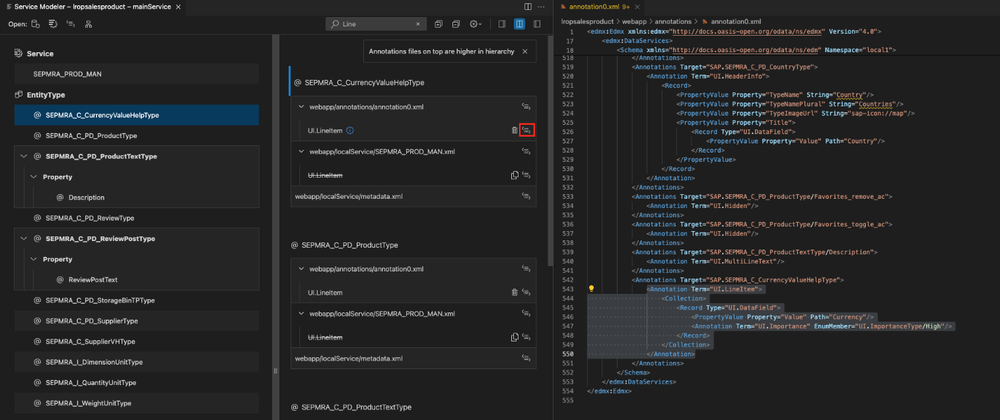

<!-- loio58784b52f2284532afe2ab161e0312c9 -->

<link rel="stylesheet" type="text/css" href="../css/sap-icons.css"/>

# Visualizing Annotations with Service Modeler

You can view back-end annotations in the SAP Fiori tools - Service Modeler, and maintain them with [XML Code Editor](maintaining-annotations-with-language-server-6fc93f8.md#loio6fc93f80827940809437365abdf85b75__XML_Code_Editor).

Only OData service and CAP service annotations are supported. Annotations are associated with entity types, entities, and properties and are identified by the  \(*Annotations*\) icon for the entity or properties in the tree list.

You can view the annotations associated with an entity type, entity, or properties displayed in the SAP Fiori tools - Service Modeler Annotation panel.

For OData service, the Annotation panel displays the annotations associated with the target entity in both the back end and local annotations files. The annotation terms defined in the local annotation file win over the same annotation with the same qualifier and applied to the same target in the back-end sources. Back-end annotations can’t be edited via the SAP Fiori tools - Service Modeler tool but back-end annotations can be overridden in the local annotation file and edited manually via a **text editor** or using the [XML Code Editor](maintaining-annotations-with-language-server-6fc93f8.md#loio6fc93f80827940809437365abdf85b75__XML_Code_Editor). The local annotations file is located at `/webapp/annotations/<filename>.xml`, for more information about how to work with local annotations, see [XML Code Editor](maintaining-annotations-with-language-server-6fc93f8.md#loio6fc93f80827940809437365abdf85b75__XML_Code_Editor).

<a name="loio58784b52f2284532afe2ab161e0312c9__section_uph_2rk_xlb"/>

## Launching Service Modeler for Annotations

Service Modeler can be launched in several ways.

**Using Command Palette**

-   Open *Command Palette*
-   Start typing *Service Modeler*
-   Select *SAP Fiori tools: Service Modeler: Open Service Modeler* 
-   Select SAP Fiori elements project from your workspace.

**Using folder context menu**

If you already have an SAP Fiori elements project in your current workspace, you can right-click any folder within your project and *Override Annotations*.

**From the Text Editor**

If your `metadata.xml` file is open in the text editor, click the  \(*Annotations*\) icon.

<a name="loio58784b52f2284532afe2ab161e0312c9__section_fcs_dn1_wlb"/>

## Using Service Modeler for Annotations

To view annotations associated with an entity type, do the following:

1.  In the tree list, select the target entity type or the property by expanding the entity type. This will highlight the annotations in the annotation panel.
2.  Click the  \(*Show in Source*\) icon beside the annotation. The source file is opened to the side with the annotation highlighted.

<a name="loio58784b52f2284532afe2ab161e0312c9__section_m2j_nhs_cnb"/>

## Searching for Annotations

Enter the search criteria in the search input box in the upper-right corner. The annotations matching the search criteria are listed in the annotation panel. The entity and properties to which the resulted annotations are associated are also filtered in the tree list.

<a name="loio58784b52f2284532afe2ab161e0312c9__section_fjp_hdj_ylb"/>

## Editing Annotations

You can’t edit back-end annotations with the SAP Fiori tools - Service Modeler. However, you can edit local annotations by navigating to XML annotation language server with the Service Modeler.

1.  Select the target entity set in the tree list, this will highlight the annotations in the side panel.
2.  Click the  \(*Show in Source*\) icon opposite the selected local annotation in the service local annotation file.
3.  Edit the local annotation manually in the [XML Code Editor](maintaining-annotations-with-language-server-6fc93f8.md#loio6fc93f80827940809437365abdf85b75__XML_Code_Editor) and save the local annotation file.

    

<a name="loio58784b52f2284532afe2ab161e0312c9__section_apf_xfs_cnb"/>

## Deleting Annotations

1.  Select the target entity type or property with annotations.
2.  In the annotation panel, click the :wastebasket: \(*Delete*\) icon opposite to the selected local annotation in the service local annotation file.

