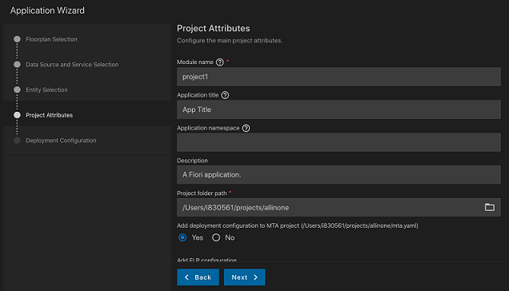

<!-- loio5a17ba6b62b2462aa0e25ffae7b8d728 -->

# Adding a Fiori Application to an MTA Deployment File with the SAP Fiori Application Generator

<a name="loiod7525cef6f6c4aa4acf3ec09c5a8eacb"/>

<!-- loiod7525cef6f6c4aa4acf3ec09c5a8eacb -->

## Adding Deployment Configuration to an Existing MTA Deployment File

When the user selects a project folder path for an application and an MTA file already exists in the selected folder, the SAP Fiori application generator automatically switches to *Yes* for adding deployment configuration. During the generation of an application, the generator updates the MTA project file by default with the supplied deployment configuration.

> ### Note:  
> For successful deployment of the generated application, the MTA file must already have the required services defined, depending on whether the application has to be deployed by using the Standalone or Managed application router. To ensure the required services are added to the MTA deployment file, use the MTA generator provided by SAP Fiori tools or the Application Router generator in SAP Business Application Studio. For more information, see [Generating an MTA Deployment File](generating-an-mta-deployment-file-9c41152.md).

> ### Note:  
> For local CAP projects, you can optionally chose to generate an instance based destination as part of CF deployment configuration, or use an existing instance based destination that is already defined in your MTA deployment file.

<a name="loioe03f08cfec9e44e59da828542cbaf906"/>

<!-- loioe03f08cfec9e44e59da828542cbaf906 -->

## Creating an MTA Deployment File during Application Generation

If the MTA deployment file is not available in the project folder location, you can create a new file. To do so, when adding deployment configuration, select *Cloud Foundry* as the target landscape. In this case, the relevant MTA file to be used with a managed application router will be added to the same folder as your generated SAP Fiori application.

> ### Note:  
> In this scenario, the generated MTA file is not applicable for use with multiple applications, as it is contained in the same folder as the SAP Fiori application. We recommend that you first create the MTA file and then generate the SAP Fiori application in a subfolder.

