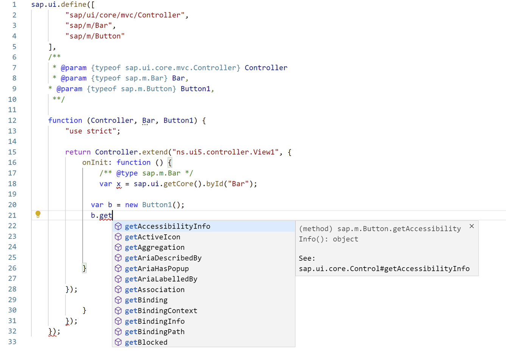

<!-- loio5c561ed1243946bf8317709957698141 -->

# Adding Javascript Code Assist

You can modify an SAP Fiori project with javascript code assist libraries in the *Advanced configuration* step.

To add javascript code assist libraries to the already generated application with SAPUI5 version 1.76 and newer, perform the following steps in your project:

1.  Update the `package.json` file:

    ```
    "devDependencies": { "eslint": "5.16.x", "@sap/eslint-plugin-ui5-jsdocs": "2.0.x", "@sapui5/ts-types": "1.92.x" }
    ```

2.  Add `tsconfig.json` with the following content to the root folder :

    ```
    { "compilerOptions": { "module": "none", "noEmit": true, "checkJs": true, "allowJs": true, "types": [ "@sapui5/ts-types" ] } }
    ```

3.  Add the `.eslintrc` file with the following content to the root folder:

    ```
    { "plugins": ["@sap/ui5-jsdocs"], "extends": ["plugin:@sap/ui5-jsdocs/recommended", "eslint:recommended"] }
    ```

4.  Delete `node_modules` and execute `npm install`.

Open a JS file to see the code completion for SAPUI5:



