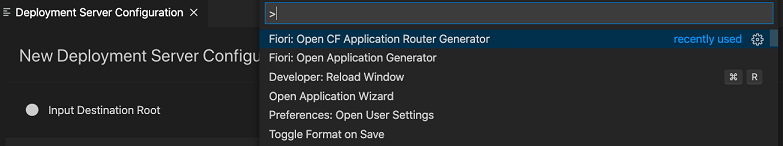

<!-- loio9c41152c5b8d4a658d7ef9f318b28917 -->

# Generating an MTA Deployment File

In the MTA deployment scenario, developers can generate an app router configuration, that contains the `mta.yaml` file, and then add multiple generated SAP Fiori apps to the app router configuration project. To do so, open the Command Palette \([CMD/CTRL\] + [Shift\] + [P\] \) and execute the *Fiori: Open CF Application Router Generator* command.

The user can manage the source code of the app router configuration and multiple SAP Fiori elements projects under a single root directory.

The app router configuration project has the following structure:

-   `router` - A folder that contains app router configuration.

    > ### Note:  
    > This folder can have a different name, such as `configurable`.

-   `.gitignore`
-   `mta.yaml` - The configuration `mta.yaml` file.
-   `package-lock.json` - The file is generated automatically for any operations where npm modifies either the `node_modules` tree or `package.json` and describes the exact tree that was generated.
-   `package.json` - Contains specifics of the `npm package.json` handling.

Once the app router configuration project is generated, one or more SAP Fiori apps can be generated inside its root directory by using the SAP Fiori application generator.

> ### Note:  
> There are two types of routers standalone and managed. For more information, see [SAP Tech Bytes: FAQ Managed Approuter vs. Standalone Approuter](https://blogs.sap.com/2021/05/17/sap-tech-bytes-faq-managed-approuter-vs.-standalone-approuter/) or [Developing HTML5 Applications in the Cloud Foundry Environment](https://help.sap.com/products/BTP/65de2977205c403bbc107264b8eccf4b/11d77aa154f64c2e83cc9652a78bb985.html).

