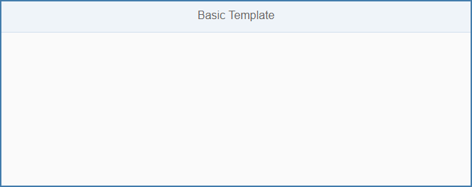

<!-- loio14fdcc0a9d834090a07435cfef962b01 -->

# Basic Template

The basic template is intended for all developers who want to start developing their own SAPUI5 app from scratch.

With this basic template you have a blank canvas to start coding right away. The basic file structure is set up according to our best practices.

> ### Note:  
> This template does not include SAP Fiori launchpad features and is intended for standalone use. If you want to convert it to a launchpad app you have to add some features manually, such as the *Save as Tile* feature.

  
  
**Screenshot of the Basic App**

The `index.html` file defines the page that is displayed when the app is started. It is located in the `webapp` folder. It contains an XML view with a header and a title from the `sap.m` library as a starting point. You can easily modify the app to add more functionality.

<a name="loio14fdcc0a9d834090a07435cfef962b01__section_sgm_1yw_k1b"/>

## Integrated Tests

  
  
**Test for the Basic App**

An important best practice is to have unit and integration tests for your app. With this template, we have included sample tests that you can use: Tests on formatters and the app controller are the basic tests any app should cover. You can find them in the `test` subfolder of the `webapp` folder.

<a name="loio14fdcc0a9d834090a07435cfef962b01__section_els_xvw_k1b"/>

## Where Can I Find the Basic Template?

You can find the template in the following places:

-   **Basic** template in SAP Fiori tools.

-   `openui5-basic-template-app` in the [SAP Repository on GitHub](https://github.com/SAP).

    For more information about how to clone or download the template from GitHub, refer to the template documentation on [GitHub](https://github.com/SAP/openui5-basic-template-app/blob/master/README.md).

