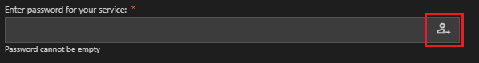
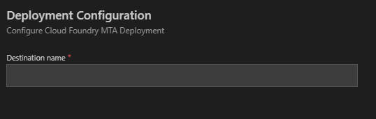

<!-- loio616b1a4bd4314070a9fa5bf79ecb3909 -->

# Freestyle SAPUI5

**Generating an freestyle SAPUI5 application**.

> ### Note:  
> In SAP Business Application Studio, use SAP Fiori elements Dev Space.

1.  Select [Supported Templates](supported-templates-20d1146.md), click *Next*.
2.  Select [Data Source](data-source-37a0fcf.md), click *Next*.

    -   **Connect to an SAP system**.
    -   **Connect to an OData service**.
    -   **Connect to SAP Business Accelerator Hub**.
    -   **Use a local CAP Node.js project**
    -   **Upload a Metadata Document**.
    -   **None**

    > ### Note:  
    > If username and password are required, enter these credentials and click *Login*.
    > 
    > 

3.  Select [Template Properties](template-properties-c2a3c82.md).
4.  Add project attributes:

    > ### Tip:  
    > Mandatory fields are prefilled with default text.

    -   **Module Name** \(Required\). Must be alphanumeric and **can’t contain spaces**. The generated NodeJS application uses the module name as its package name. It’s used as the folder name of the generated application.
    -   **App Title** \(Required\). The title in the header of the generated application.
    -   **App Namespace** \(Required\). The SAPUI5 project namespace to be used. Must start with a letter and contain letters, digits, and periods only.
    -   **Description**. The text description of the application.
    -   **Project Folder** \(Required\). The parent folder in which the new application is generated. The new application is generated in a new folder with the module name. If a folder with the same name already exists, the user must choose a new module name.
    -   **Minimum SAPUI5 version**. From the drop-down list, select the minimum SAPUI5 version that the application will require.

        -   The dropdown will show the list of available versions of SAPUI5, with the current **default** version being preselected. The dropdown will list SAPUI5 versions grouped by maintenance status as listed [here](https://ui5.sap.com/versionoverview.html).
        -   If the source system during generation is an ABAP on-premise system, then the **default** version selected in the dropdown will be equal to the SAPUI5 version on that ABAP system where possible.

        > ### Note:  
        > For an application generated with the `OData V4` data source, the list of SAPUI5 versions supported is limited to the most recent ones.

    -   **Advanced Options**:
        -   Select the SAPUI5 theme:
            -   [SAP Quartz Light](https://help.sap.com/viewer/0120a9e442b44ad9925841dde3bc521f/201909.002/en-US/bf53ad16229e4e438dc0ea5c42064cff.html?q=-%09SAP%20Quartz%20Light%20)
            -   [SAP Belize](https://help.sap.com/viewer/8ec2dae34eb44cbbb560be3f9f1592fe/1709%20002/en-US/977672c6940f48578d08d770bee236f2.html?q=SAP%20Belize)
            -   [SAP Quartz Dark](https://help.sap.com/viewer/085edb30fb3d413da552832f3d5c01c0/2002.500/en-US/ed83b3029c724c9cb267cc4c6eff1068.html?q=SAP%20quartz%20dark)

                > ### Note:  
                > SAP Quartz Dark is only available in SAPUI5 versions 1.72 and later.

    -   **Adding to MTA project**.

        Generated project is added to the existing MTA config at the time of application generation. The project creates in a subfolder with MTA config.

        Enter a mandatory destination name.

        

5.  Click *Next* to generate the application.

