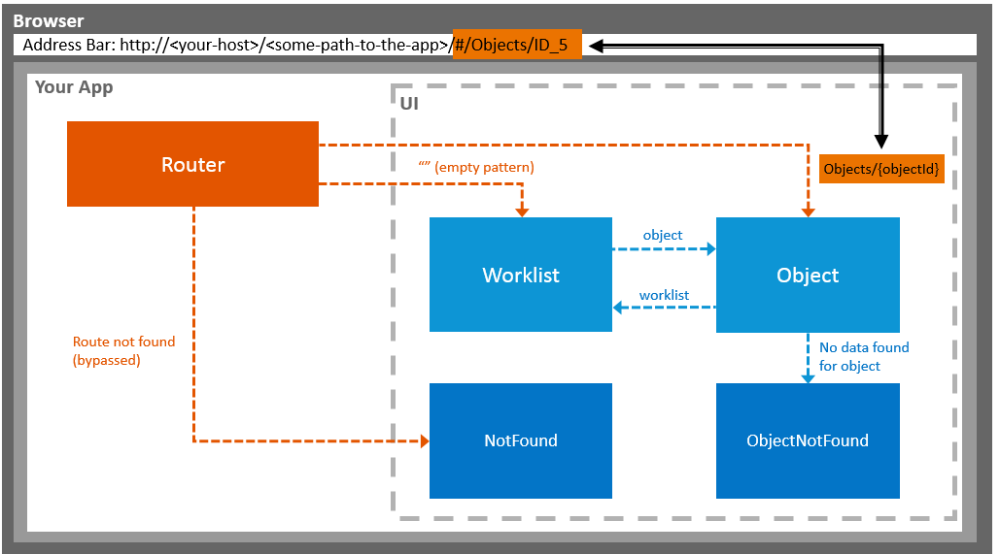

<!-- loio59e62d8b4cc246698b1987f2fee82717 -->

# Navigation

The navigation flow of the Worklist application is very simple as it only contains two main views and the *not found* pages that are displayed as a message to the user in case of navigation errors.

  
  
**Navigation Flow of the Worklist App**



The two main views *Worklist* and *Object* each have a route and a target configured. When the route matches the URL, the target is displayed and the corresponding view is created. For more information, see [Routing and Navigation](https://ui5.sap.com/#/topic/3d18f20bd2294228acb6910d8e8a5fb5.html).

Here is a sample implementation for navigating from the worklist to the object page. First you have to implement a press handler on the `ListItem`. Inside, you extract the current ID of the object pressed by the user by using its `bindingContext`. Since we want to navigate to the “object” route, you need to supply the mandatory `objectId` parameter and pass it to the `navTo` function, as described in the [sap.ui.core.routing.Routing\#navTo](https://sapui5.hana.ondemand.com/#/api/sap.ui.core.routing.Router/methods/navTo) section of the *API Reference* in the Demo Kit and shown here:

```js
/**
 * Event handler when a table item gets pressed
 * @param {sap.ui.base.Event} oEvent the table selectionChange event
 * @public
 */
onPress : function (oEvent) {
   // The source is the list item that got pressed
   this.getRouter().navTo("object", {
      objectId: oEvent.getSource().getBindingContext().getProperty("ObjectID")
   });
},
// more controller code
```

After calling `navTo`, the hash of the browser is updated and you get an event on the `ObjectController` when the route “object” matches the current hash. In the event handler, you extract the `objectId` using the `Event.getParameter` function. You then bind the data to the view:

```js
// init function of the object controller
onInit : function () {
   var oView = this.getView();
   var oModel = oView.getModel();
   this.getRouter().getRoute("object").attachPatternMatched(function (oEvent) {
      var sObjectId =  oEvent.getParameter("arguments").objectId;
      oModel.metadataLoaded().then(function() {
         var sObjectPath = oModel.createKey("Objects", {
            ObjectID :  sObjectId
         });
         oView.bindElement({
			path: ("/" + sObjectPath)
		});
      });
   });
	…
   // more init code
}, 
…
// more controller code
```


## notFound \(similar to an HTTP 404 "not found" status code\)

The *not found* pages are implemented using an [`sap.m.MessagePage`](https://ui5.sap.com/#/entity/sap.m.MessagePage) an `sap.m.MessagePage`. They display an error message according to the SAP Fiori UX specifications. There are different "not found" cases that each have a separate target and a *notFound* view.

If you have the following URL, no route will match: `index.html/#/thisIsInvalid`. This means that the *notFound* view will be displayed, as the target *notFound* is defined in the bypassed section.

The code sample below shows the relevant parts of the configuration. For a full implementation of a *not found* page, see [Step 3:Catch Invalid Hashes](https://ui5.sap.com/#/topic/e047e0596e8a4a1db50f4a53c11f4276.html).

```js
"routing": {
	"config": {
		…
		"bypassed": {
	  		"target": "notFound"
		}
	}
	…
  "targets": {
	…
	"notFound": {
		"viewName": "NotFound",
		"viewId": "notFound"
	}

}
```


## objectNotFound

If the object route matches – an ID is passed \(for example `#/Objects/1337`\) but the back end does not contain an object with the ID `1337`, then you need to display the *objectNotFound* page. This is achieved by listening to the “change” event of a binding. Inside this, you check if there is no data and tell the router to display the *objectNotFound* target, as shown in the sample code below:

```js
// inside of a controller
this.getView().bindElement({
	path: “/Objects/1337”,
   change: function () {
       // there is no data
       if (!this.getView().getElementBinding().getBoundContext()) {
		this.getRouter().getTargets().display("objectNotFound");
					return;
				}
	   // code handling the case if there is data in the backend
      …
   };
});
```


The routing configuration for this navigation flow is set up in the descriptor for applications \(`manifest.json` file\), as shown here:

```js

"routing": {
  "config": {
	"routerClass": "sap.m.routing.Router",
	"viewType": "XML",
	"viewPath": "sap.ui.demo.worklist.view",
	"controlId": "app",
	"controlAggregation": "pages",
	"bypassed": {
	  "target": "notFound"
	}
  },
  "routes": [
	{
	  "pattern": "",
	  "name": "worklist",
	  "target": "worklist"
	},
	{
	  "pattern": "Objects/{objectId}",
	  "name": "object",
	  "target": "object"
	}
  ],
  "targets": {
	  "worklist": {
		"viewName": "Worklist",
		"viewId": "worklist",
		"viewLevel": 1
	  },
	  "object": {
		"viewName": "Object",
		"viewId": "object",
		"viewLevel": 2
	  },
	  "objectNotFound": {
		"viewName": "ObjectNotFound",
		"viewId": "objectNotFound"
	  },
	  "notFound": {
		"viewName": "NotFound",
		"viewId": "notFound"
	}
  }
}

```

For more information, see [Routing and Navigation](https://ui5.sap.com/topic/3d18f20bd2294228acb6910d8e8a5fb5.html), the [`sap.m.routing.Router`](https://sapui5.hana.ondemand.com/#/api/sap.m.routing.Router) section of the *API Reference* documentation in the Demo Kit, and the [`sap.ui.core.routing.Router`](https://sapui5.hana.ondemand.com/#/entity/sap.ui.core.routing.Router/sample) sample within the Demo Kit.

