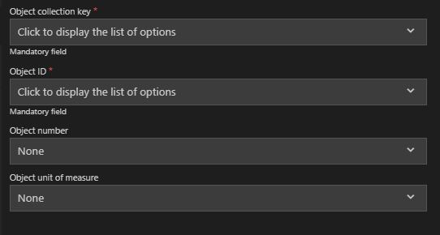
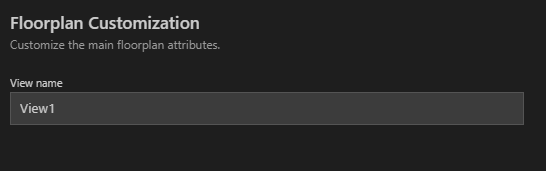

<!-- loioc2a3c82e603c4e46b007627f5ec93aad -->

# Template Properties

Once the data source is supplied, you can customize the application by selecting from the list of entities in the data source.

Generic options across multiple template types:

-   *Object Collection*. The OData entity set used to display the data in the selected template.

-   *Object Collection Key*. The key property of the entity set, which makes the entry unique.

-   *Object ID*. The display name of the entity to be used.

-   *Object Number*. The number field displayed on the right side of the table data.

-   *Object Unit of Measure*. The measurement unit for the Object number above.

    

Select the entity set to be used from the drop-down list of entities. Note, that this is a mandatory field. After selecting the entity set, a list of properties appears that is filtered depending on the selected entity.

The *SAP Fiori List-Detail Application* specific template option is a list of line items for the detail page, with similar meaning as object page values.

The **Basic** application template has an additional property, which is the *View name*. This is a unique name selected for the SAPUI5 view to be created.

