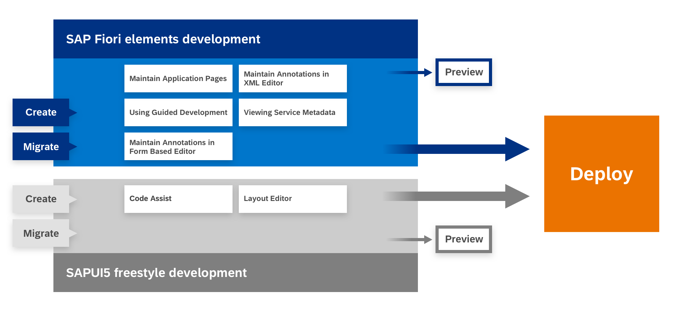

<!-- loio2d8b1cb11f6541e5ab16f05461c64201 -->

# Getting Started with SAP Fiori Tools

SAP Fiori tools simplifies the development of SAP Fiori elements applications by providing extensions for your SAP Business Application Studio and VS Code development environment.

The SAP Fiori tools extensions help you create applications, visualize navigation, automatically generate code, and more. Used in combination with SAP Fiori elements, these extensions can increase your development productivity, ensure the consistency of experience between applications, and help you build a scalable experience. SAP Fiori tools includes the following extensions:

-   [**Application Wizard**](../Generating-an-Application/SAP-Fiori-Elements/sap-fiori-elements-1488469.md). A wizard-style approach to generate the provided SAP Fiori elements and freestyle SAPUI5 templates.
-   [**SAP Fiori Tools – Application Modeler**](../Developing-an-Application/developing-an-application-a9c0043.md). Access to a visualization of the application pages, navigation, and service entities. You can add new navigation and pages, delete pages, and navigate to corresponding editing tools. The following features are part of this extension:
    -   [Page Editor](../Developing-an-Application/configure-page-elements-047507c.md)
    -   [Page Map](../Developing-an-Application/define-application-structure-bae38e6.md)

-   [**Guided Development**](../Developing-an-Application/use-feature-guides-0c9e518.md). Access to How-To guides and tutorials that explain how to implement certain functionality in an SAP Fiori elements application. You can follow the steps required to implement a feature and then use the guided development approach to make the required changes in your project.
-   [**Service Modeler**](../Project-Functions/viewing-service-metadata-e369c2c.md). Visualization of the OData service metadata files. You can use it to browse complex services easily, including entities, properties, and associations.
-   **[Maintaining Annotations with Language Server](../Developing-an-Application/maintaining-annotations-with-language-server-6fc93f8.md)**. Access to resources that help to define annotations in the code editor, thus improving application development by reducing effort and maintaining code consistency. The following subset of features is part of this extension:
    -   Code completion
    -   Micro-snippets
    -   Diagnostics
    -   Internationalization support

-   [**SAP Fiori tools Environment Check**](../Project-Functions/environment-check-75390cf.md). A tool which is designed to run checks against your environment and/or destinations configured in SAP Business Technology Platform \(SAP BTP\).

For more information, see [Report Issues and Security](report-issues-and-security-7c755a5.md).

**Supported Deployment Landscapes:**

-   SAP S/4HANA
-   SAP S/4HANA Cloud
-   SAP BTP \(ABAP and Cloud Foundry Environments\)

For supported data sources, see: [Data Source](../Generating-an-Application/SAP-Fiori-Elements/data-source-9906181.md)

> ### Note:  
> If there are any issues, create an incident in the SAP Support Portal for the `CA-UX-IDE` component.

SAP Fiori tools is available in two integrated development environments \(IDEs\).

-   [SAP Business Application Studio](sap-business-application-studio-b011040.md)
-   [Visual Studio Code](visual-studio-code-17efa21.md#loio17efa217f7f34a9eba53d7b209ca4280)

> ### Caution:  
> SAP Fiori tools supports the development of SAP Fiori elements and freestyle SAPUI5 applications with a minimum SAPUI5 version of 1.65 or higher.

