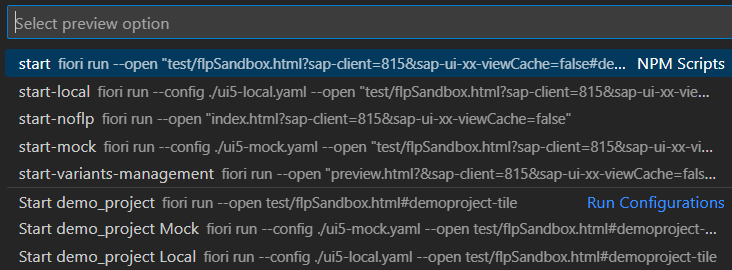

<!-- loiob962685bdf9246f6bced1d1cc1d9ba1c -->

# Previewing an Application

> ### Note:  
> In the development environment, `localhost` is used as an HTTP proxy server to reach the back-end OData service. A domain security policy, that is applied in some companies, includes `localhost`, which forces HTTPS to be used in redirected URLs. As a result, when the user attempts to access a website, an error may occur.
> 
> If an SSL protocol error appears after the URL redirection, check the security configuration of your browser. For example, Chrome HSTS configuration can be accessed by entering the following URL address to the browser: `chrome://net-internals/#hsts`.

<a name="loiob962685bdf9246f6bced1d1cc1d9ba1c__section_nt3_lrm_p4b"/>

## Starting a Preview from Terminal

After the application is successfully generated, several options to preview it are available by running `npm start` scripts in the terminal:

-   [Use Live Data](use-live-data-497aee2.md)
-   [Use Mock Data](use-mock-data-bda83a4.md)
-   [Use Local Sources](use-local-sources-6d3a210.md)
-   [Use Custom Middlewares](use-custom-middlewares-dce5315.md)

<a name="loiob962685bdf9246f6bced1d1cc1d9ba1c__section_xv1_zrt_r4b"/>

## Starting a Preview with Run Control

For various options of starting your application, use the *Run Control* function in VS Code or SAP Business Application Studio. You can also create a new *Run Configuration* in SAP Business Application Studio or *Launch Configuration* in VS Code:

-   [Use Run Control](use-run-control-09171c8.md)

-   [Create a New Run Configuration in Visual Studio Code](create-a-new-run-configuration-in-visual-studio-code-3b1f37e.md)
-   [Create a New Run Configuration in SAP Business Application Studio](create-a-new-run-configuration-in-sap-business-application-studio-05f2a9e.md)

<a name="loiob962685bdf9246f6bced1d1cc1d9ba1c__section_jn2_svd_44b"/>

## Starting a Preview from Context Menu

This section provides instructions on previewing an application from a context menu in VS Code and SAP Business Application Studio.

You can right-click the project folder or any application-related subfolder and click *Preview Application*. You have the following options by default:

-   **`start`** - starts the application with real service data.

-   **`start-local`** - starts the application with mock data and a local copy of the SAPUI5 resources for offline work.

-   **`start-noflp`** - starts the application without the sandbox for SAP Fiori launchpad.

-   **`start-mock`** - starts the application with mock data.

Run configurations - starts the application using the existing run configuration selection in the preview command.

> ### Note:  
> Automatic download is only supported with SAPUI5 versions 1.76 and higher.

<a name="loiob962685bdf9246f6bced1d1cc1d9ba1c__section_s2f_5rr_hpb"/>

## Enabling App-to-App Navigation Preview

-   [App-to-App Navigation Preview](app-to-app-navigation-preview-543675f.md)

