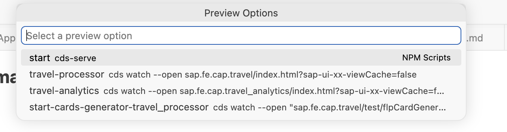

<!-- loio1dc179a7f74d48c7816e90b867058887 -->

# Previewing an SAP Fiori Elements CAP Project

Once your CAP project is generated, you can preview it in Visual Studio Code or SAP Business Application Studio.

The available preview options depend on where you are using CAP Node.js or CAP Java.

> ### Note:  
> The following preview functionality is supported for applications generated using Application Generator. For more information, see [Generating an Application](../Generating-an-Application/generating-an-application-db44d45.md). This may differ for other applications.

## Previewing a CAP Node.js Project

CAP Node.js projects use the `cds-plugin-ui5` node module to serve UI5 applications using the CDS server process. For more information, see [cds-plugin-ui5](https://www.npmjs.com/package/cds-plugin-ui5).

### Prerequisites

The following prerequisites are required in the root `package.json` file:

-   <code><code>@sap/cds</code></code> with a version equal to or greater than 6.8.2 under `dependencies`.
-   <code><code>cds-plugin-ui5</code></code> with a version equal to or greater than 0.17.9 under `devDependencies`.
-   <code><code>workspaces: ["app/*"]</code></code>

These are automatically added when you generate a CAP application with SAP Fiori tools. If they are missing, execute the following command: `npx --yes @sap-ux/create@latest add cds-plugin-ui5`.

### Starting the Preview Using the Terminal

To preview a CAP Node.js project using the terminal, proceed as follows:

1.  Open a terminal in the root directory of your CAP project and execute `cds watch`.

    The CDS server on `http://localhost:4004` is started and serves all UI5 apps registered in the workspace.

2.  Execute `npm run watch-<appName>` in the terminal to open a specific application directly.

### Starting the Preview Using the Context Menu

To preview a CAP Node.js application using the context menu, right-click the application folder and select *Preview Application*. The following options are displayed:

-   *start*: `cds serve` - Starts the preview for the project.
-   *<Application Name\>*: `cds watch --open <Application Folder>/<index.html>?sap-ui-xx-viewCache=false` - Starts the preview for a specific application.
-   *start-card-generator-<Application Name\>*: `cds watch --open <Application Folder>/test/flpCardGenerator`: Starts the card generator for a specific application. For more information, see [Using the Card Editor When Previewing Your Application](using-the-card-editor-when-previewing-your-application-ece91bc.md).

### Preview Functionality

The `cds-plugin-ui5` node module and `fiori-tools-preview` middleware provide the following features:

-   A local sandbox for SAP Fiori launchpad at `/test/flp.html`. Custom paths are also supported.
-   Flex support using `WorkspaceConnector` and `LocalStorageConnector`.
-   Integration with the Page Map and Guided Development. For more information, see [Define Application Structure](../Developing-an-Application/define-application-structure-bae38e6.md) and [Use Feature Guides](../Developing-an-Application/use-feature-guides-0c9e518.md).
-   Card Generator support to create cards. For more information, see [Using the Card Editor When Previewing Your Application](using-the-card-editor-when-previewing-your-application-ece91bc.md).

Without the `cds-plugin-ui5` node module, you can still navigate directly to the application, for example, `http://localhost:4004/<appId>/webapp/index.html`.

## Previewing a CAP Java Project

CAP Java does not support UI5 server middleware so only previewing a specific application is supported.

To preview a CAP Java application, proceed as follows:

1.  Open a terminal in the root directory of your Java project and execute `mvn spring-boot:run`.

    The preview server is started at `http://localhost:8080`.

2.  Open a second terminal in the application folder and execute `ui5 serve`.

    You can also use the context menu to preview an application. For more information, see [Previewing an Application](previewing-an-application-b962685.md).

3.  Open the application using the URL displayed in the terminal, for example, `http://localhost:8080/<appName>/webapp/index.html`.

