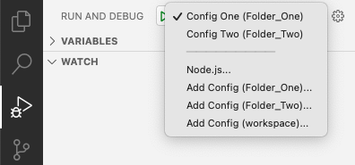

<!-- loiod7f20f306af14d34999f56a536f28d47 -->

# Run Control Overview

The *Run Configuration* dialog looks for the `<workspace_root>/.vscode/launch.json` file. It does not traverse into any subfolders so any configurations inside `launch.json` files that reside in nested folders are not found. You can merge configurations from multiple`launch.json` files by using workspaces. Here is a sample that shows different development environment setups:

<a name="loiod7f20f306af14d34999f56a536f28d47__section_sdc_rwh_fsb"/>

## Example

Assuming the following file system structure:

The `launch.json` files contain the configuration noted next to them: **Config One**, **Config Two**, and**Config Subfolder**. Depending on which folder you choose, you get different results.

When opening Folder\_One, Config One is shown in *Run and Debug* view.

If you open Folder Two, the *Run and Debug* view shows Config Two.

> ### Note:  
> The config from Subfolder is not shown because the`launch.json` configuration file cannot be found in the `<workspace_root>/.vscode` file.

When you open Subfolder in your development environment, only Config Subfolder is shown.

In addition, you can create a workspace, by opening one of the folders and selecting *Add Folder to Workspace* in your development environment. The workspace can be configured in many ways. Here are some examples:

-   **workspace root:** Folder\_One.

    Only **Config One** is displayed, same as shown above in Open Folder\_One.

-   **workspace roots**: Folder\_One and Folder\_Two.

    

    Config One and Config Two are displayed, because these two configurations can be found in `Folder_One/.vscode/launch.json` and `Folder_Two/.vscode/launch.json`.

    

-   **workspace roots**: Folder\_One, Folder\_Two, and Subfolder.

    

    The configurations from all three `launch.json` files are displayed:

    

> ### Note:  
> As seen in the last example, you can add a subfolder of an existing workspace root folder as a standalone workspace root.

For more information on run configurations, see[Launch configurations](https://code.visualstudio.com/docs/editor/debugging#_launch-configurations) .

**Related Information**  

[Create a New Run Configuration in Visual Studio Code](create-a-new-run-configuration-in-visual-studio-code-3b1f37e.md)

[Create a New Run Configuration in SAP Business Application Studio](create-a-new-run-configuration-in-sap-business-application-studio-05f2a9e.md)

