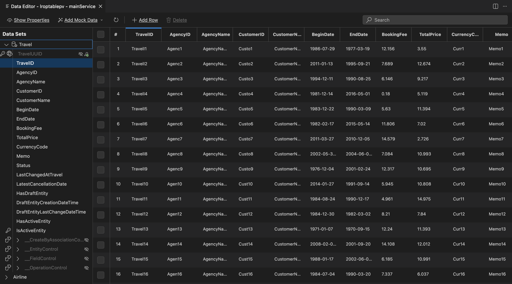
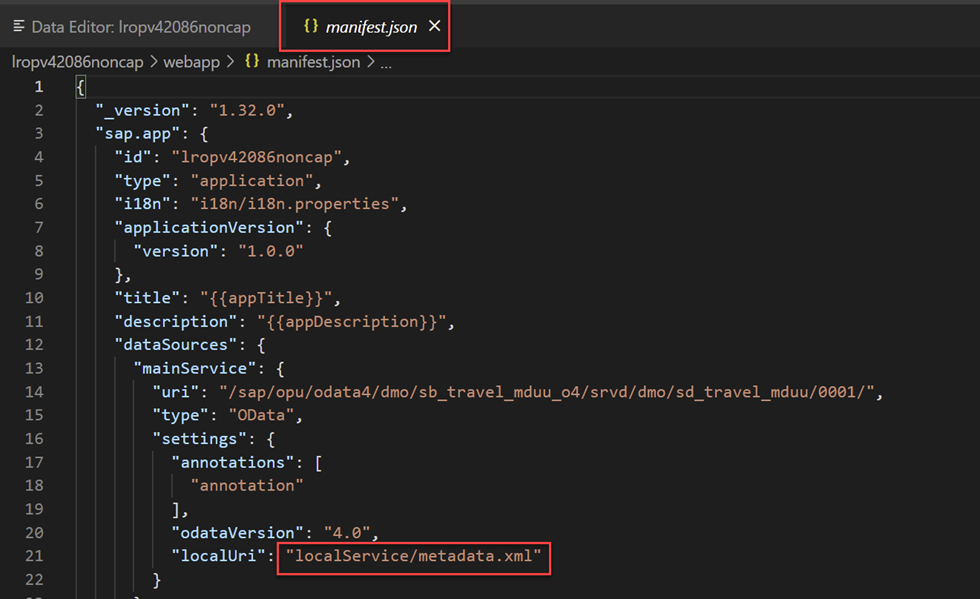
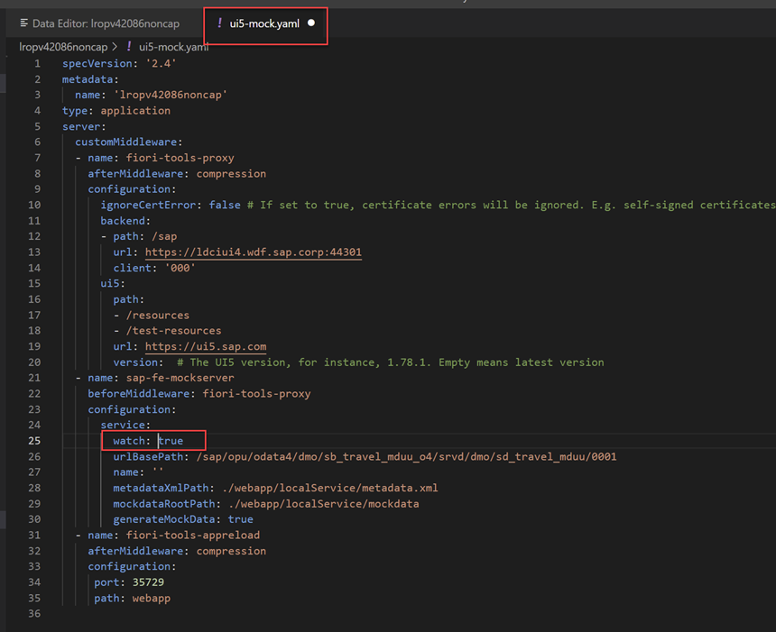

<!-- loio18e43b5a01cf433f86de5ba10e7881c6 -->

# Data Editor

Previewing the application using `npm run start-mock` generates mock data on the fly. If you want to generate mock data and store it in the `.json` file format, you can right-click on your project and launch *Open Data Editor*. Once generated, mock data is stored in the `.json` format under the `/webapp/localService/mockdata` file.

> ### Note:  
> You need to configure mock server prior to using `npm run start-mock`. For more information, see [Installing MockServer](../Previewing-an-Application/installing-mockserver-2538055.md).

Where there are multiple services, you see a dropdown to select the metadata file you want to use. If your application is running, you can stop the mock server by pressing [Ctrl\] + [C\] .

The *Data Editor* reads the `metadata.xml` file that is defined in the `manifest.json` file under the `dataSource` property and generates mock data based on the property type.

Data can be edited by either double-clicking in the cell of the *Data Editor* or by editing the `Entity.json` file.

If the mock server isn’t running, you can:

-   Make changes in the *Data Editor*, which are automatically reflected in the `.json` file.

-   If changes are made in the `.json` file, click *Refresh* to update with the latest changes.

If the mock server is running, you can:

-   Add the `watch: true` parameter to the `ui5-mock.yaml` file to auto-reload the mock server whenever changes are made.

    

## Generating Mock Data

You can generate mock data in one of the following ways:

-   *Generate Data*

    *Generate Data* generates 20 rows of mock data for every entity set.

-   *Generate Data Using AI*

    *Generate Data Using AI* generates up to 10 rows of mock data for every entity set using AI to produce meaningful and contextually relevant mock data. For more information, see [Generating Mock Data Using AI](../Previewing-an-Application/generating-mock-data-using-ai-815c310.md).

To generate mock data, perform the following:

1.  If you have no mock data, click *Generate Data* or *Generate Data Using AI*.
2.  If you have existing mock data, click *Add Mock Data* in the header bar of the *Data Editor* and then click *Generate Data* or *Generate Data Using AI*.
3.  *Generate Data*: 20 rows of mock data are generated for every entity set.
4.  *Generate Data Using AI*: For more information, see [Generating Mock Data Using AI](../Previewing-an-Application/generating-mock-data-using-ai-815c310.md).

<a name="loio18e43b5a01cf433f86de5ba10e7881c6__section_dbj_4pg_hsb"/>

## Editing Mock Data

-   **Edit Data**: Edit data by double-clicking in the editable cell. Primary keys and foreign keys aren’t editable.

-   **Add Row**: Add a row by clicking *Add Row*. Additional rows are added automatically to all the entities that are associated with a foreign key.

-   **Delete Row**: Delete a row by selecting a row and clicking *Delete Row*. Rows are automatically deleted on all the entities that are associated with a foreign key.

<a name="loio18e43b5a01cf433f86de5ba10e7881c6__section_zmb_spm_c5b"/>

## Searching Mock Data

To search for mock data, perform the following steps:

1.  Click on the *Search* field in the header bar of the *Data Editor*.
2.  Enter your search criteria in the *Search* field.
3.  Select the mock data that matches the search criteria in the dropdown. The data you selected is highlighted in the table.

<a name="loio18e43b5a01cf433f86de5ba10e7881c6__section_ogm_fqm_1vb"/>

## Show and Hide Properties

To show properties in the table, perform the following steps:

1.  Click *Show Properties* in the header bar of the *Data Editor* to open the popup.

2.  Select the properties you want to display.

3.  Click *Save*.

To hide properties in the table, perform the following steps:

1.  Click *Show Properties* in the header bar of the *Data Editor* to open the popup.

2.  Deselect the properties that you don't want to display.

3.  Click *Save*.

> ### Note:  
> Certain property groups are hidden by default and can be shown using *Show Properties*. You can also search for a particular property using the *Search* field in the popup.

