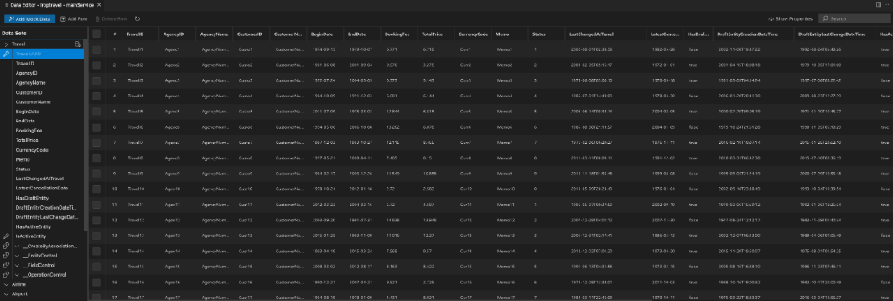

<!-- loio18e43b5a01cf433f86de5ba10e7881c6 -->

# Data Editor

Previewing the application using `npm run start-mock` generates mock data on the fly. If you want to generate mock data and store it in the `.json` file format, you can right-click on your project and launch `Open Data Editor`. Once generated, mock data is stored in the `.json` format under the `/webapp/localService/mockdata` file.

> ### Note:  
> Mockserver configuration is needed prior to using `npm run start-mock`. See [Installing MockServer](../Previewing-an-Application/installing-mockserver-2538055.md).

For templates like *Overview page* where there are multiple services, you will see a drop-down list to select the metadata file you want use. If your application is running, you can stop the mock server by pressing [Ctrl\] + [C\] .

Data Editor reads the `metadata.xml` file that is defined in the `manifest.json` under the `dataSource` and generates mock data based on the property type.

Data can be edited by either double-clicking in the cell of the Data Editor or by editing the `Entity.json` file.

If the **mock server isn’t running**, you can:

-   Make changes in the Data Editor, automatically reflected in the `.json` file.

-   If changes are made in the `.json` file, hit the *Refresh* button to update the canvas.

If the mock server is running:

-   Add `watch: true` parameter to the `ui5-mock.yaml` file in order to pick up the changes.

    

<a name="loio18e43b5a01cf433f86de5ba10e7881c6__section_dbj_4pg_hsb"/>

## Editing Mock Data

**Editing Data**- **double-click** in the editable cell.

> ### Note:  
> Primary keys and foreign keys aren’t editable.

**Add Row** - add one row at a time to your data by pressing the *Add Row* button.

> ### Note:  
> Additional rows will be added automatically to all the entities that are associated with a foreign key.

**Delete Row** - select any row or rows and press the *Delete Row* button.

> ### Note:  
> Rows will be automatically deleted on all the entities that are associated with a foreign key.

<a name="loio18e43b5a01cf433f86de5ba10e7881c6__section_zmb_spm_c5b"/>

## Searching Mock Data

To search for mock data, perform the following steps:

1.  Click on the *Search* input field in the header bar of the Data Editor .
2.  Enter search criteria in the search input field.
3.  Select the mock data that matches the search criteria in the drop-down table. The data selected is highlighted in the Data Editor table.

<a name="loio18e43b5a01cf433f86de5ba10e7881c6__section_ogm_fqm_1vb"/>

## Show and Hide Properties

To show properties in the Data Editor table, perform the following steps:

1.  Click on *Show Properties* in the header bar of the Data Editor to open the popup.

2.  Check the properties you want to display in the Data Editor table.

3.  Click *Save*.

To hide properties in the Data Editor table, perform the following steps:

1.  Click on *Show Properties* in the header bar of the Data Editor to open the popup.

2.  Deselect the property that you don't want to display in the Data Editor table.

3.  Click *Save*.

> ### Note:  
> Certain property groups are hidden by default and can be shown using the *Show Properties* functionality. You can also search for a particular property using the search input field in the popup.

