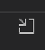

<!-- loio78a82b6852ce4061ba0825afdb79cda6 -->

<link rel="stylesheet" type="text/css" href="../css/sap-icons.css"/>

# Managing SAP System Connections

Learn how to save the connection information for a remote system in Visual Studio Code \(VS Code\).

> ### Note:  
> Support for adding new systems using service keys in VS Code has been removed because all *ABAP Environment on SAP Business Technology Platform* connections support reenetrance tickets. Existing saved systems with service keys are still supported.

> ### Note:  
> The password for an ABAP On Premise system connection is saved in the operating system's secured storage and is subject to its respective security policy:
> 
> -   **Windows**: Credentials are securely stored in the Windows Credential Manager and are accessible to authorized processes when you are signed in. For more information, see [Credentials process in Windows authentication](https://learn.microsoft.com/en-us/windows-server/security/windows-authentication/credentials-processes-in-windows-authentication).
> 
> -   **macOS**: Credentials are securely stored in the macOS Keychain and are accessible to authorized processes after you have authenticated with your account password, when prompted. This prompt can be bypassed if you click *Always Allow*. For more information, see [Allow apps to access your keychain](https://support.apple.com/en-by/guide/mac-help/kychn002/mac).

<a name="loio78a82b6852ce4061ba0825afdb79cda6__section_lmc_zkz_ygc"/>

## Create a New SAP System Connection

To create a new ABAP On Premise system connection, perform the following steps:

1.  Hover over the *SAP Systems* panel and click the :heavy_plus_sign: \(*Add SAP System*\) icon.
2.  Select *ABAP On Premise* as the *System Type* and provide the following values:
    -   *System Name*: Provide a name for the system.
    -   *URL*: Enter the URL for the system.
    -   *Client*: Enter the client for the system, if required. This usually consists of three characters.
    -   *Username*: Enter the username for the system.
    -   *Password*: Enter the password for the system.

3.  Click*Test Connection* and verify that the following message is shown: **This SAP system connected successfully**.
4.  Click *Save* and verify the following:

    -   A message is displayed which says: *System information saved*.

    -   The saved system is shown in the *SAP Systems* panel: **<name of added system\> \[username\]**.

To create a new *ABAP Environment on SAP Business Technology Platform* \(SAP BTP\) system connection, perform the following steps:

1.  Hover over the *SAP Systems* panel and click the :heavy_plus_sign: \(*Add SAP System*\) icon.
2.  Select *ABAP Environment on SAP Business Technology Platform* as the *System Type* and provide the following values:

    -   *System Name*: Provide a name for the system.

    -   *URL*: Enter the URL for the system.

3.  Click *Test Connection*.

    The results show if the system connection was successful and whether the system supports OData V2 and OData V4 services.

4.  Click *Save* and verify the following:

    -   A message is displayed which says: *System information saved*.

    -   The saved system is shown in the *SAP Systems* panel:**<name of added system\> \(ABAP Cloud\)**.

<a name="loio78a82b6852ce4061ba0825afdb79cda6__section_jv1_xgh_3qb"/>

## View SAP System Details

To view the details of an existing SAP system, perform the following steps:

1.  On the activity bar, click the  \(*SAP Fiori*\) icon.
2.  Expand the *SAP Systems* panel.

    You can see the list of saved systems along with the usernames used for authentication.

3.  To see the stored system details in a new view, click a specific system entry or right-click and click *Show SAP System Details*.

> ### Note:  
> You can create an SAP Fiori application with your selected SAP system by clicking *Create SAP Fiori Application*. This opens the SAP Fiori application generator and automatically selects your SAP system as the data source.

<a name="loio78a82b6852ce4061ba0825afdb79cda6__section_mrq_tbr_2rb"/>

## Test an SAP System Connection

To test the connection of an existing SAP system, perform the following steps:

1.  Open the details of a saved system. For more information, see [View Saved Systems Details](managing-sap-system-connections-78a82b6.md#loio78a82b6852ce4061ba0825afdb79cda6__section_jv1_xgh_3qb).
2.  Click *Test Connection*.

    The results show if the system connection was successful and whether the system supports OData V2 and OData V4 services.

> ### Tip:  
> We recommend that you test a saved system connection to ensure the service catalog of a selected system works as expected.

<a name="loio78a82b6852ce4061ba0825afdb79cda6__section_v2b_wpy_lqb"/>

## Edit an SAP System Connection

To edit the connection details of an existing SAP system, perform the following steps:

1.  Right-click the saved system name you wish to edit and click *Show SAP System Details*.
2.  For an *ABAP On Premise* system, you can update the following fields:
    -   System Name
    -   URL
    -   Client
    -   Username
    -   Password

3.  For an *ABAP Environment on SAP Business Technology Platform* system, you can update the following fields:

    -   System Name: editable
    -   URL: editable

4.  Click *Test Connection*.
5.  Click *Save*.

<a name="loio78a82b6852ce4061ba0825afdb79cda6__section_hr1_zhh_3qb"/>

## Delete an SAP System Connection

To delete the connection of an existing SAP system, perform the following steps:

1.  On the activity bar, click the  \(*SAP Fiori*\) icon.
2.  Expand the *SAP Systems* panel.
3.  Hover over the saved system you wish to delete and click the :wastebasket: \(*Delete*\) icon next to the system's name.
4.  Click *Yes* in the confirmation dialog box.

<a name="loio78a82b6852ce4061ba0825afdb79cda6__section_jxl_rtf_c5b"/>

## Export and Import an Existing ABAP On Premise SAP System Connection

To export an existing system connection for an ABAP On Premise system, perform the following steps:

1.  Right-click a saved system name and click *Show SAP System Details*.
2.  Click *Export System*. A copy of the saved system connection is downloaded in JSON format. No sensitive credential information is included in the exported JSON file.

To import an ABAP On Premise system connection, perform the following steps:

1.  On the activity toolbar, click the  \(*SAP Fiori*\) icon.
2.  Next to the *SAP Systems* title bar, click *Import SAP System* \( \).
3.  Select the JSON file that you would like to import.
4.  Provide your system credentials and click *Test Connection*.
5.  Click *Save* to import the system connection.

> ### Note:  
> If you already have a saved local SAP system connection with the same name, you are asked to confirm before overwriting it.
> 
> You can only import and export saved SAP system connections between development environments that are using VS Code. You cannot import or export system connections between VS Code and SAP Business Application Studio.

