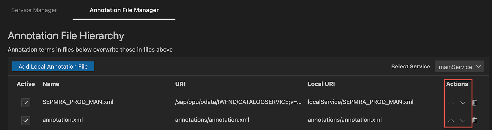

<!-- loio8182ff3b19574f038bd636b9991aa24e -->

# Managing Service and Annotations Files

<a name="loio8182ff3b19574f038bd636b9991aa24e__section_khb_j3p_ylb"/>

## Manage Service Files

### How to add services to a project

> ### Note:  
> The ability to add services is only supported for the SAP Fiori elements Overview Page and SAP Fiori freestyle projects.

1.  Right-click the application project `manifest.json`.
2.  In the context menu, select *Service Manager*.
3.  Click *Add Service*.
4.  Choose Connection Type:
    1.  Destination \(SAP Business Application Studio\) - Select server destination from the dropdown. Enter username and password if needed.
    2.  SAP System \(VS Code\) - Select server SAP System from the dropdown. Enter username and password if needed.
    3.  Hostname - Enter the server hostname, SAP Client, and username and password if needed.

5.  To specify the OData service URL
    1.  Enter Service URL manually.
    2.  Fetch Services from the server catalog and select from the dropdown list.

6.  Click *Add*.

    A new service appears in a service list. A service `metadata.xml` is now added to a local service folder of the project along with the service back-end annotations \(if they’re available\).

### How to Refresh a Service from the Server

1.  Right-click the SAP Fiori elements application project `manifest.json`.
2.  In the context menu, select *Service Manager*.
3.  Click the *Pencil* icon opposite the service.
4.  Choose Connection Type:
    1.  Destination \(SAP Business Application Studio\) - Select server destination from the dropdown. Enter username and password if needed.
    2.  SAP System \(VS Code\) - Select server SAP System from the dropdown. Enter username and password if needed.
    3.  Hostname - Enter the server hostname, SAP Client, and username and password if needed.

5.  Click
    -   *Refresh* - Refresh local copy of metadata and annotation files of service.
    -   *Refresh & Save* - Refresh local copy of metadata and annotation files of service and save connection to UI5 yaml files.

### How to Delete a Service:

1.  Right-click the SAP Fiori elements application project `manifest.json`.
2.  In the context menu, select *Service Manager*.
3.  Click *Delete* icon.

The `metadata.xml`, related annotation XML files and mockdata is deleted from the project. Also, the `ui5*.yaml` files will removed any back-end routing and mockserver entries specific to the service being deleted.

For more information about mockserver, see [Use Mock Data](../Previewing-an-Application/use-mock-data-bda83a4.md).

<a name="loio8182ff3b19574f038bd636b9991aa24e__section_sl5_xd4_ylb"/>

## Manage OData Annotations Files

The OData services can have multiple local annotation files associated with a service. The Annotation File Manager can be used to manage local annotation files associated with a service.

> ### Note:  
> Managing annotations is limited to the OData service and not applicable to CAP CDS.

**How to open the Annotation File Manager**

1.  Right-click the `manifest.json` file in the SAP Fiori elements application project.
2.  In the context menu, select *Annotation File Manager*.
3.  Select the target service from the drop-down list.

Alternatively, you can click *Annotation Hierarchy* in the **Annotation List View** for a particular projection or property of service.

### How to add annotation files in the Annotation File Manager:

1.  Right-click the `manifest.json` file in the SAP Fiori elements application project.
2.  In the context menu, select *Annotation File Manager*.
3.  Select the target service from the drop-down list.
4.  Click *Create Local Annotation File*.
5.  Fill in the criteria required for creating an annotation file.
6.  Click *Create*.

The newly created annotation file appears in the *Annotation File Manager* for that service, and also in the *Annotation List View* for the target projection.

### How to change the hierarchy of local annotation file

> ### Note:  
> The highest-ranked annotation file in the *Annotation File Manager* table is at the bottom resembling precedence rules in the `manifest.json`.

1.  In the *Annotation File Hierarchy* use the up/down arrows to change the hierarchy.

### How to activate and deactivate local annotation files:

1.  Right-click the `manifest.json` file and select *Open Annotation File Manager*.
2.  Select or clear the checkbox in the active column of the *Annotation File Manager* table to activate or deactivate the annotation.

    > ### Note:  
    > When a file is deactivated, it’s no longer considered a part of the annotation file hierarchy.

### How to delete an annotation file:

1.  Select the active checkbox.
2.  Click the delete icon  next to the annotation file.

