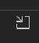

<!-- loio78a82b6852ce4061ba0825afdb79cda6 -->

# Managing System Connection

SAP Fiori tools running in VS Code enable to save the connection information to a remote system. This functionality provides faster authentication while creating an application, generating deployment configuration, and deploying an application. The credentials are saved in the operating system secured storage, such as Credential Manager in Windows and Keychain in Mac.

<a name="loio78a82b6852ce4061ba0825afdb79cda6__section_jv1_xgh_3qb"/>

## View Saved Systems Details

To view the saved systems details, perform the following steps:

1.  On the activity toolbar from the left side, click *SAP Fiori* \(the wrench and pencil icon\).
2.  Expand the *SAP Systems* view.

    You can see the list of saved systems along with the usernames used for authentication.

3.  To see the stored system details in a new view, click a particular system entry or right-click and select.*Show SAP System Details*

<a name="loio78a82b6852ce4061ba0825afdb79cda6__section_mrq_tbr_2rb"/>

## Test Saved Systems Connection

To test the connection of a saved system, perform the following steps:

1.  Open the details of a saved system. For more information, see [View Saved Systems Details](managing-system-connection-78a82b6.md#loio78a82b6852ce4061ba0825afdb79cda6__section_jv1_xgh_3qb).
2.  Click *Test Connection*.

    As a result, you’ll see if the system connection was successful and whether it supports OData V2 and/or OData V4 services.

> ### Note:  
> We recommend that you test a saved system connection to ensure the service catalog of a selected system works as expected.

<a name="loio78a82b6852ce4061ba0825afdb79cda6__section_v2b_wpy_lqb"/>

## Edit Saved Systems

For editing an existing SAP system connection detail, perform the following steps:

1.  Right-click a saved system name and click [Show SAP System Details\] button or click a saved system name to open system details tab to open `SAP system Details`
2.  For `ABAP On Premise`, update any of the following fields.
    -   System Name
    -   URL
    -   Client
    -   Username
    -   Password

3.  For `ABAP Environment on SAP Business Technology Platform`, update the following fields:
    -   System Name - editable
    -   URL - noneditable \(determined\)
    -   Client - non-editable \(determined\)
    -   Service Key - editable

4.  Click on [Test Connection\]
5.  Click [Save\]

> ### Note:  
> It is recommended for you to test the connection before saving to ensure it is working as expected.

<a name="loio78a82b6852ce4061ba0825afdb79cda6__section_hr1_zhh_3qb"/>

## Delete Saved Systems

To delete the saved systems, perform the following steps:

1.  On the activity toolbar from the left side, click *SAP Fiori* \(the wrench and pencil icon\).
2.  Expand the *SAP Systems* view.
3.  Select any saved system.
4.  Click the *Delete* icon next to the system name.
5.  Click *Yes* in the confirmation dialogue box.

<a name="loio78a82b6852ce4061ba0825afdb79cda6__section_cn1_1lh_3qb"/>

## Create New System

To create a new ABAP On Premise system, perform the following steps:

1.  Click [\+\] icon with tooltip *Add SAP System* on the right side of system panel.
2.  Enter valid values for ABAP On Premise system that you have access to:
    -   *System Name*- your choice
    -   *URL* - system URL
    -   *Client* - usually 3 digits, leave empty if not required
    -   *Username* - your username
    -   *Password* - your password

3.  Click [Test Connection\], verify that message is shown: **This SAP system connected successfully**.
4.  Click [Save\].
    -   Message **System information saved**is displayed.
    -   Saved system is shown in systems panel in a format: **<name of added system\> \[username\]**.

> ### Note:  
> You can still save the new system without first validating that the connection succeeds. However, it is recommended that you test the connection before saving to ensure it is working as expected.

To create a new **ABAP Environment with service key**, perform the following steps:

1.  Click [\+\] icon with tooltip *Add SAP System* on the right side of system panel.
2.  Click [System Type\], select *ABAP Environment on SAP Business Technology Platform* and enter valid values for *ABAP Environment on SAP Business Technology Platform* system that you have access to:
    -   *System Name* - your choice
    -   *Service Key* - copy/paste service key of your chosen SAP BTP system

3.  Click [Test Connection\] - authentication page will open in browser. If required, enter your SAP BTP system user email/password to log on via browser. After successful authentication go back to VS Code and verify that:
    -   URL value is filled in by system
    -   message is shown: *This SAP system connected successfully.*

4.  Click [Save\]:
    -   Message is shown: *System information saved.*
    -   Added system is shown under systems panel in a format **<name of added system\> \(BTP\)**.

<a name="loio78a82b6852ce4061ba0825afdb79cda6__section_jxl_rtf_c5b"/>

## Export/Import an existing ABAP on Premise SAP System

To export an existing ABAP On Premise system, perform the following steps:

1.  Right-click a saved system name and click [Show SAP System Details\] or click a saved system name to open *SAP Systems* details.
2.  Click [Export System\]. A copy of the saved system will be downloaded in JSON format. Please note that no sensitive credential information is included in the exported JSON file.

To import an ABAP On Premise system, perform the following steps:

1.  On the activity toolbar from the left side, click [SAP Fiori\], .
2.  Alongside the SAP Systems title bar, click on the [Import SAP System\], .
3.  Navigate to the the JSON file that you would like to import.
4.  Upon successful import, provide your credentials for that system and click [Test Connection\].
5.  Once the connection is successfully tested, click [Save\] to finish importing the system.

> ### Note:  
> If you already have an SAP Saved system locally with the same name, you will asked to confirm before overwriting.

