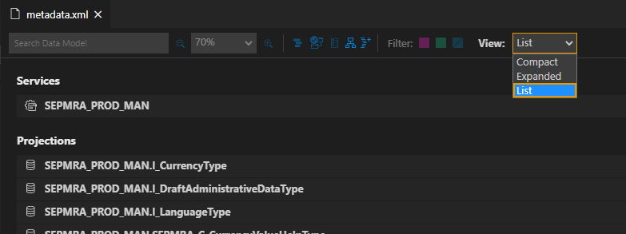
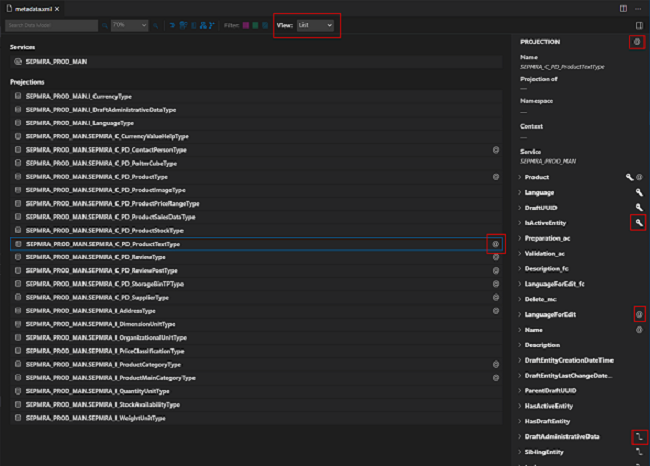
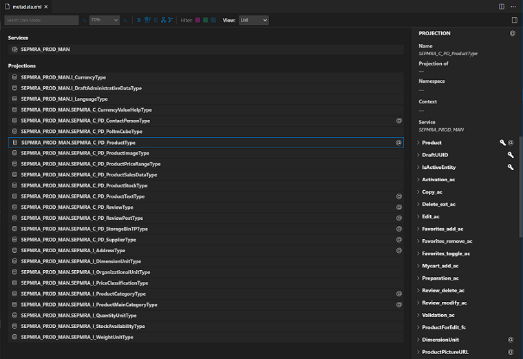
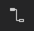
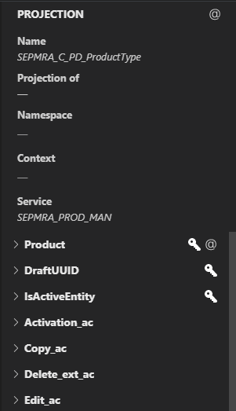
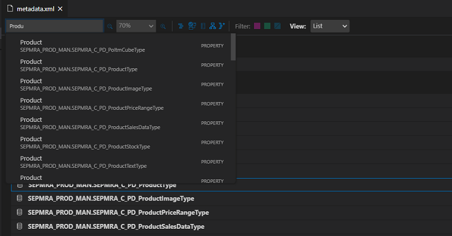

<!-- loioe369c2c20c03458a92b24b9dcbcb470f -->

# Viewing Service Metadata

The Service Modeler supports the visualization of the OData V2/V4 Service Model based on the `.xml/.edmx` files and CAP CDS services.

With the SAP Fiori tools - Service Modeler extension, you can perform the following operations::

-   Easily browse complex services and view the entities, projections, properties, and associations of a service.
-   View annotations associated with the entities, projections, and properties of a service.
-   Manage services required for SAP Fiori elements applications, such as adding new services to a project or syncing services that already exist to ensure they are up to date.
-   Manage local annotation files associated to the different OData services of a SAP Fiori elements project.

<a name="loioe369c2c20c03458a92b24b9dcbcb470f__section_uph_2rk_xlb"/>

## Launch Service Modeler

Service Modeler can be launched in several ways.

**Use Command Palette**.

-   Open *Command Palette*.
-   Start typing *Service Modeler*.
-   Select *SAP Fiori tools: Service Modeler: Open Service Modeler*.
-   Select SAP Fiori elements project from your workspace.

    > ### Note:  
    > If the project contains multiple services, you need to specify the service that you want to visualize.

**Use folder context menu**.

If you already have an SAP Fiori elements project in your current workspace, you can right-click any folder within your project and *Open Service Modeler*.

**From the Text Editor**.

If your `metadata.xml file` is open in the text editor, click the annotations icon .

<a name="loioe369c2c20c03458a92b24b9dcbcb470f__section_e45_xjy_wlb"/>

## Use Service Modeler for a Service

**Visualize a Service**

The service can be visualized in three different views:

-   *Expanded*
-   *Compact*
-   *List*

The *List View* is the default view on launching the Service Modeler.

### List View

The *List View* displays the entities and projections of a service in a list format. Details of a projection or entity are displayed in the detail panel on selection. The detail panel lists the properties of the entity or projection. The details of the properties are also displayed, such as the properties name and type.

-   Properties that are the primary key of the entity or projection are identified by a key icon .

-   Associations are identified by a link icon.
-   Properties that have annotations associated to them are identified by an annotation icon .

### Expanded and Compact View

*Expanded* and *Compact View* show a graphical representation of a service. Each entity or projection in a service is represented by a node on the canvas.

-   **Service Node** has a blue header. In the *Expanded View*, the service node lists all the entities included in this service.
-   **Entities** are connected to the service nodes with a pink link.
-   **Associations** between **entities** or **projections** are represented by blue links. The blue links are displayed on selection of an **entity** or projections in the service model. They can also be set by default using the filter on the service model toolbar. The association links are used between the source properties and the target properties.

    > ### Note:  
    > Only one to one associations are currently supported.

-   Properties of a projection or entity are displayed in the entity or projection node.
-   **Properties** that are primary keys of the entity or projection are identified by a key icon .
-   **Properties** that have annotations associated with the property field are identified by an annotation icon .

    > ### Note:  
    > In the *Compact View*, properties of the projection or entity are not displayed. As some service models can be large, the canvas may become overloaded.

-   **Detail Panel**. The detail panel lists the properties of the entity or projection. The details of the properties are also displayed. Details like the name and type. Properties that are the primary key of the entity or projection are identified by a key icon .

    

-   Associations are identified by a link icon  and properties that have annotations associated with them are identified by an annotation icon  .

    

### Searching for Entities

Search functionality is available in the Service Modeler toolbar.

When you enter a phrase in the search input field, results matching the search criteria are displayed in a list. The list contains the type of element that matches the search criteria. For example, an entity, a projection, or a property.

On selection of an item in the search result list, the entity or projection is selected in the view. If the selection in the list is a property, the entity or projection is selected in the view but the property in the detail panel is opened by default and scrolled into view.

### How to Browse the Service

**To Switch Views**

The Service Modeler can be viewed graphically or in a list. To change the views, select the preferred view from the view drop-down list in the toolbar.

**Zoom**

Zoom functionality can be used to manage large data models. Some data models can be too large to be viewed clearly on the canvas. The zoom functionality enables users to focus on particular areas or entities of a Service Model. You can use the plus, and minus icons in the toolbar to set the preferred zoom percentage or select the preferred zoom from the dropdown list.

**Redistributing and Saving Graph**

When viewing a Service Modeler in the *Expanded* or *Compact View*, users can configure the layout of the **Service Model**. Users can move the entity or projection nodes around the Service Modeler canvas to make the model more manageable or readable. All association, projections, or service links adapt to the entities new position.

To move entities or projections on the canvas.

-   Drag the entity to desired position, and then click *Save Graph*  icon on the toolbar.

> ### Note:  
> The updated node position is not reflected in the different views. The node position has to be updated in every view.

To redistribute the node positions of the model to its original state, click *Redistribute Graph*  icon on the toolbar.

**Filter connection links**

As some services can have multiple entities or projections, filtering in the *Expanded* or *Compact View* can help to reduce the number of connection links. To do so, use the filter to identify which connection links can be visible to make the service model more manageable and readable. To filter connection links, click the link color that can be removed from the Service Model on the toolbar. Another way to filter is to click *Show/Hide Legend*  icon and check the connection links to be displayed in the Service Model.

<a name="loioe369c2c20c03458a92b24b9dcbcb470f__section_cn4_124_ylb"/>

## How to set default preferences for the Service Modeler

The Service Modeler preferred default view to display service links in **EDMX** files can be set with the extension settings of the tool.

1.  Click *Extensions tab*  icon.
2.  Click *settings*  in the Service Modeler tool.
3.  Set default settings.

