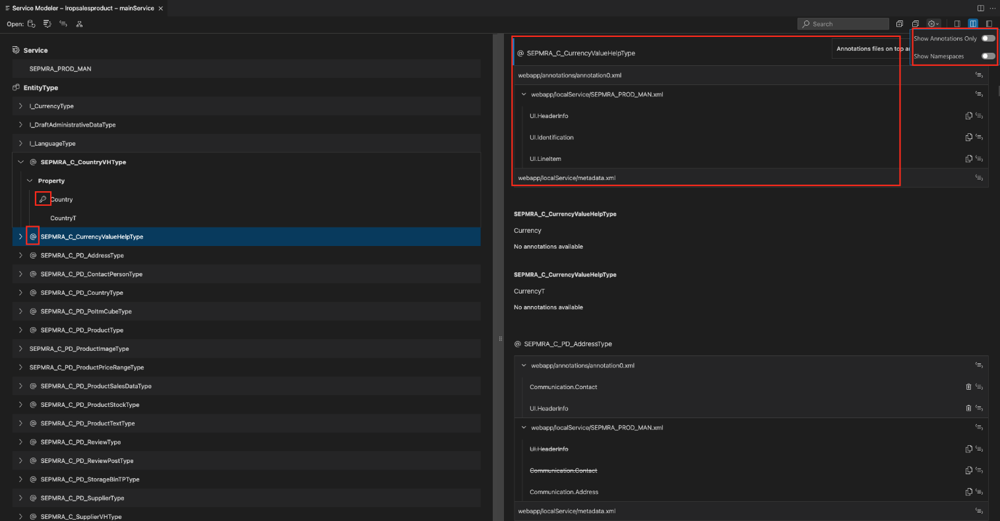

<!-- loioe369c2c20c03458a92b24b9dcbcb470f -->

# Viewing Service Metadata

The SAP Fiori tools - Service Modeler extension supports the visualization of the ODataV2/V4 Service Model based on the `.xml/.edmx` files and CAP CDS services.

You can perform the following operations with the Service Modeler:

-   Easily browse complex services and view the entity sets, entities, and properties of a service.
-   View annotations associated with the entity and properties of a service.
-   Manage services required for SAP Fiori elements applications, such as adding new services to a project or syncing services that already exist to ensure they are up to date.
-   Manage local annotation files associated to the different OData services of an SAP Fiori elements project.

<a name="loioe369c2c20c03458a92b24b9dcbcb470f__section_uph_2rk_xlb"/>

## Launch the Service Modeler

You can launch the Service Modeler in several ways:

-   **Use the Command Palette**

    -   Open *Command Palette*.
    -   Start typing **Service Modeler**.
    -   Select *SAP Fiori tools: Service Modeler: Open Service Modeler*.
    -   Select the SAP Fiori elements project from your workspace.

        > ### Note:  
        > If the project contains multiple services, you need to specify the service that you want to visualize.

-   **Use the Folder Context Menu**

    If you already have an SAP Fiori elements project in your current workspace, you can right-click any folder within your project and *Override Annotations*.

-   **From the Text Editor**

    If your `metadata.xml file` is open in the text editor, click the annotations icon .

<a name="loioe369c2c20c03458a92b24b9dcbcb470f__section_e45_xjy_wlb"/>

## Use the Service Modeler for a Service

**Visualize a Service**

The Service Modeler displays the entities and properties of a service in a list format. You can expand the entity node to view all the associated properties for that entity. You can expand the sections for *Complex Types* and *Entity Containers* to see the associated properties and entity sets. The namespace is hidden from the metadata by default. You can click the [Settings\] icon to toggle it on.

Properties that are the primary key of the entity or projection are identified by a key icon .

Entities or properties that have annotations associated with them are identified by an annotation icon . You can filter them to only view the metadata targets that have annotations.

You can select a specific node to see the related annotations in the side panel. The annotation panel lists the annotation files and the associated annotations for the entities and the properties in the main list.

### Search for Entities, Properties, or Annotations

The search functionality is available in the Service Modeler toolbar.

When you enter a phrase in the search input field, results matching the input term are filtered on the screen. If the search matches an entity name, then all the child properties are also displayed and the associated data is filtered in the annotation side panel.

If the search term matches an annotation term, all the associated data is filtered in the list.

