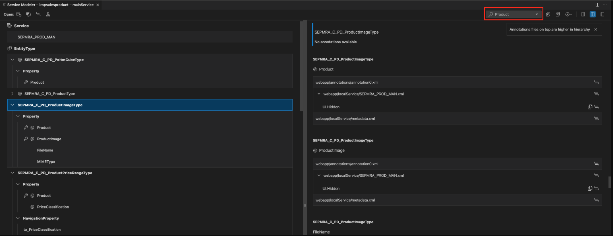

<!-- loioe369c2c20c03458a92b24b9dcbcb470f -->

# Viewing Service Metadata

The Service Modeler supports the visualization of the OData V2/V4 Service Model based on the `.xml/.edmx` files and CAP CDS services.

With the SAP Fiori tools - Service Modeler extension, you can perform the following operations:

-   Easily browse complex services and view the entity sets, entities, and properties of a service.
-   View annotations associated with the entity and properties of a service.
-   Manage services required for SAP Fiori elements applications, such as adding new services to a project or syncing services that already exist to ensure they are up to date.
-   Manage local annotation files associated to the different OData services of an SAP Fiori elements project.

<a name="loioe369c2c20c03458a92b24b9dcbcb470f__section_uph_2rk_xlb"/>

## Launch Service Modeler

Service Modeler can be launched in several ways.

**Use Command Palette**.

-   Open *Command Palette*.
-   Start typing **Service Modeler**.
-   Select *SAP Fiori tools: Service Modeler: Open Service Modeler*.
-   Select SAP Fiori elements project from your workspace.

    > ### Note:  
    > If the project contains multiple services, you need to specify the service that you want to visualize.

**Use folder context menu**.

If you already have an SAP Fiori elements project in your current workspace, you can right-click any folder within your project and *Override Annotations*.

**From the Text Editor**.

If your `metadata.xml file` is open in the text editor, click the annotations icon .

<a name="loioe369c2c20c03458a92b24b9dcbcb470f__section_e45_xjy_wlb"/>

## Use Service Modeler for a Service

**Visualize a Service**

The Service Modeler displays the entities and properties of a service in a list format. The entity node can be expanded to view all the associated properties for that entity. Sections for Complex Types and Entity Containers can be expanded to see the associated properties and entity sets.

Properties that are the primary key of the entity or projection are identified by a key icon .

Entities or properties that have annotations associated with them are identified by an annotation icon .

A node can be selected to see the related annotations in the side panel. The annotation panel lists the annotation files and the associated annotations for the entities and the properties in the main list.

### Searching for Entities, Properties or Annotations

Search functionality is available in the Service Modeler toolbar.

When you enter a phrase in the search input field, results matching the input term are filtered on the screen. If the search matches an entity name - all the child properties are also displayed and associated data is filtered in the annotation side panel.

If the search term matches an annotation term, all the associated data is filtered in the list.

