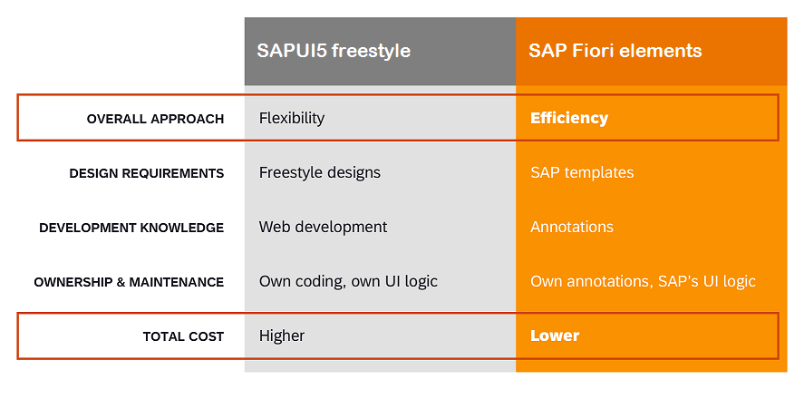

<!-- loiof09752ebcf63473e9194ea29ca232e56 -->

# Developing SAP Fiori Applications with SAP Fiori Tools

To develop an application that connects to SAP data sources, you can use one of the following options:

-   SAP Fiori elements creates standard applications based on several basic floorplans for common business scenarios. These floorplans provide UI code, including some logic, so that the data from the back end goes exactly where it’s supposed to, and the UI behavior is based on the metadata you provide. You can customize the floorplans using XML annotations.
-   freestyle SAPUI5 gives you complete flexibility about your application's look and performance. You can select floorplans and specify the layout, flow, menu structure, colors, fonts, interactions, patterns, and more. For each screen, you have to write the JavaScript UI code, which may be time-consuming.

<a name="loiof09752ebcf63473e9194ea29ca232e56__section_pnf_3nd_xmb"/>

## What Is SAP Fiori Elements?

SAP Fiori elements is one of the options available to develop SAP Fiori apps based on SAPUI5. SAP Fiori elements provide designs for UI patterns and predefined templates for common application use cases. Using standard templates as the starting point for creating applications increases developer efficiency, enforces UX consistency across apps, and ensure that applications created using SAP Fiori elements include features expected in a typical enterprise.

Application developers can use SAP Fiori elements to create SAP Fiori apps based on an OData service and annotations that do not need JavaScript UI coding to create a front end of their app. This means that no application-specific view instances are required. The SAP Fiori elements runtime interprets the metadata and annotations of the underlying OData service and uses the corresponding views for the SAP Fiori apps at startup. SAP Fiori apps are created with SAPUI5 and follow the SAP Fiori design guidelines to ensure consistency and high quality. For more information, see [SAP Fiori Design Guidelines](http://help.sap.com/disclaimer?site=https://experience.sap.com/fiori-design-web/).

For more information about SAP Fiori apps, see [http://www.sap.com/fiori](http://www.sap.com/fiori).

For more information about SAP Fiori, see [SAP Fiori Overview](https://help.sap.com/viewer/product/SAP_FIORI_OVERVIEW/5_OVERVIEW/en-US?task=discover_task).

For more information about SAP Fiori elements, see[Developing Apps with SAP Fiori elements](https://sapui5.hana.ondemand.com/#/topic/03265b0408e2432c9571d6b3feb6b1fd).

### Project Structure and Artifacts of SAP Fiori elements

The SAP Fiori elements framework interprets OData metadata and annotations to render the application UI. While the metadata describe your data model or what is on your screen, the annotations describe your data semantics or the visualization.

For example, any entity type property that has the `Communication.IsEmailAddress` annotation term set to true is interpreted by the SAP Fiori elements framework as an e-mail address and displayed in an application UI as a clickable link that leads to the e-mail client.

Annotations can be associated to **entities**, **relationships**, and **properties** of a service.

You can also use annotations to perform the following actions:

-   Describe the relationships between **properties**, such as between an amount and the related currency. SAP Fiori elements display these **properties** side by side in an application UI.
-   Group **properties** together so that they are displayed next to each other in a form.
-   Describe the actions available on a given object, whether you can edit it, delete it, apply some filters, and more.

All of this is interpreted by the SAP Fiori elements framework and shown in the application accordingly.

Annotations can be defined together with the metadata or in dedicated annotation files, both in the back end along with the service, and in the frontend, in the local annotation files.

For an annotation to be considered by the SAP Fiori elements framework during runtime, it must reside in an annotation source registered in an application descriptor file `manifest.json` of the application.

Additionally, in the web app manifest, the description of your application basic metadata can be found, such as its name and version, as well as its content, such as application pages, navigation, service details used, and more.

The same descriptor file `manifest.json` that is a runtime source for your annotations can be used for the following operations:

-   Adding navigation from pages, such as a drill down from a *List Report* to an *Object Page*. For more information, see [Define Application Structure](Developing-an-Application/define-application-structure-bae38e6.md).
-   Defining the settings of tables, columns, or other UI elements. In addition, registering custom extensions like custom columns, pages or sections.

For flex changes in the individual pages, such as enabling export, you can use the *Page Editor*.

<a name="loiof09752ebcf63473e9194ea29ca232e56__section_gmp_yrt_jnb"/>

## What Is Freestyle SAPUI5?

Freestyle SAPUI5 is another option available to develop SAP Fiori apps. Choose the type of template required, along with the relevant OData service to start your application development process. By using the freestyle SAPUI5 templates, you can be flexible in creating a custom application based on an OData service and JavaScript UI coding. freestyle SAPUI5 incorporates our latest recommendations and can be used as a starting point for developing custom apps according to the SAP Fiori design. For more information, see [SAP Fiori Design Guidelines](http://help.sap.com/disclaimer?site=https://experience.sap.com/fiori-design-web/).

For more information about SAP Fiori apps, see [http://www.sap.com/fiori](http://www.sap.com/fiori).

For more information about SAPUI5, see [Get Started with UI5](https://sapui5.hana.ondemand.com/).

### Project Structure and Artifacts of Freestyle SAPUI5

With the freestyle SAPUI5 framework, you can optimize your SAP Fiori-based development by using OData and SAPUI5 tooling to render the application UI. The SAPUI5 controls are convenient and intuitive to use for your app development. Additionally, they ensure adherence to the design guidelines.

The freestyle SAPUI5 templates create at least three basic files for your application:

-   `manifest.json`
-   `app.view.xml`
-   `component.js`

With each of these files, you can control certain aspects of your application. For more information, see [Basic Files for your App](https://ui5.sap.com/#/topic/28b59ca857044a7890a22aec8cf1fee9).

> ### Note:  
> The freestyle SAPUI5 templates are deprecated, and it’s recommended to use the custom page SAP Fiori template based on the flexible programming model as an alternative. For more information, see [Flexible Programming Model](https://ui5.sap.com/test-resources/sap/fe/core/fpmExplorer/index.html#/overview/introduction).

<a name="loiof09752ebcf63473e9194ea29ca232e56__section_r3j_ctt_jnb"/>

## What Is the Difference between SAP Fiori Elements and Freestyle SAPUI5?

The following table lists the differences between freestyle SAPUI5 and SAP Fiori elements.

<a name="loiof09752ebcf63473e9194ea29ca232e56__section_n5y_kd1_knb"/>

## Creating an SAP Fiori Application with SAP Fiori Tools

SAP Fiori tools provides many capabilities to increase the efficiency of developing SAP Fiori applications using either SAP Fiori elements or the freestyle SAPUI5 approach. SAP Fiori tools, together with SAP Fiori elements, reduce development time, maintenance costs, and leverage the advantages of a metadata-driven UI. SAP Fiori tools includes the following:

-   Wizard for the initial creation of an application.
-   Service modeler for viewing the data model.
-   XML and form-based editor for maintaining of annotations - SAP Fiori elements only.
-   Application page structure and ability to configure the SAPUI5 flexibility settings - SAP Fiori elements only.
-   Guided Development for implementing features - SAP Fiori elements only.

For more information about how to use SAP Fiori tools, see [Getting Started with SAP Fiori Tools](Getting-Started-with-SAP-Fiori-Tools/getting-started-with-sap-fiori-tools-2d8b1cb.md).

<a name="loiof09752ebcf63473e9194ea29ca232e56__section_o1p_3kz_51c"/>

## Generating an Application with Joule's SAP Fiori Tools Generative AI

Joule, SAP's innovative AI copilot, enables you to generate data models, services, sample data for your project with simple language descriptions, as well as an SAP Fiori UI. Joule can help you create an SAP Fiori elements app simply by pasting your business requirements document. For more information, see [Generating an Application with Joule Using SAP Fiori Tools Generative AI](generating-an-application-with-joule-using-sap-fiori-tools-generative-ai-6845fed.md).

